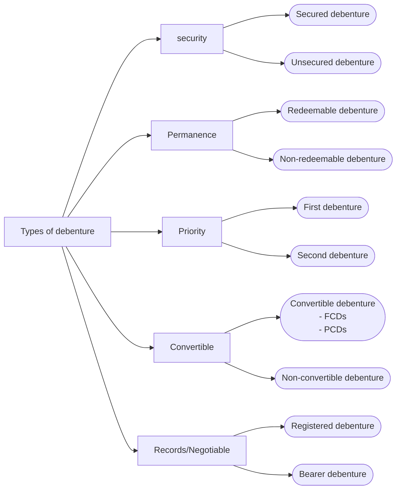

<u><strong> Types of Debenture </strong></u>
On the basis of 
1. security point of view
	- *Mortgage debenture / Secured debenture*: Secured weather on  fixed asset or general asset called floating charges
	- *Naked debenture / unsecured debenture*
2. Permanence point of view
	- *Redeemable debenture*
	- *Irredeemable debenture* : holder cannot demand payment from the company so as long as it is a going concern
3. Priority point of view 
	- *First debenture* : Repaid before other debenture are paid out
	- *Second debenture / Sub-ordinated debenture* : Repaid after first debenture.
4. Convertible debenture 
	- *Convertible debenture*
		- FCDs
		- PCDs
	- *Non-convertible debenture (NCDs)*
5. Record point of view
	- *Registered debenture*
	- *Bearer debenture*
	

| Basis                     | Registered Debentures                                                                                                        | Bearer debentures                                                                |
| ------------------------- | ---------------------------------------------------------------------------------------------------------------------------- | -------------------------------------------------------------------------------- |
| meaning                   | Registered debentures are those debentures which are payable only to the registered debenture holders                        | Bearer debentures are those debentures which are payable to the bearer or holder |
| negotiable                | Registered debenture are [not negotiable]{cannot handover the benefits of debenture to other person}                         | Bearer debentures are negotiable                                                 |
| Debenture holder register | Registered debentures are recorded in the company's debenture holder's register with full details of every debenture holders | Bearer debenture are not recorded in the company's debenture holder's register   |
| Transferable              | Such debentures are transferable by transfer deeds                                                                           | Such debentures are transferable by mere delivery                                |
| Interest payment          | Principle and interest of such debentures is payable to the registered debenture holders                                     | Interest is paid to the person who produces coupon attached to the debenture     |

