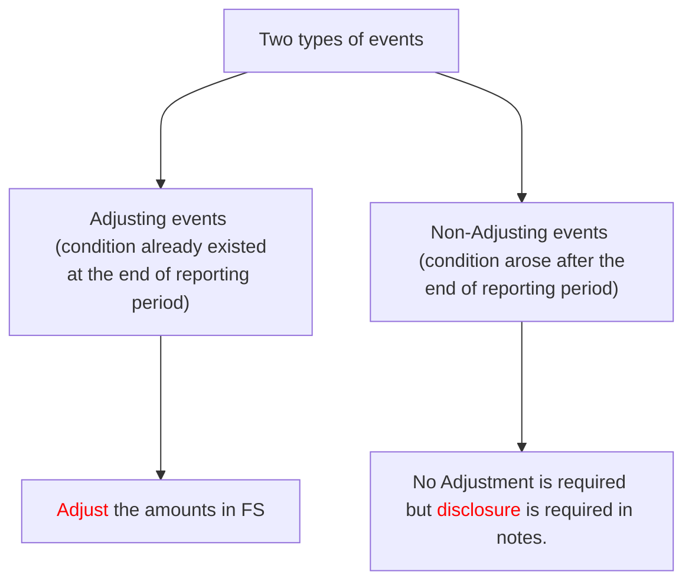

# NAS 10: Events after reporting period 

## C.No. 1 Definition

Events after reporting period are those events, favorable and unfavorable, that occur between the end of reporting period and the date when financial statements are authorized for issue.

# C.No 2 Adjusting events and their treatment

Adjusting events are those events that provide evidence of conditions that existed at the end of the reporting period

## Examples of adjusting events:

- Settlement of court case after the reporting period. (Provision)
- Bankruptcy of customer after the reporting period. (Impairment of debtors)
- Sale of inventories after the reporting period. (Net realizable value)
- Determination of profit sharing payment or bonus payment after reporting period. (A
- Discovery of fraud and error. (FS incorrect)

## Treatment of adjusting events: 

An entity shall adjust the amounts recognized in the financial statements to reflect adjusting events after the reporting period.

# C.No 3 Non adjusting events and their treatment

Non adjusting events are those events that are indicative of conditions that arose after the reporting period.

## Example of non-adjusting events:

- A major business combination after the reporting date or the disposal of a major subsidiary
- Announcing a plan after the reporting date to discontinue an operation
- Major purchases and disposals of assets after the reporting date
- Destruction of assets by a fire after the reporting date
- Announcing or commencing a major restructuring after the reporting date
- Large changes after the reporting date in foreign exchange rates
- Equity dividends declared or proposed after the reporting date.
- A fall in value of an asset after the end of the reporting period, such as a large fall in the market value of some investments owned by the company, between the end of the reporting period and the date the financial statements are authorized for issue. A fall in market value after the end of the reporting period will normally reflect conditions that arise after the reporting period, not conditions already existing as at the end of the reporting period.

## Treatment of non-Adjusting Events

An entity shall not adjust the amounts recognized in the financial statements to reflect nonadjusting events after the reporting period.

If non-adjusting events after the reporting period are material and non-disclosure of such information could influence the economic decisions that users make on the basis of financial statements, An Entity shall disclose the following for each material category of non-adjusting event after the reporting period:

- The nature of the event
- An estimate of financial effect, or statement that such estimate cannot be made.

# C.No 4 Treatment of dividend declared after reporting period 

If dividends are declared after the reporting period but before the financial statements are authorized for issue, the dividends are not recognized as a liability at the end of reporting period because no obligation exist at that time.

# C.No 5 Going concern Assumption

If, after the reporting period, going concern assumption is not appropriate due to various factors, Entity shall not make financial statements on going concern basis. Entity shall prepare its financial statements on break up basis. All the assets should be recognized at their expected realizable value.

# QUESTIONS

## Questions related to Adjusting events:

### Question No 1

AX Limited prepares its financial statement on 31st March each year. A client sued the company on 15th March 2009, for damages against company's failure to fulfill the warranty amounting Rs.500,000. The company made a provision of Rs.300,000 on advice of the lawyer. The financial statements were authorized on 30th April 2009. On 15th April 2009, the court decided against the company and a compensation of Rs.450,000 was awarded. You are required to advise the treatment.

#### Solution,

First explain the provisions contained in standard by quoting standard name.

#### Conclusion:

The entity shall adjust the provision made and provide an additional provision of Rs.150,000 in the financial statements of the financial year 31st March 2009. The company can not disclose only as a contingent liability as the decision of court provides additional evidence of a present obligation on the balance sheet date.

### Question No 2

BX Limited valued the closing stock of finished goods (10,000 units) at Rs.100,000 being its cost as it was lower than net realizable value which was estimated at Rs.120,000 on the basis of selling price available on 23rd March 2009 as the selling price on 31st March was not available. The balance sheet date was 31st March 2009. The financial statements were authorized on 15th April 2009. On 3rd April 2009, the company sold its one lot of finished goods of 100 units for Rs.800. Advise the company on valuation of its finished goods for the financial statements of the year 31st March 2009.

#### Solution, 

First explain the provisions contained in standard by quoting standard name.

#### Conclusion:

The sale of finished goods provides additional information about net realizable value of stock. The company should adjust the value of its stock at Rs.80,000 (10,000 units $\times$ Rs.8).

### Question No 3

The Board of directors of CX Limited approved its financial statements for the year ended on 31st March 2009 on 30th June 2009. A debtor against whom insolvency proceeding were instituted before 31st March 2009, is declared 10th June 2009. The amount receivable from the debtor was Rs.100,000. Advice the appropriate treatment for the year ended 31st March 2009, to CX Limited.

#### Solution,

First explain the provisions contained in standard by quoting standard name.

#### Conclusion:

The company should make a provision for loss of Rs.100,000 in its financial statements of the year ended on 31st March 2009.

### Question No 4 (June 2016-5 Marks)

The Board of directors of DX Limited approved its financial statements for the financial year ended on 31st March 2009 on 30th June 2009.DX Limited entered into an agreement to sell its land included in its balance sheet at Rs.1,000,000 for Rs.2,500,000. The agreement to sell was concluded on 24th January 2009 but the sale deed was registered on 15th April 2009.

#### Solution,

First explain the provisions contained in standard by quoting standard name.

#### Conclusion:

Amounts recognized in balance sheet should be adjusted for events occurring after balance sheet date that provide additional information for determining amount relating to condition existing on balance sheet date. The sales were existing on balance sheet date, the deed registration gives an additional evidence. So the transaction should be adjusted in the financial statements for the year ended 31st March 2009.

### Question No 5 

The Board of directors of AB Limited approved its financial statements for the financial year ended on 31st March 2009 on 30th June 2009. Employees were entitled to performance bonus as a percentage of turnover. The evaluation was incomplete on 31st March 2009. An estimated sum of Rs.100,000 was provided for the bonus in the financial statement of the year ended 31st March 2009. The bonus was finalized at Rs.120,000 on 15th April 2009.

#### Solution,

First explain the provisions contained in standard by quoting standard name.

#### Conclusion:

The finalization of bonus provides additional information about determination of bonus which was existing on balance sheet date. The provision for performance bonus should be adjusted and increased to Rs.120,000.

### Question No 6

The Board of directors of BB Limited approved its financial statements for the financial year ended on 31st March 2009 on 30th June 2009. The company had given advance amounting to Rs.1,000,000 to a foreign party for purchase of a machine on 5th March 2009. The machine was to be delivered on 15th March 2009 but was not delivered. On 15th April 2009, it was discovered that the advance was given to a fictitious party and the party was not traceable. The company is in process of collecting the advance.

#### Solution,

First explain the provisions contained in standard by quoting standard name.

#### Conclusion:

This standard requires adjustment in the financial statement for frauds and errors discovered after balance sheet date that show that financial statements are incorrect. So the company should create provision for the amount advanced to the foreign party i.e. for Rs.1,000,000.

## Questions related to non-adjusting events

### Question No 7

The Board of directors of ABX Limited approved its financial statements for the financial year ended on 31st March 2009 on 30th April 2009. It has investments held for trading and therefore valued at market price of 31st March 2009 which is fair value of the investment. The market price of the investment was decreased on 12th April 2009.

#### Solution, 

First explain the provisions contained in standard by quoting standard name.

#### Conclusion:

Subsequent decline in the market price does not reflect the conditions prevailing as on the balance sheet date. And such event is non-adjusting event. So it should not be adjusted in the financial statement for the year ended on 31st March 2009. But it should be disclosed in notes to accounts.

### Question No 8

A major fire has damaged assets in a factory of X Co. Ltd. On 8.4.2005, 8 days after the year end closing of accounts. The loss is estimated to be Rs. 16 crores (after estimating the recoverable amount of Rs. 24 crores from the Insurance Company). If the company had no Insurance cover, the loss due to fire would be Rs. 40 crores. Explain how the loss should be treated in the Final Accounts of the year ended 31.3.2005.

#### Solution,

The present event does not relate to conditions existing at the end of the reporting period therefore the loss of assets by fire of X Ltd. is a non-adjusting event. Hence, no specific adjustment is required in the financial statements for the year ending on 31.3.2005. However, as per the disclosure requirements to NAS 10, if non-adjusting events after the reporting period are material, non-disclosure could influence the economic decisions that users make on the basis of the financial statements. Accordingly, an entity shall disclose the following for each material category of non-adjusting event after the reporting period:
(a) the nature of the event; and
(b) an estimate of its financial effect, or a statement that such an estimate cannot be made.

Therefore, X Ltd. should make disclosure about the event and the expected loss from the event in the notes.

## Mix Questions (Both adjusting and Non-adjusting events)

### Question 9 (June 2019 -5 Marks) 

Kathmandu Ltd. is a company that prepares accounts in accordance with Nepal Financial Reporting Standards (NFRS). A meeting of the Directors of Kathmandu Ltd. is scheduled to discuss the following matters with a view to finalizing the accounts for the year ending 32nd Ashadh 2075:
I. A fire occurred in one of the warehouses of Kathmandu Ltd. on 3rd Shrawan 2075, destroying inventory which had a cost price of Rs. 100,000 and a net realizable value of Rs. 150,000.
II. On 9th Shrawan 2075, Kathmandu Ltd. received information that one of their largest customers had gone bankrupt. At 32nd Ashadh 2075, this customer owed Kathmandu Ltd. Rs. 235,000. It is anticipated that Kathmandu Ltd. can only receive 10 paisa for every Rs. 1 they were owed.
III. In Shrawan 2075, Kathmandu Ltd. sold inventory which had been in one of their warehouses for the past two years, for Rs. 75,000. This had been included in the financial statements, for the year ended 32nd Ashadh 2075, at its cost price of Rs. 105,000.
IV. On 30th Ashadh 2075, an employee of Kathmandu Ltd. fell and injured her arm at work. This employee has commenced legal action. The solicitors for Kathmandu Ltd. informed the company on 10th Ashwin 2075, that it is probable they will be found liable and have to pay this employee Rs. 33,000.

#### Solution,

I. This is a non-adjusting event as it occurred after the reporting date. If it is material it should be disclosed in the financial statements, but it should not be recognized in the financial statements.
II. This is an adjusting event as it provides evidence of conditions that existed at the reporting date. The company should recognize this in the accounts by debiting bad debts Rs. 211,500 (90/100*235,000) and crediting trade receivables Rs. 211,500.
III. This is also an adjusting event as it confirms the net realizable value of the goods that were in stock at 32nd Ashadh 2075. The company will have to recognize this by reducing the value of closing inventory in the financial statements.
IV. This is an adjusting event. As the injury took place prior to the year end it has now been confirmed that the company will probably have to pay out Rs. 33,000 in compensation. The company will have to recognize a provision of Rs. 33,000 in the financial statements by debiting expense of Rs. 33,000 and crediting provision in the statement of financial position for Rs. 33,000.