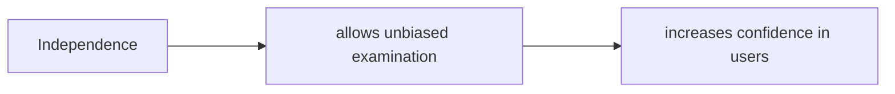
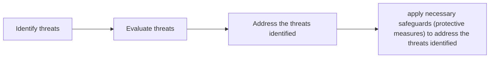
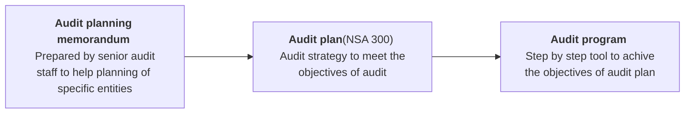
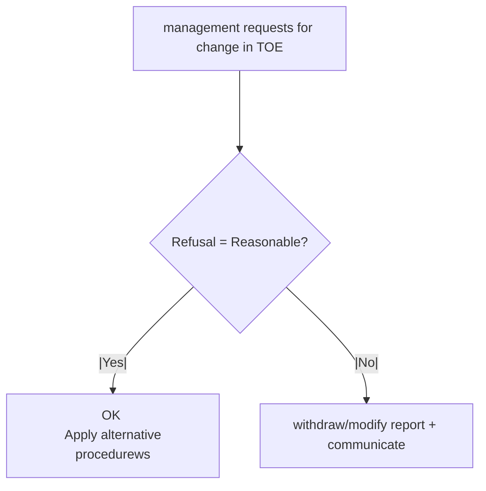
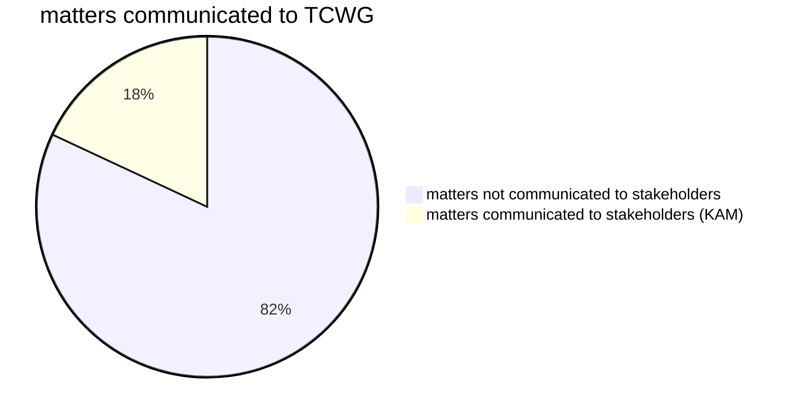
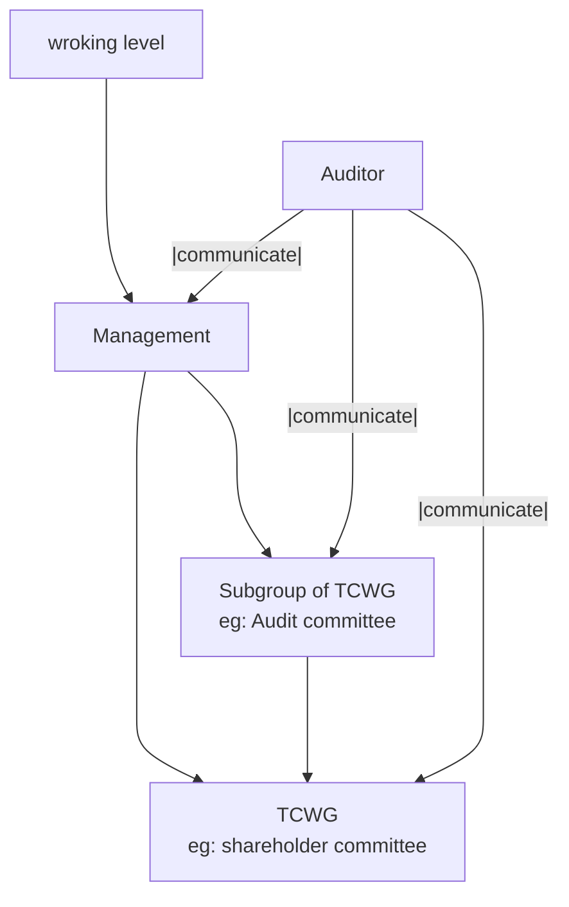
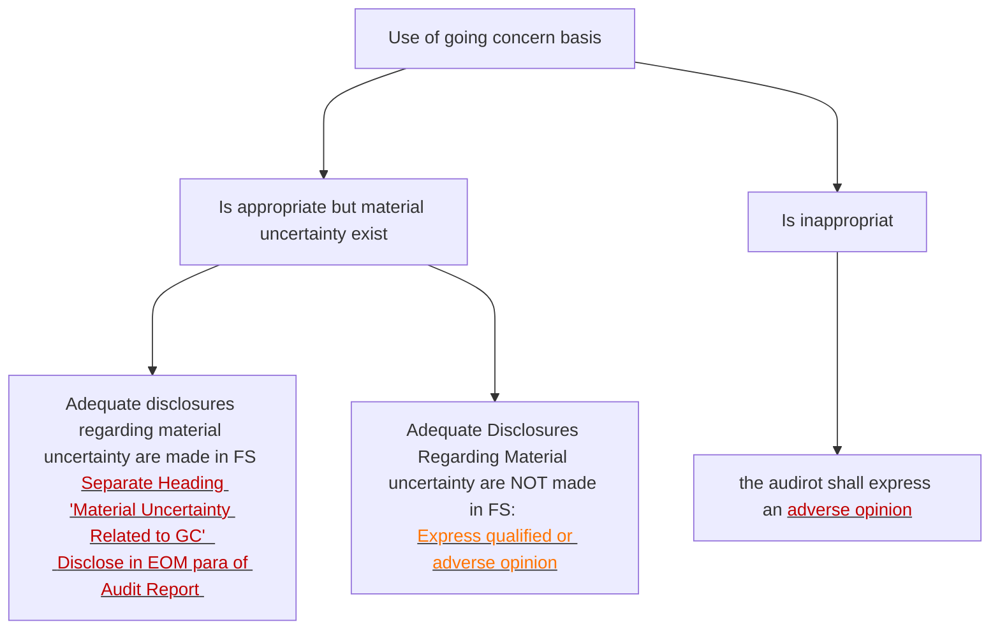

# Introduction and basic concept


## Definition of Audit
Process of examining the financial statement 
Audit : "Audire" →  Audio = "to hear"

Audit is an [[Audit note#Independent examination| Independent examination]] of [[Audit note#What is Financial statement|Financial statements]] with an [[Audit note#Objectives of Audit|objective]] of expressing an [[Audit note#Types of audit report|opinion]] on True and Fair view


**Auditor**: A professionally qualified person who is eligible to conduct audit
**professionally qualified** =
1. He/She should be member of ICAN
2. He/She must hold valid COP (Certificate of Practice)
3. He/she must not be disqualified under any other laws

Category of Auditors in Nepal

| Classes   | Max limit of company to do audit |
| --------- | -------------------------------- |
| <u>CA</u> |                                  |
| - A class | No limit                         |
| <u>RA</u> |                                  |
| - B class | 100cr                            |
| - C class | 25cr                             |
| - D class | 5cr                              |


### What is Financial statement

Components of Financial Statements
1. A Statement of Financial Position (A balance sheet);
2. A Statement of Profit or Loss and Other Comprehensive Income (An income statement);
3. A statement of changes in equity showing either:
	- All changes in equity, or
	- Changes in equity other than those arising from transactions with equity holders acting in their capacity as equity holders;
4. A cash flow statement; and
5. Notes, comprising a summary of significant accounting policies and other explanatory notes


Financial Year: The period on the basis of which the financial measurment is evaluated and the FS are prepared

Generally , FY is of 12 month <span style="color:rgb(192, 0, 0)">but shorter period can be justified depending upon the opening or closure of the business</span>

<span style="color:rgb(0, 112, 192)">Management</span> is responsible for the preparation of financial Statements
It is the responsibility of management to prepare the FS in accordance with applicable Financial Reporting Framework ([FRF]{NFRS / NAS, laws and regulation, other guidelines})

It is also the responsibility of management to design and implement suitable internal controls for prevention, detection and correction of misstatements on timely basis

**users of FS**
- Internal user
	1. Owner/Investor
	2. management
- External user
	1.  Lenders and other trade creditors
	2. Potential investors
	3. Government and its agencies
	4. Employees and trade unions
	5. Customers
	6. Public
	7. Donors
	8. Other regulatory agencies


### Independent examination
**Purpose**: to increase the confidence (assurance)


more independence = more confidence

#### types of Independence
1. Independence of mind ⇒ Auditor's personal judgement
2. Independence of appearance ⇒ Third party perception/judgement about auditor

#### Threats to Independence
It is the risk factors which can compromise the independence of auditors due to which the credibility of auditors report can be questioned. They are mentioned below  

1. **self interest threat:** mostly linked with financial interest. eg:
		- loan taken from the client
		- undue dependence upon the clients fees
		- loan given to client
2. **self review threat:** 
		- If auditor prepares original data for preparing FS
		- if auditor or audit team member was recently in appointment(employment) with the client
3. **advocacy threat:** 
		- Defending the client in lawsuit/litigations 
		- Endorsing/Promoting the business of client or acting as promoter of shares of client
4. **Intimidation threat:** Position of client is powerful or influential 
		- Removal as auditor
		- Replacement
		- Reduction or non payment of fees
5. **Familiarity threat:** Too close relationship
		- Gifts and hospitalities
			- insignificant : it is fine
			- significant (influence your judgement) : Do not accept such gifts / Return gift
		- Family member of auditor working with client
		- Relative of audit team members working with client  


what to do 



#### Safeguards to threats to independence
1. **safeguards created by profession:**
	- code of ethics
	- Education and training
	- Continuous education requirement 
	- External reviews
2. **Safeguards within the auditee entity:** 
	- Strong internal control system of client
	- Honest working culture of client
	- Client promotes the auditor's independence
3. **Safeguards within the audit firm:** 
	- Quality control practices
		- Training to staff
		- Efficient Quality control mechanisms formed


### Objectives of Audit
#### Primary objective
To express opinion on True and Fair view

<u>condition to be fulfilled to give True and fair view</u>
1. FS must comply with FRF
2. Transaction must be recorded appropriately : <span style="color:rgb(0, 112, 192)">Capital</span> and <span style="color:rgb(0, 112, 192)">revenue</span> items should be classified properly, and <span style="color:rgb(0, 112, 192)">completeness </span>should  be measured 
3. Arithmetic accuracy
4. Compliance with laws and regulations
5. Business should work within the objectives
6. Proper authorization 
7. FS are free from material misstatements 

![[Audit book#Broad Classification of Audit Report]]


![[assurance.png]]

#### Secondary objective
To detect [misstatements]{Deviation from "what should have been as per FRF}

Reason for misstatement 
1. Due to error: unintentional
2. Due to fraud: intentional , difficult to trace

The auditor cannot detect all the misstatements due to inherent limitations of audit (ILA)

![[Audit book#1 14 AUDIT EXPECTATION GAP]]


<u>Inherent Limitation of Audit (ILA)</u>
It always exist 
can be managed to some extent but cannot be eliminated completely 
1. Sampling(Test-checking):Taking [sample]{Selective Representative of population} form [population]{Entire transaction}
2. Nature of audit evidence: It is persuasive not conclusive
	- Eg: if company's employee have generated fake bill during the recording of transaction then auditor cannot differentiate fake bill and original bill on the basis of only one evidence. That's why the bill is persuasive evidence not conclusive evidence
3. Use of judgement: it depends on past experience , knowledge etc of the auditor
4. [[Audit note#Inherent limitation of ICS|Inherent limitations of Internal control system]] : The ICS adopted by the entity may have it's own limitations due to which the misstatements might not be detected . for eg:
	- collusion among employees
	- Change in conditions etc

Because of the ILA, auditor can only give opinion **( Reasonable Assurance )** and cannot give guarantee **( Absolute Assurance)** on the status of Financial Statement

![[inherent limitations 01.png]]
![[inherent limitations 02.png]]

### Basic principles governing Audit (BPGA) / fundamental principles
As per code of ethics
1. Integrity: The accountant should comply with ethical requirement
2. Objectivity: Straight forwardness, Independence , Unbiasedness
3. Professional competence and due care: to act professionally in a competent manner . To follow rules , standards and other necessary regulation , work with diligence
4. Confidentiality: it is all about keeping the information of client confidential . i.e. not to disclose the information of client to any third party for any personal benefit or otherwise
	1. Exceptions:
		-  If the information is required by the law. eg:
			- For reviews
			- if any regulatory body has investigated client
		- If the client has permitted in written form for disclosure of the information 
5. Professional behavior: Auditor should not do anything which would bring [discredit]{Badnami} to the profession

>[!note] 
>The defense of inherent limitation is available only when the auditor conducts his duties by following BPGA. If the auditor does not follow BPGA, the auditor can be held negligent in conducting his duties and thus liable for the consequence

>[!info] Kingston Cotton Mills case
><u>case</u>
>- Audit was conducted
>- Misstatement detected later by shareholder
>- They blamed their auditors
>
>Judge(Justice Lopez) said
>**"Auditor is only a watch dog not a bloodhound"**
>It is also the responsibility of management to design and implement suitable internal controls for prevention, detection and correction of misstatements on timely basis
>

## Introduction to NSA

NSA: guidelines for conducting audit. Drafted and issued by Auditing Standard Board(AuSB)


NAS/NFRS: Guidelines for accounting and Financial reporting

<u>NSA 200 OBJECTIVES AND GENERAL PRINCIPLES GOVERNING AN AUDIT OF FINANCIAL STATEMENTS</u>
- Auditor must follow NSA while conducting audit
- The objective of each NSA must be achieved
- If the objective of NSA is not achieved, the auditor should document the reason and perform other procedures


# Overall audit process
<!--
```mermaid
flowchart 
	
    subgraph one
    G ---> Q[Expression of opinion]
    end
	
    subgraph two
    F ---> J["`Risk assessment procedures,(RAP)`"]
	F ---> K[other than RAP's]
	K ---> L["`Compliance procedures <br> - Related to ICS  <br>1.   <br>2.  <br>3.   <br>`"]
	K ---> M["`Substantive procedure <br>1.   <br>2.   <br>3.   <br>4.   <br>5.   <br>6.   <br>7.   <br>`"]
	M ---> n[Analytical procedures]
	M ---> N[test of Details]
	N ---> O["`Vouching <br> - of transactions`"]
	N ---> P["`Verification <br> - of assets and liabilities`"]
    end
	
	
    subgraph three
    E ---> I["`As per NSA 300 <br> Developement of overall audit strategy and audity program`"]
    end
	
	
	subgraph four
    D ---> H["`As per NSA 315 <br> 1. entity <br> 2. Nature of business <br> 3. Laws and regualtions <br> 4. Internal control system <br> 5. management and TCWG <br> 6. Accounting policies and practices`"]
    end
    
	
	
	A["x"]
	B[y]
	A --Relevant laws and regulation--> C["Appointment of Auditor"]
	B --Terms of engagement--> C
	C ---> D[Understanding the entity and its environment]
	D ---> E[Audit plan and audit program]
	E ---> F[Audit procedures]
	F --|Evidence|--> G[Audit conlusion and reporting]

-->


![[Natural Person Flow-2026-06-26-142032.png]]
## Appointment of auditor
1. Relevant laws and regulations: The appointment of the auditor must be made by complying the laws and regulation in a cohesive manner so that the appointment becomes valid eg: company →  companies act, Bank → BAFIA


2. Terms of engagement: It is a letter issued by an auditor to the management for confirming his appointment as an auditor and for specifying his terms and condition which must be agreed by the auditor and management both before the start of audit
	The appointment is also based upon the terms of engagement
	
	<u>Terms of engagement(TOE)</u>
	- It is a letter issued by the auditor through the appointing authority or the management confirming the acceptance of appoinment and also mentioning the terms and conditions to be accepted by the management before the start of the audit
	- Contents of Engagement letters:
		- The objective and scope of the audit of the financial statements 
		- The [[Audit note#Primary objective|responsibilities of the auditor]]
		- The responsibilities of management
		- Identification of the applicable FRF for the preparation of the financial statements 
		- Reference to the expected form and content of any reports to be issued by the auditor
	- The TOE help the auditor and management to reduce Audit Expectation Gap
		<u>Audit expectation Gap</u>
		The difference between <span style="color:rgb(192, 0, 0)">Expectation of users/management about auditor's Responsibilities </span>and <span style="color:rgb(0, 112, 192)">Auditor's actual responsibilities to express opinion on Financial statements</span>
		following points must be consider to reduce Audit expectation gap to an acceptable level 
			1. The management must acknowledge their responsibilities in an absolute manner and not only as a formality.
			2. Auditor must communicate his responsibilities through workshops and seminar 
			3. management/users must understand about the inherent limitations of audit
		 ^kxil14
	- The guidance regarding the content and format of TOE is given in NSA 210
	<u>NSA 210: Agreeing upon Terms of Engagement</u>
	1. Preconditions for Audit: The condition which <span style="color:rgb(192, 0, 0)">must exist</span> before the start of audit are known as preconditions
		- FRF adopted by the entity is acceptable
		- The management acknowledges it's responsibilities 
			- For preparation of FS in accordance with FRF
			- For designing and implementing ICS to prevent, detect and correct the misstatement on timely basis
			- For providing the auditor with 
				- Access to books of a/c, records etc
				- Additional information which auditor may require during the course of Audit
				- Unrestricted access to employees staffs for inquiries relevant to audit
	2. Limitation on scope: It means restricting the scope of work(Rights of auditor) of auditor
		1. Before Auditing
		2. During auditing
		If due to limitation on scope auditor have to give disclaimer opinion then do not accept such appointment
	3. Recurring Audit (Re + occur ): TOE is not required in recurring audit
		Exception:
		- If management changes
		- if ownership changes
		- if required by laws and regulations
		- if the client/management has misunderstood the TOE sent previous year
	4. Change in Terms of Engagement: 
		Once the TOE are set, the management and the auditor must act and work upon the established TOE . And the TOE must not be changed without reasonable basis
```mermaid
flowchart
A[management requests for change in TOE]
A ---> B{Request = Reasonable?}
B --|Yes|--> C["`OK <br> - can change <br> - draft new TOE <br> - and work as per new TOE`"]
B --|No|--> D[Do not accept the request for change and continue as per original TOE]
D ---> E{permitted to continue as per original TOE}
E --|yes|--> F["`  continue <br> - Also check effect in audit report`"]
E --|No|--> G[withdraw + communicate]

```


>[!info]- Example of an Audit Engagement Letter
>
>To The appropriate representative of management or TCWG
ABC Company:
>
\[The objective and scope of the audit]
>You have requested that we audit the financial statements of ABC Company, which comprise the balance sheet as at and the income statement, statement of changes in equity and cash flow statement for the year then ended, and a summary of significant accounting policies and other explanatory information. We are pleased to confirm our acceptance and our understanding of this audit engagement by means of this letter. Our audit will be conducted with the objective of our expressing an opinion on the financial statements.
>
>\[The responsibilities of the auditor]
>We will conduct our audit in accordance with Nepal Standards on Auditing (NSAs). Those standards require that we comply with ethical requirements and plan and perform the audit to obtain reasonable assurance about whether the financial statements are free from material misstatement. An audit involves performing procedures to obtain audit evidence about the amounts and disclosures in the financial statements. The procedures selected depend on the auditor's judgment, including the assessment of the risks of material misstatement of the financial statements, whether due to fraud or error. An audit also includes evaluating the appropriateness of accounting policies used and the reasonableness of accounting estimates made by management, as well as evaluating the overall presentation of the financial statements.
>
>Because of the inherent limitations of an audit, together with the inherent limitations of internal control, there is an unavoidable risk that some material misstatements may not be detected, even though the audit is properly planned and performed in accordance with NSAs. In making our risk assessments, we consider internal control relevant to the entity's preparation of the financial statements in order to design audit procedures that are appropriate in the circumstances, but not for the purpose of expressing an opinion on the effectiveness of the entity's internal control. However, we will communicate to you in writing concerning any significant deficiencies in internal control relevant to the audit of the financial statements that we have identified during the audit.
>
>Our audit will be conducted on the basis that management and, where appropriate, those charged with governance acknowledge and understand that they have responsibility:
>
>a. For the preparation and fair presentation of the financial statements in accordance with Nepal Financial Reporting Standards;
>
>b. For such internal control as \[management] determines is necessary to enable the preparation of financial statements that are free from material misstatement, whether due to fraud or error; and
>
>c. To provide us with:
>1. Access to all information of which \[management] is aware that is relevant to the preparation of the financialstatements such as records, documentation and other matters;
>2. Additional information that we may request from \[management] for the purpose of the audit; and
>3. Unrestricted access to persons within the entity from whom we determine it necessary to obtain audit evidence.
>
>As part of our audit process, we will request from management and, where appropriate, those charged with governance, written confirmation concerning representations made to us in connection with the audit.
We look forward to full cooperation from your staff during our audit.
>
>\[Other relevant information]
Unsert other information, such as fee arrangements, billings and other specific terms, as appropriate.)] 
>
\[Reporting] 
\[Insert appropriate reference to the expected form and content of the auditor's report.]
>
>The form and content of our report may need to be amended in the light of our audit findings. Please sign and return the attached copy of this letter to indicate your acknowledgement of, and agreement with, the arrangements for our audit of the financial statements including our respective responsibilities.
>
>XYZ & Co.


![[Terms of engagement 01.png]]

![[Terms of engagement 02.png]]


## Understanding the entity and it's environment

As per NSA 315 : things we should do to understand the entity `(page 55 para 11-24)`
1. understand the **laws and regulations** applicable to the entity
2. identify and understand the **management/TCWG**
3. learn **Accounting policies , practices** etc used by entity
4. understand **Industry benchmarks** (financial status of other entity in this industry)
5. Other matters (ICS, rules and regulations of entity)
Above procedures will help the auditor to assess the Risk of Material misstatement and plan the audit effectively


![[Audit book#4 6 NSA315 Revised IDENTIFYING AND ASSESSING THE RISKS OF MATERIAL MISSTATEMENT THROUGH UNDERSTANDING THE ENTITY AND ITS ENVIRONMENT]]


## Audit planning 




![[Audit book#4 3 AUDIT PLANNING]]


![[Audit book#NSA 300 PLANNING AN AUDIT OF FINANCIAL STATEMENTS]]


### Audit memorandum
Prepared by senior audit staff to help planning of specific entities

![[Audit book#4 4 AUDIT PLANNING MEMORANDUM]]


### Audit plan (NSA 300)
Audit strategy to meet the objectives of audit 

**Benefits of planning** (AFTER)
1. Appropriate documentation
2. Future reference
3. Time management
4. NTE of audit procedure set
5. Review and monitoring 


**Overall Audit strategy** (para7-11) (CD NPR)
1. Characteristics of engagement: eg: Auditor appointed by AGM, appointed by DG , appointed by NRB etc
2. Directing engagement team effort
3. NTE of audit resources
4. Results of preliminary engagement activities (para 6)
	1. quality controls related
	2. TOE related
5. Reporting objectives : who will use the report , for what purpose will it be used etc
The audit plan should be updated and revised as and when necessary to incorporate the additional matters observed during the course of audit
Overall audit strategy should be documented
Preliminary engagement activities: 
Pg:48


### Audit Program

<u>sample format of a basic audit program</u>

| Task                                          | Responsible person | Alloted time | Remarks |
| --------------------------------------------- | ------------------ | ------------ | ------- |
| 1. **Fixed Assets**                           |                    |              |         |
| - Details of FA purchased during the FY       |                    |              |         |
| - Verification of Asset register              |                    |              |         |
| - Physical verification of Assets             |                    |              |         |
| - Reconciliation of Actual vs recorded assets |                    |              |         |


Advantages of Audit program
1. checklist
2. Allocation of work (to whom work is allocated)
3. Review of work/ monitoring
4. Time management
5. Future reference
6. Defense if any charges of negligence are brought against the auditor

Disadvantages of Audit program
1. mechanical approach (staff performs without understanding his duty, and purpose of work)
2. the sentiments of efficient staffs may get hurts due to rigid approach
3. Rigid approach
4. Defense for inefficient staff


![[Audit book#4 5 AUDIT PROGRAM]]


## Audit procedures

Audit procedures are 
- techniques 
- to obtain  audit evidence ⇒ sufficient(quantity) and appropriate(quality)
- to express opinion on FS
### Risk assessment procedures :
The techniques used by the auditor for identification of risk of misstatement in the financial statement weather due to fraud and error are known as RAP
	Risk ⇒ misstatement
		- Fraud (Intentional)
		- Error (unintentional)
	Assessment ⇒ identification
	Procedures ⇒ techniques
	-
	1. Inquiry ⇒ management, TCWG, staff
	2. Inspection(examination of documentary evidences such as bills vouchers etc) and observation(process adopted)
	3. Analytical procedures(NSA 520)): comparing with previous year data. Comparison and analysis for identification of fluctuation and variance `(pg;53)` 


### other procedures

#### Compliance(to follow ⇒ rules and regulations i.e ICS) procedure: 

- Procedures to identify weather the ICS designed and implemented by the entity(management) is effective or not. we can determine the extent of further substantive procedures using compliance procedure. 
- Compliance procedure relate to identification or examination of effectiveness of ICS designed and implemented by the entity for prevention, detection and correction of misstatements on timely basis
- The compliance procedure help the auditor to determine the extent of reliance that can be placed on entity's ICS so that he/she can design the NTE of further audit procedures
- **Assertions:** It is the representations made by the management in FS. <br> **Assertions in compliance procedure** ^p9evu1
	1. Existence: That the entity has designed suitable ICS as per its requirement (i.e. the ICS exist)
	2. Operating effectiveness: That the entity's ICS is able to prevent, detect and correct the misstatements on timely basis
	3. Continuity: That the ICS is in operation continuously throughout the reporting period


#### Substantive procedures: 

The procedures related to examination of accounts balances, transactions to confirm their compliance, appropriateness , accuracy etc are known as substantive procedures

##### Analytical procedures 
- Comparison and analysis of financial figures of 2 different comparable periods for identification of <span style="color:rgb(0, 112, 192)">fluctuation and variation</span> ⇒ <span style="color:rgb(192, 0, 0)">misstatement</span>  Analytical procedures gives more results in short time <br> **Types of Analytical procedure**
	1. Ratio Analysis: Always use comparable period
	2. Trend analysis: 
		- Diagnostic approach: compare PY data with CY data
		- Casual approach: compare CY estimated(on the basis of PYs data) data with CY actual data
	3. Reasonableness testing: based upon auditor's prudence (1lakh ko jeans)
	4. Model based procedures: model prepared by studying other business in that industry

###### **NSA 520: Analytical Procedures**
Substantive Analytical Procedures: The analytical procedures which are the part of substantive procedures, used by the auditor to obtain sufficient appropriate audit evidence are known as substantive analytical procedures  

Things to consider while using substantive analytical procedures <span style="color:rgb(192, 0, 0)">(S-REED)</span>
- ==Suitability== of particular Analytical procedures: i.e which AP will be suitable to use
- ==Reliability== of data used to perform analytical procedure `(page 72)`
- Development of ==expectation:==
- comparison of ==Expectation VS Actual==
- ==Difference identified== : find the reason of difference, 

Uses of Analytical procedures (Page 70,73)
- Planning: at planning stage under RAP's . To determine the areas of higher risk
- substantive test: to obtain audit evidence
- conclusion: To give opinion

**Assertions in substantive procedure** <span style="color:rgb(192, 0, 0)">(COVER MP)</span> : i.e. representation of financial figures
		1. measurement: that the Transactions are recorded in proper account and in proper amount i.e appropriate measurement is considered for transaction
		2. Presentation and disclosure: That all the relevant information relating to financial transaction have been properly presented and disclosed
		3. Completeness: that all the material transactions are recorded in complete manner i.e no material transactions are left unrecorded
		4. Occurrence: that the transactions relevant to reported FY have occured during the FY only
		5. Valuation: that the assets and liabilities are valued as per the appropriate valuation norms
		6. Existence : That the assets and liabilities reflected in the FS actually exist as on that date
		7. Rights and obligation: that the asset is a right and liability is an obligation for the entity
		Q. what are the assertions regarding following items in the FS `(page 74)`
		- Balance sheet ⇒ Fixed assets RS 500000
		- Profit or loss a/c ⇒ salary and wages: Rs 120000 ^iwv6cl
 
##### Test of details

- Vouching: Examination of accounting vouchers to determine their reliability OR,<br> Examination of transaction to ensure the accuracy appropriateness, classification etc 
- verification: It is the process of examination of existence of assets and liabilities reflected in the FS.


### Audit Evidence

![[Audit book#Chapter 7 AUDIT EVIDENCE]]

#### NSA 500 : Audit evidence
<u>NSA 500: Audit evidence</u>
Auditor should design appropriate audit procedures in order to obtain sufficient appropriate audit evidence
**Methods to obtain audit evidence** `(page 77)`
1. Inquiry ⇒ management, TCWG, staff
2. Inspection(examination of documentary evidences such as bills vouchers etc) and observation(process adopted)
3. Analytical procedures(NSA 520)): comparing with previous year data. Comparison and analysis for identification of fluctuation and variance `(pg;53)`
4. Recalculation: Performed to check arithmetical accuracy
5. Reperformance: eg: stock counting, making Bank reconciliation statement
6. External confirmation


**Reliability of audit evidence**
Reliability ⇒ appropriateness
following features increase the reliability of audit evidence `(page 78)`
1. external source [[Audit note#NSA 505|(NSA 505)]]
2. original form
3. obtained by auditor directly
4. paper form/ documentary form compared to oral evidence
5. ICS is strong

**use of the Management experts**
Expert is a person having skills and qualifications in the field other than accounting and auditing
Expert 
- Management expert ⇒ NSA 500
- Auditor's expert ⇒ NSA 620

If following conditions are satisfied auditor can use the work of expert however if the above conditions are not fulfilled the auditor should perform his own procedures to obtain SAAE `(page 78)`
1. professional qualification of expert
2. appropriateness of working procedures of expert
3. weather Results obtained from that working procedures is sufficient or not


#### NSA 620 : Using the work of Auditor's expert
<u>NSA 620 using the work of an auditor's expert</u>

Auditor's expert: An individual or organization possessing expertise in a field other than accounting or auditing, whose work in that field is used by the auditor to assist the auditor in obtaining SAAE. An auditor's expert may be either an auditor's internal expert (who is a partner or staff, including temporary staff, of the auditor's firm or a network firm), or an auditor's external expert

incase of internal auditors work, external auditor should 
- evaluate the internal auditor's work
- determine procedures applied
- use the internal auditors work
	- discuss the work
	- study the report
	- check SAAE
	- review the conclusions drawn

consider the following in appointing an auditor's expert
- professional qualification, technical competence etc of expert
- Agreement with auditor on following matters:
	- where auditor will use the work of expert
	- how auditor will use the work of expert
	- what works expert has to perform etc
- Review the work of expert
	-  source of data
	- weather assumptions made were reasonable
	- Alternative assumptions if used by expert
⇒<span style="color:rgb(192, 0, 0)"> Ultimate responsibility always relies on Auditor</span>
⇒ 
- it is not required to give reference to the auditor's expert in the auditor's report (unless required by laws) and auditor may have to obtain expert's permission, and
- The auditor's report shall indicate that the reference does not reduce the auditor's responsibility for the auditor's opinion


following answer can be used as an alternative for following NSAs instead of leaving empty
let the following persons be <span style="color:rgb(0, 112, 192)">Mr.X</span>
NSA 600 ⇒ component auditor
NSA 610 ⇒ internal auditor
NSA 620 ⇒ expert

The statutory auditor has to consider the following for using the work of <span style="color:rgb(0, 112, 192)">Mr.X</span>
1. Professional competence and objectivity of Mr.X
2. Appropriateness of working procedures used by Mr.X , eg:
	- source of data
	- assumptions made
	- controls applied
3. weather the evidence obtained from the work of Mr.X can be considered as SAAE


#### NSA 505 : External confirmation
<u>NSA 505: External conformation </u> `(page 83)`
for notes on external confirmation:
1. meaning
2. uses of external confirmation `(page 84)`

External confirmation procedures: identify following points
1. which information/balances needs to be confirmed
2. From which party
3. using which method
	1. positive confirmation request
	2. negative confirmation request
4. how to  send follow up

when management refuses to allow the auditor to send  confirmation request




#### NSA 501 : Audit evidence - Specific consideration for selected items
<u>NSA 501: Specific  consideration for selected items</u>
> Pg:80
##### Inventories
- if inventory is material 
	1.  ⇒ physical verification necessary,  <span style="color:rgb(192, 0, 0)">if not possible</span> <br> ⇒ use alternative procedure, eg:
		- counting the inventories at any other date and making reconciliation of changes in between
		- if inventories are at the custody of third party: examine
			- Process of consignment (ICS of that process)
			- confirmation from that third party
		⇒ use other procedures as given below:
		- ==evaluating management's instructions== and procedures for recording and controlling the results of the entity's physical inventory counting
		- ==observe the performance== of management's count procedures
		- ==inspect the inventory== 
		- ==perform test count==
	2. If inventories cannot be confirmed or SAAE regarding inventories cannot be obtained, then auditor has to modify his opinion in accordance with NSA 705
##### Litigations and claims
page 81
if we see the following in FS, then it indicates that there may be some litigations pending
- legal expense
- lawyer's charges
- legal charges
- Professional legal fees
- Professional fee

we should search for
- proper disclosure of litigation
- accounting for Provisioning and possible effects of that litigation
 if every thing is present then ok , else modify opinion
 
##### Segment report
> page 81


>[!tip]- Q3 pg:82 Hints
ans: As per NSA 501 ----- it is the responsibility of auditor to obtain SSAAE regarding the value of inventories reflected inthe FS . The audito shall do so by page:80 para 4-8
>
>
page 80
further if the auditor is unable to attend physical verification he shall 
i. 
ii.
>
>
in the given case, ..............
>
>
>
otherwise, if it is not possible to do so, the auditor shall modify the opinion in the auditor's report in accordance with NSA 705


#### NSA 580 : Written representation
<u>NSA 580 : written representations</u>

eg: management have one long term investment(valued at cost) and one short term investment (valued at higher of cost or NRV) .  Management could sell long term investment sooner than short term investment . User can question the auditor on that matter since it affect the accounting treatment. Therefore auditor need written representation on that matter form the management as a proof that management was not intending to sell long term investment before short terms


- written representations can be obtained along with other audit evidence to make the evidence sufficient and appropriate 
- However, written representation alone cannot be considered as the substitute of sufficient and appropriate audit evidence ⇒ <span style="color:rgb(192, 0, 0)">auditor may be considered negligent if he assumes WR = SAAE</span>

> page:86

**meaning of written representation**
A written statement by management provided to the auditor to confirm certain matters or to support other audit evidence. Written representations in this context do not include financial statements, the assertion therein or supporting books and records.

- Audit evidence is the information used by the auditor in arriving at the conclusion on which the auditor's opinion is based. written representations are necessary information that the auditor requires in connection with the audit of the entity's financial statements. Accordingly, similar to responses to inquiries, written representations are audit evidence.
- Although ==written representations provide necessary audit evidence, they do not provide sufficient appropriate audit evidence on their own about any of the matters with which they deal . Furthermore, the fact that management has provided reliable written representations does not affect the nature or extent of other audit evidence that the auditor obtains about the fulfillment of management's responsibilities, or about specific assertions==

Written representations about
1. Preparation of FS (FRF)
2. Completeness of information provided (Disclosure)
3. other responsibilities

>[!info] Sample Representation letter
>
>

<div style ="text-align: center;">
  <span>(Entity Letterhead)</span>
</div>
>
--- start-multi-column: ID_uabz
```column-settings
Number of Columns: 2
Largest Column: standard
border : off
shadow : off
```

(To Auditor)

--- column-break ---

(Date) ......................................

--- end-multi-column
>[!info]- .
>This representation letter is provided in connection with your audit of the financial statements of ABC Company for the year ended for the purpose of expressing an opinion as to whether the financial statements are presented fairly all material respects, for give a true and foir view) in accordance with Nepal Financial Reporting Standards.
We confirm that, to the best of our knowledge and belief, having made such inquiries as we considered necessary for the purpose of appropriately informing ourselves):
**Financial Statements:**
We have fulfilled our responsibilities, as set out in the terms of the audit engagement dated [insert date], for the preparation of the financial statements in accordance with Nepal Financial Reporting Standards, in particular the financi statements are fairly presented (or give a true and foir view) in accordance therewith.
> - Significant assumptions used by us in making accounting estimates, including those measured at fair value, are reasonable (NSA 540)
>- Related party relationships and transactions have been appropriately accounted for and disclosed in accordance with the requirements of Nepal Financial Reporting Standards. (NSA-550)
> - All events subsequent to the date of the financial statements and for which Nepal Financial Reporting Standard require adjustment or disclosure has been adjusted or disclosed. (NSA 560)
> - The effects of uncorrected misstatements are immaterial, both individually and in the aggregate, to the financia statements as a whole. A list of the uncorrected misstatements is attached to the representation letter. (NSA 4501
> **Information Provided:** We have provided you with
> - Access to all information of which we are aware that is relevant to the preparation of the financial statements such as records, documentation and other matters
> - Additional information that you have requested from us for the purpose of the audit, and
>- Unrestricted access to persons within the entity from whom you determined it necessary to obtain audit evidence.
>	All transactions have been recorded in the accounting records and are reflected in the financial statements. Wr have disclosed to you the results of our assessment of the risk that the financial statements may be material misstated as a result of fraud. (NSA 240)
> - We have disclosed to you all information in relation to fraud or suspected fraud that we are aware of and that affects the entity and involves
>	- Management
>	- Employees who have significant roles in internal control; or
>	- Others where the fraud could have a material effect on the financial statements. (NSA 240)
> - We have disclosed to you all information in relation to allegations of fraud, or suspected fraud, affecting the Imancial statements communicated by employees, former employees, analysts, regulators or others
> - We have disclosed to you all known instances of non-compliance or suspected noncompliance with laws and regulations whose effects should be considered when preparing financial statements. (NSA 250)
> - We have docused to you the identity of the entity's related parties and all the related party relationships and transactions of which we are aware. (NSA 550)
--- start-multi-column: ID_uabz
```column-settings
Number of Columns: 2
Largest Column: standard
border : off
shadow : off
```


--- column-break ---

Management .....................................

--- end-multi-column


>Q1,2,3 page:89


### Materiality

**Material transactions:** 
- Those transactions which can affect the judgement of the users significantly are known as material transactions. 
- Material transactions are significant transactions in the financial statement which have greater impact on the FS.
- Materiality is qualitative aspect of material transaction
- Materiality is decided during understanding the entity as per [[Audit note#Understanding the entity and it's environment|NSA 315]]
-  <span style="color:rgb(192, 0, 0)">materiality</span> = Range of material transaction 
>page:63

Types of materiality
1. overall materiality
2. Individual materiality

>[!warning]+ Traditional benchmark to decide materiality
>0.5% - 1% of turnover
>
>5% - 10% of profit before taxes
>
>1% - 2% of Gross Assets


#### NSA 320
> page:65
<u>NSA 320: materiality in planning and performing an audit</u>

>[!note]- Q. short note on materiality


Performance materiality: 
- Those items which are below the materiality level but which can have significant effect when adjusted in the FS are known as performance materiality item, eg: 
	- low materiality unrecorded purchase could change profit into loss 
	- chances of fine (viz material) due to low material error


Evaluating the effect of misstatement

| 1. Aggregate uncorrexted missatement (AUM)/ Accumulated misstatement |            |
| -------------------------------------------------------------------- | ---------- |
| Identified + uncorrected misstatement (PY)                           | xxx        |
| Identified + uncorrected misstatement (CY)                           | xxx        |
| Expected + uncorrected misstatement (CY)                             | <u>xxx</u> |
|                                                                      | xxx        |
is AUM material
- yes ⇒ ask the management to rectify
	- management rectify ⇒ ok
	- management refuses to rectify ⇒ effect in audit report
- no ⇒ no need to adjust


> Q1,3 page:68

>[!tip]- Q1 hint
>Ans: material items are ................
>
>define AUM
>
>in the given case.. 
>
>Therefore, individually error of Rs5 is immeterial but when the errors are accumulated it comes to 40,000 which is material amount , therefore if the management refuses to adjust it in FS auditor have to modify his report


### Audit conclusion and reporting

Format (as per priority given below)
1. As prescribed by law
2. As per NSA 700


#### NSA 700 Forming an opinion on FS

>page: 214

Elements 
1. Title
2. Addressee
	- To the partnership firm
	- To the SH
	- To the members
3. Opinion paragraph
	- para 1 : intro to FS
	- para 2 : opinion , weather FS gives [[Audit note#Primary objective|true and fair view]]
4. Basis for opinion 
5. [[Audit note#NSA 570 going concern|Going concern]] Requirement
6. Key Audit matter
7. Other information
8. Responsibilities for the FS
9. Auditor's responsibility to conduct audit
10. Other reporting responsibilities : specifically recommended by laws and regulation 
11. Name of engagement partner (Auditor / firm) (signature ,place and date too )
12. signature
13. place (location of firm)
14. Date (date of signing report)

#### sample audit report

>[!info]- INDEPENDENT AUDITOR'S REPORT
>
To the Shareholders,
ABC Company
>
Report on the Audit of the Financial Statements 1
>
**Opinion**
>
We have audited the financial statements of ABC Company (the Company), which comprise the statement of financial position as at Ashadh 32, 20XX, and the statement of comprehensive income, statement of changes in equity and statement of cash flows for the year then ended, and notes to the financial statements, including a summary of significant accounting policies.
>
In our opinion, the accompanying financial statements present fairly, in all material respects, (or give a true and fair view of) the financial position of the Company as at Ashadh 32, 20XX, and (of) its financial performance and its cash flows for the year then ended in accordance with Nepal Financial Reporting Standards (NFRSs).
>
**Basis for Opinion**
>
We conducted our audit in accordance with Nepal Standards on Auditing (NSAs): Our responsibilities under those standards are further described in the Auditor's Responsibilities for the Audit of the Financial Statements section of our report. We are independent of the Company in accordance with the ICAN's Handbook of Code of Ethics for Professional Accountants together with the ethical requirements that are relevant to our audit of the financial statements in \[jurisdiction], and we have fulfilled our other ethical responsibilities in accordance with these requirements and the ICAN's Handbook of The Code of Ethics For Professional Accountants. We believe that the audit evidence we have obtained is sufficient and appropriate to provide a basis for our opinion.
>
**Key Audit Matters**
>
Key audit matters are those matters that, in our professional judgment, were of most significance in our audit of the financial statements of the current period. These matters were addressed in the context of our audit of the financial statements as a whole, and in forming our opinion thereon, and we do not provide a separate opinion on these matters.
*\[Description of each key audit matter in accordance with NSA 701.]*
>
**Other Information \[or another title if appropriate such as "Information Other than the Financial Statements and Auditor's Report Thereon"**
>
*\[Reporting in accordance with the reporting requirements in NSA 720 (Revised))*
Management is responsible for the other information. The other information comprises the \[information included in the "Annual Report" (as defined in NSA 720), but does not include the financial statements and our auditor's report thereon.] Our opinion on the financial statements does not cover the other information and we do not express any form of assurance conclusion thereon.
>
In connection with our audit of the financial statements, our responsibility is to read the other information, and in doing so, consider whether the other information is materially inconsistent with the financial statements or our knowledge obtained in the audit or otherwise appears to be materially misstated. If. based on the work we have performed, we conclude that there is a material misstatement of this other information; we are required to report that fact. \[We have nothing to report in this regard for a statement that describes any material misstatement of the other information].
>
**Responsibilities of Management and Those Charged with Governance for the Financial Statements**
>
Management is responsible for the preparation and fair presentation of the financial statements in accordance NFRSs, and for such internal control as management determines is necessary to enable the preparation of financial statements that are free from material misstatement, whether due to fraud or error preparing the financial statements, management is responsible for assessing the Company's ability to continue as a going concern, disclosing, as applicable, matters related to going concern and using the going concern basis of accounting unless management either intends to liquidate the Company or to cease operations, or has no realistic alternative but to do so.
Those charged with governance are responsible for overseeing the Company's financial reporting process.
**Auditor's Responsibilities for the Audit of the Financial Statements**
Our objectives are to obtain reasonable assurance about whether the financial statements as a whole are free from material misstatement, whether due to fraud or error, and to issue an auditor's report that includes our pinion. Reasonable assurance is a high level of assurance, but is not a guarantee that an audit conducted in accordance with NSAs will always detect a material misstatement when it exists.
Misstatements can arise from fraud or error and are considered material if, individually or in the aggregate, they could reasonably be expected to influence the economic decisions of users taken on the basis of these financial statements.
As part of an audit in accordance with NSAs, we exercise professional judgment and maintain professional skepticism throughout the audit. We also:
 >- Identify and assess the risks of material misstatement of the consolidated financial statements, whether due to fraud or error, design and perform audit procedures responsive to those risks, and obtain audit evidence that is sufficient and appropriate to provide a basis for our opinion. The risk of not detecting a material misstatement resulting from fraud is higher than for one resulting from error, as fraud may involve collusion, forgery, intentional omissions, misrepresentations, or the override of internal control.
> - Obtain an understanding of internal control relevant to the audit in order to design audit procedures that are appropriate in the circumstances, but not for the purpose of expressing an opinion on the effectiveness of the Group's internal control.
> - Evaluate the appropriateness of accounting policies used and the reasonableness of accounting estimates and related disclosures made by management.
> - Conclude on the appropriateness of management's use of the going concern basis of accounting and, based on the audit evidence obtained, whether a material uncertainty exists related to events or conditions that may cast significant doubt on the Group's ability to continue as a going concern. If we conclude that a material uncertainty exists, we are required to draw attention in our auditor's report to the related disclosures in the consolidated financial statements or, if such disclosures are inadequate, to modify our opinion. Our conclusions are based on the audit evidence obtained up to the date of our auditor's report. However, future events or conditions may cause the Group to cease to continue as a going concern.
> - Evaluate the overall presentation, structure, and content of the consolidated financial statements, including the disclosures, and whether the consolidated financial statements represent the underlying transactions and events in a manner that achieves fair presentation.
> - Obtain sufficient appropriate audit evidence regarding the financial information of the entities or business activities within the Group to express an opinion on the consolidated financial statements. We are responsible for the direction, supervision and performance of the group audit. We remain solely responsible for our audit opinion.
> - We communicate with those charged with governance regarding, among other matters, the planned scope and timing of the audit and significant audit findings, including any significant deficiencies in internal control that we identify during our audit.
> - (For listed entities) We also provide those charged with governance with a statement that we have complied with relevant ethical requirements regarding independence, and to communicate with them all relationships and other matters that may reasonably be thought to bear on our independence, and where applicable, related safeguards.
>
>**Report on Other Legal and Regulatory Requirements**
> - <u>(Example: The following points are for the entities covered by application of companies Act. If client is proprietorship firm or partnership firm which is not covered by Companies Act, the following section can be removed totally unless the laws related to proprietorship firm or partnership firm specifically require the auditor to report similar matters. Similarly, it the client is banking company the requirements under sec 66(3) -refer heading 17.3 would have to be mentioned accordingly) </u>
As per the requirements of Section 115 of the Companies Act, 2063 (First Amendment 2074), we further report that:
a) We have obtained all the information and explanations, which to the best of our knowledge and belief were necessary for the purpose of our audit.
>
b) In our opinion the Company has kept proper books of account as required by law so far, as appears from our examinations of those Books.
>
c)The financial statements are in agreement with the books of account.
>
d) In our opinion and to the best of our information and according to the explanation given to us, the financial statement the said Balance Sheet, Income Statement and Cash Flow Statement, read together with the notes forming part of the accounts give the information required by the Companies Act 2063 (First Amendment 2074) in the manner so required and give a true and fair view:
>
i. In the case of Balance Sheet, of the state of affairs of the Company as at 32nd Ashadh, 20XX; and
ii. In the case of Income Statement, of the results of operations of the Company for the year ended on 32nd Ashadh, 20XX; and 
iii.In the case of the Cash Flow Statement, of Cash inflow and outflow of Company for the year ended on that date.
>
e) Neither we have come across any of the information about the misappropriation of fund by the directors or any of the representative or company's staffs during the course of our audit nor have we received any such information from the management.
>
f) No accounting fraud has been observed during the course of our audit.

--- start-multi-column: ID_3692
```column-settings
Number of Columns: 2
Largest Column: standard
border : off
shadow : off
```

Place:
Date:

--- column-break ---

For XYZ & Associates
Chartered Accountants
Signature
Name of Member
Designation 
Membership No.

--- end-multi-column


#### Elements of audit report (summary for 5 marks)
1. Title
	- The title of the audit report should indicate that it is an independent auditors report. Therefore the title is generally written as "Independent auditor's report"
2. Addressee
	- Addressee are the persons to whome the audit report is formally communicated (i.e addressed) . In case of company addresses can be shareholders, in case of partnership firm , addressees can be partners, in case of NGO addressees can be members etc
3. Opinion paragraph 
	- In this paragraph auditor expresses his opinion on the FS. The auditor shall identify the components of FS that were audited
4. Basis for opinion paragraph 
	- In this paragraph auditor provides the basis for his opinion i.e. it is the reasoning paragraph which gives the logic behind the opinion provided int he previous paragraph
5. Going concern 
	- The requirements related to NSA 570 "Going concern" are reported under this paragraph
6. Key audit matters
	- The requirements of NSA 701 "Key audit matters " are reported under this paragraph
7. other information
	- The requirement of NSA 720 , 706 etc are reported under this paragraph 
8. Responsibility for FS
	- In this paragraph auditor shall mention the responsibility of management/ TCWG for preparation of FS in accordance with applicable FRF. The auditor shall also mention that the reponsibility for designing and implementing suitable internal control is that of the management/TCWG
9. Auditor's Responsibility 
	- In this paragraph auditor mention his responsibility to conduct audit in accordance with NSA's and to comply with ethical and independence requirements 
10. Other Reporting responsibilities
	- In this paragraph, auditor reports the matters specified by laws and regulations.
11. Name of engagement partner
	- The person (auditor) who is required to sign , shall mention his/her name and designation.
12. Signature
	- Auditor shall sign the report 
13. Place 
	- The location of office from where the audit report is issued is to be mentioned
14. Date
	- The date on which the auditor signs his report is mentioned


#### Types of audit report

##### Unmodified Audit report 

-  unmodified opinion 
	- unqualified opinion/report : 
		- This opinion is given by the auditor when the FS give a [[Audit note#Primary objective|true and fair view]]
		- The FS are said to give true and fair view when the following conditions are satisfied
			1. FS must comply with FRF
			2. Transaction must be recorded appropriately : Capital and revenue items should be classified properly, and completeness should be measured
			3. Arithmetic accuracy
			4. Compliance with laws and regulations
			5. Business should work within the objectives
			6. Proper authorization
			7. FS are free from material misstatements
		- Unqualified opinion is also known as clean opinion
		- wording : "In our opinion the (FS give a true and fair view) / (FS are presented fairly in all material respect)"

##### Modified audit report (NSA 705)
 the audit report which consist of modified audit opinion is known as modified audit report. 
>page:217

###### modified opinion
Modified opinion means the following opinion
- Qualified opinion/report
	- This opinion is given by auditor when the <span style="color:rgb(192, 0, 0)">misstatement</span> identified <span style="color:rgb(192, 0, 0)">is material but not pervasive</span>
	- The auditor has to quantify the effect of misstatement identified
	- Even when the auditor is<span style="color:rgb(192, 0, 0)"> unable to obtain SAAE</span> and the <span style="color:rgb(192, 0, 0)">effect</span> of such inability is <span style="color:rgb(192, 0, 0)">material but not pervasive</span>, then auditor gives qualified opinion
	- wording: 
		- "Except for the matters specified in basis for opinion paragraph, in our opinion, The FS give a true and fair view"
		- <u>Basis for opinion paragraph:</u> <br> "The entity has valued it's inventories on the basis of historical cost only . As per the provision of NAS-02 , the inventories should be valued on the basis of lower of cost or NRV <br> * \[Quantifying effect of misstatement]* <br>  Currently, the inventories value is reflected at 50L , however, the NRV of inventories is RS 40L . Therefore due to the violation of principle of NAS-02, the inventories are overstated by RS 10L, and the gross profit of the entity is also overstated by RS 10L "
- Adverse opinion/report
	- This opinion is given by the auditor when the effect of <span style="color:rgb(192, 0, 0)">misstatement</span> is<span style="color:rgb(192, 0, 0)"> material and pervasive</span>.
	- It means that the effect of misstatement is such that giving an qualified opinion would not sufficient
	- Wording: "Because of the matters specified in basis for opinion paragraph, in our opinion the FS do not give a true and fair view"
- Disclaimer opinion /report
	- This opinion is given by auditor when the auditor is <span style="color:rgb(192, 0, 0)">unable to obtain sufficient and appropriate evidence</span> regarding the FS and the <span style="color:rgb(192, 0, 0)">effect </span>of lack of evidence is <span style="color:rgb(192, 0, 0)">material and pervasive</span>
	- wording: "Because of the matters specified in basis for opinion paragraph , we do not express our opinion on the FS"
>page:219 :Q1

  <table border="1">

        <tr>

            <th rowspan="2">Nature of matter giving rise to modification</th>

            <th colspan="2">Auditor's Judgement</th>

        </tr>

        <tr>

            <td><strong> Material but not pervasive </strong></td>

            <td> <strong> Material and pervasive </strong> </td>

        </tr>

        <tr>

            <td>Financial statements are materially misstated</td>

            <td>Qualified opinion</td>

            <td>Adverse opinion</td>

        </tr>

        <tr>

            <td>Inability to obtain sufficient and appropriate audit evidence</td>

            <td>Qualified opinion</td>

            <td>Disclaimer opinion</td>

        </tr>

  

    </table>
   
#### NSA 706 EOM/OM paragraph 
>page: 225 , 

Emphasis of matter paragraph
NSA 706
1. EOM para : 
	-  For the matter which has already been disclosed in FS
	- The auditors opinion is not affected regarding this matter
2. Other matter para (OM)
	- For the matters other than those disclosed in FS, eg:
		- NSA 710, 720 : comparative info, other info

<u>Placement of EOM/OM</u>
Anywhere in the audit report 
generally accepted norm: after opinion paragraph


>Q1 page 227


#### NSA 701 : Communicating Key Audit Matters (KAM) in audit report
>Page: 231

<u>KAM</u>
Auditor performs Audit procedure ⇒ Auditor collects findings ⇒ auditor make a report of those findings ⇒ auditor communicate those findings to TCWG ⇒ TCWG replies 




NSA 701 was made to enhance the communicative value
As per ICAN : KAM is mandatory for listed entities


Format to represent KAM *(Descriptions of individual KAM)*

| KAM | How the matter was addressed (came to knowledge of auditor) | Auditors response |
| --- | ----------------------------------------------------------- | ----------------- |
|     |                                                             |                   |


>[!note]- Short note on Key audit matters
>hello


<u>EOM vs KAM</u>

| Basis                  | EOM                                                              | KAM                                                                 |
| ---------------------- | ---------------------------------------------------------------- | ------------------------------------------------------------------- |
| meaning                | Matters already disclosed in FS separately emphasized by auditor | The important matter(s) out of those matters communicated with TCWG |
| selected from          | Selected from the matters disclosed in FS                        | selected from the matters communicated to TCWG                      |
| NSA                    | 706                                                              | 701                                                                 |
| Reporting              | Reported separately under heading EOM                            | Reported separately under heading KAM                               |
| matters to be reported | Reference to the matter loacated in FS                           | Key audit matter and how it was addressed                           |


# Internal control system (ICS) (आंतरिक नियंत्रण प्रणाली )
set of Rules and regulations →  established by organization →  To achieve the objective(to run the business smoothly)

<u>Definition of ICS</u>
Set of rules and regulations, policies and procedures adopted by the entity to conduct its operations efficiently and effectively so that overall business objectives are achieved

Responsible person for ICS: Responsibility to design and implement suitable internal control system is of the management along with TCWG.

ICS classification
1. Operational control 
	- Administrative and operational related rules and regulations
2. Financial controls
	- Accounts and finance related rules and regulations
	- Auditor is more concerned about financial controls

>[!info]- Write short note on ICS
>**Definition**
>Set of rules and regulations, policies and procedures adopted by the entity to conduct its operations efficiently and effectively so that overall business objectives are achieved
>**classification**
>1. Operational control 
>	- Administrative and operational related rules and regulations
>2. Financial controls
>	- Accounts and finance related rules and regulations
>	- Auditor is more concerned about financial controls
>
> **Objectives**
> 1.


## Inherent limitation of ICS
> page:104

The constraints due to which the ICS may not be able to achieve its objectives completely are known as Inherent limitation of ICS. 
It means that due to the inherent limitation of ICS, it cannot be guaranteed that the established internal control will prevent detect and correct all the misstatements

Inherent limitations of ICS 
1. Cost effectiveness 
	- The cost incurred may not provide the desired results. Therefore cost effectiveness is a subjective evaluation and it is one of the limitation
2. unusual events
	- The ICS is designed for normal business activities i.e. usual events. Sometimes the unusual events i.e circumstances beyond control due to which the entity might face loss and ICS may not be able to prevent it. Eg: fire, mouse , flood, protest damaged the godown/goods
3. Change in conditions
	- The ICs operating under one conditions / circumstances may not be effective when the conditions changes i.e the different circumstances eg: A new manager who is less strict than earlier manager may not be able to monitor the existing controls properly
4. collusion among employees
	- The persons responsible for maintaining controls might collide(might agree among themeselves) to order to obtain unfair advantage eg: A security manager and the stock manager can plan together to steal the inventories from the company
5. Human error
	- Sometimes there might be an error while operating the controls due to which the IC may fail eg: security personel forgets to lock the godown because of his personal emergency 
6. Abuse of authority
	- The person having power for authority might abuse their authority and may override internal control to obtain unfair advantage eg: 
		- The general manager refuese to undergo security check and steal the high value item from company or, 
		- The general manager uses the vehicle of company for personal use
7. Manipulation by management 
	- The management along with TCWG might manipulate the established controls in order to window dress the accounts eg: Recording fictitious entries in order to manage tax liability

## Components of ICS
>page: 102

committee of sponsoring organization (COSO)
1. American institute of certified Public accountants (AICPA)
2. American accounting association(AAA)
3. Institute of internal auditors (IIA)
4. Finance executive international (FEI)
5. Institute of management accounting (IMA)

COSO ⇒ designed framework (IC framework) ⇒designed the following cube
front = components of ICS
side = Levels of entity
up = objectives

![[coso cube png.png]]


**Components of ICS**
1. **control environment :**  ==making rule== . Factors affecting control environment are;
	 1. Organizational structure
		- There should be proper segregation of duties so that no-one is able to override the controls
	2. Management supervision
		- There should be appropriate supervision and monitoring process to ensure that established internal controls are operating effectively
		- Supervision acts as moral check
	3. Personnel 
		- The staff/employees must be trained well to comply with internal control
2. **control activities :** ==following rule== ⇒ Procedures/ activities required to maintain control
	1. Segregation of duty
	2. Budget preparation
	3. Physical verification
3. **Entity's RAP**
4. **monitoring Activities**
5. **Information and communication** : of rules and regulations and other instructions for effective IC
## Evaluation of Internal Control System
>page:104

Process of identifying weather or not the established ICs are effective i.e weather they are able to prevent, detect and correct the misstatements on timely basis
Evaluation of ICS is necessary to determine the NTE of [[Audit note#Substantive procedures|substantive procedures]] 

Tools used by auditor to evaluate ICS `page:105`
1. Narrative records
	- It is a descriptive record
	- useful for small organization only
	- Advantage
	- Disadvantage
2. IC checklist `page: 107 ill-1`
	- Set of questions
		- Auditor ⇒ audit staff ⇒ management
	- Reply 
		- management ⇒ audit staff ⇒ auditor
3. IC questionnaire `page: 107 ill-2`
	- Set of questions
		- Auditor ⇒ management
	- Reply
		- management ⇒ Auditor
4. Flowchart : Diagrammatic representation of entity's internal control system. (Bird's eye view)
	Eg: ![[sales flowchart audit.pdf]]
>Q.no 5 page: 109


### Surprise check
>page: 110

management's surprise check is ⇒ part of ICS ⇒part of [[Audit note#Components of ICS|monitoring activities]]
Auditor's surprise check is ⇒ part of compliance procedure ⇒ to identify ROMM

### Examination in depth / walk through tests
>page 110

Eg1: purchased fixed assets 

| Normal process              | Examination in depth ⇒ check following things                   |
| --------------------------- | ---------------------------------------------------------------- |
| check bills                 | check the need to purchase                                       |
| check accounting entry      | who issued asset requisition note                                |
| check arithmetical accuracy | who approved asset requisition note (was it approved as per ICS) |
| physical verification       | Quotations(tender) evidences                                     |
|                             | Quotation selection process                                      |
|                             | Agreement with vendor                                            |
|                             | Bill issued by vendor                                            |
|                             | Goods received note (GRN) sent                                   |
|                             | Accounting entry                                                 |
|                             | Payment vouchers/cheque                                          |
|                             | settlement entry                                                 |
|                             | Physical verification                                            |

Eg2: receipt form debtor: for examination in depth check the following
- customer order
- approval evidence and authority who approved
- invoice issued
- accounting entry of sales and it's accuracy
- GRN received
- weather credit period given is normal or unusual 
- mode of payment
- copy of payment receipt
- accounting entry and accuracy of debtor balance adjustment

### Internal check
> page: 111

The work performed by one person is automatically checked by the other. Internal check is the part/activity of ICS

<u>Guidelines to design effective internal check system</u>
1. Distribution of power
	- The administrative and financial powers should be distributed. It means that single person should not be assigned with the authority to discharge administrative as well as financial duties
2. Segregation of duties: 
	- There must be appropriate segregation of duties depending upon qualification and competence of the staff/ employees so  that the risk of manipulation or ==override of controls== is reduced
3. Asset - record distribution
	- The person who is given the responsibility for handling/monitoring the assets or custody of assets should not be given the responsibility for accounting of assets
4. job rotation: 
	- There should be a system of job rotation on timely basis so that the errors or frauds committed by one staff are detected by the other staff easily
5. Emphasis to go n a leave:
	- The staff or employee whose work is to be checked should be encouraged to take a leave because it is easier to check his work when he/she is on a leave and also the conflict can be avoided
6. Budgetary control:
	1. The budget also creates a control because the actual transactions must not exceed the budgeted values without proper justification . Therefore system of preparing budgets is also a part of internal check system
7. Cash/inventory controls:
	1. Since cash and inventory are liquid assets , the chance of manipulation is greater . Thus there must be appropriate mechanism to verify cash/inventories.

<u>General considerations for an efficient and effective internal check system</u>
>page: 111


### Internal audit
>page:112

<u>Difference between</u> `page 124, Q16`

| Basis        | Internal Audit                                                                       | Statutory Audit / External Audit                           |
| ------------ | ------------------------------------------------------------------------------------ | ---------------------------------------------------------- |
| meaning      | ==Independent== appraisal activity                                                   | ==Independent== examination of FS                          |
| Report to    | Management                                                                           | Stake holders / shareholders                               |
| Report       | Internal Auditor's Report                                                            | Independent Auditor's Report                               |
| Independence | less                                                                                 | high                                                       |
| objective    | Prevention, detection and correction of misstatement                                 | expression of opinion on true and fair view                |
| conducted by | Internal auditor ⇒ can be any person who has good knowledge of account, finance etc | External auditor ⇒ A person licensed to act as an auditor |
| Standards    | Internal Auditing Standards                                                          | Nepal Standards on Auditing (NSA)                          |


#### Internal audit report
>page: 113

A report issue by internal auditor to the management including findings of auditor along with his/her suggestions is known as inter audit report

<u>Structure of internal audit report</u>
1. Executive summary
2. Body (include findings)
3. Recommendations
4. Appendix (include schedules/working notes of report)

<u>Elements of internal audit report (5Cs)</u>
1. condition ⇒ समस्या के थियो ?
2. criteria ⇒ हुनुपर्ने के हो ?
3. cause ⇒ किन भयो ?
4. consequence ⇒ अब के हुन्छ ?
5. corrective action ⇒ कसरी सुधारने ?

<u>Features/ characterstics of Internal audit report</u>
1. Brevity ⇒ concise
2. objectivity
3. clarity
4. accuracy
5. timeliness

#### Internal audit and corporate governance

##### corporate governance 
>page: 113

corporate ⇒ entity, company, corporation
Governance ⇒ Running mechanism \[Driving mechanism]
The collection of all those  policies, procedures, mechanisms, rules , regulation which help entity to drive/ reach it's objectives is known as corporate governance

<u>Elements/Principles of corporate governance</u> (to make strong corporate governance) `page:114`
1. Rights and equitable treatment of ==shareholders==
2. Interest of other ==stakeholders==
3. Roles and responsibilities of ==board== (BOD)
4. Integrity and ethics (==code of conduct== should be established)
5. Disclosure and transparency 

##### Internal audit
> page: 114

![[pillar of corporate governance.png]]
==Internal audit== is one of the four pillars of corporate governance

#### NSA 610: Using the work of Internal Auditors
>page:115

user ⇒ Statutory auditor

Important points
1. The auditor is solely responsible for his opinion and using the work of internal auditor does not relieve the auditor of his responsibilities
2. If the work of internal auditor is not appropriate ⇒ auditor should apply his own procedures to obtain SAAE
3. Evaluate `CEO`
	- ==competence== of Internal auditor
	- weather proper ==evidence== is backing up internal auditor's work or not
	 - weather internal auditor is ==objective==

<u>important concepts</u>
Evaluation 
using the work of internal auditor
direct assistance

>[!tip]- Q5, page:120 hints
> Ans: As per NSA 610 .................... para 11 (page115)
> 
> para 21-25 (page:116)
> 
> In the given case .....................
> 
> Although the internal auditor is experienced CA, NSA 610 clearly specifies that the external auditor is solely responsible for his opinion . Therefore, the approach of audit assessment is wrong and he must evaluate the work of internal auditor before relying on their work

> Q1,2,5,17 page: 120


## NSA 260 : Communication with TCWG
> page:276

TCWG: Those charged with Governance
Those ⇒ persons
charged with ⇒ given the responsibility
Governance ⇒ governing the entity

>[!note]- concept
>TCWG are the actual founders of business where as management is the employees hired by the TCWG to delegate the authority and reduce the work load of founders when business grows to a significant level



<u>matters to be communicated</u> `RPIF`
1. [[Audit note#Primary objective|Responsibilities of auditor]]
2. Independent Requirement
3. Planned scope and timing of audit
4. Significant ==finding== from audit


>[!tip]- Q. "The audit of FS does not relieve the management of its responsibilities" comment (5marks)
>Ans : 
>1. management and TCWG are responsible to prepare FS as per FRF. They are responsible for ..................... of ICS
>2. Auditors responsibility
>3. Therefore, the ultimate responsibility of the FS always relies upon the management and the audit of FS does not relive the management of its responsibilities

>[!tip]- Q. Short notes on "Significant findings from Audit" (5 marks)
> Ans: 
> 1. Auditor's views about accounting policies
> 2. significant Difficulties encountered during the course of audit
> 3. Findings ........................
> 4. Form and content of audit report


<u>The communication process</u> `FATE`
>page 277

1. Forms of communication: proper documented (written) communication is more preferable
2. Adequacy of communication: There must be ==2 way communication== 
3. Timing of communication: mistakes and errors should be communicated timely so that  management can rectify on time. Auditor should not accumulate errors to communicate at the last day of reporting 
4. Establishing communication process : appointment को time  मा पहिलई inform गरी दिनु पारो employee हरु संग की "management मात्र हैन employees संग पनि communicate गर्नु पार्न सक्छ भनेर  "

## NSA 265 communicating deficiencies in internal control system
> page: 117


>[!info]+
> auditor is appointed to give an opinion on FS not ICS. But if auditor find any misstatement , auditor should determine the deficiencies(deficiencies in ICS or deficiencies in implementation of ICS) and communicate it with TCWG and management


letter of weakness/ management letter: The letter written by the auditor to communicate the weakness of ICS, and suggestions and recommendations thereof to TCWG is known as letter of weakness. it includes following
1. Audit गर्दा देखिएको  deficiencies
2. Recommendations
3. specific communication to reduce audit expectation gap


# Audit Risk / (Residual risk) and it's components
> page 127

Risk = something which will have negative outcome
Audit risk : <span style="color:rgb(0, 112, 192)">The risk that the auditor may express an inappropriate opinion</span> <span style="color:rgb(112, 48, 160)">when the FS are materially misstated.</span> It is also known as Residual risk

## components of Audit Risk 

Audit Risk(AR) = IR x CR x DR
### Inherent Risk (IR)


- It is the risk that the susceptibility of an assertion about a transaction, account balance or disclosure to a misstatement, individually or in total with other misstatements that can be material, assuming no related internal controls.
- The risk which always exists irrespective of the existence of internal controls is known as inherent risk
- inherent risk arises at Financial statement level and also account balances and transaction level
- Inherent risk generally considered to be higher where
	- Degree of judgement is involved
	- Complexity of transaction exist / Nature of transactions are complex


Inherent risk arise at
1. Account balance level /Transaction level
	1. **Degree of judgement involved** (managements judgement regarding provision for bad debt, depreciation can be manipulative)
	2. **Complexity of underlying transactions**(where the expert's work might be required) 
	3. **Year end transactions :** business generally procrastinate their work(recording and adjusting transaction) which increases the fluctuation in their work and eventually increases the chances of misstatement ^zloint
	4. **Assets prone to misstatement** : eg: some assets are easy to steal , misuse
2. FS level : reasons of arising risk(i.e. FS being misstated) are as follows
	1. Integrity of management
	2. experience and knowledge of people responsible for preparation of FS is insufficient
	3. unusual pressure within the entity (eg: to approve loan, to impress TCWG/user of FS)
	4. Nature of entity's business ⇒ complex business increase the complexity of transaction which could result in misstated FS


### Control Risk (CR)
>page 128

- Risk of failure of prevention, detection and correction of misstatement on timely basis 
- it is due to [[Audit note#Inherent limitation of ICS|inherent limitation of ICS]]

Assessment of control risk
1. Stage 1 : preliminary Assessment ⇒ Assume high risk unless;
	- have evidence that ICS are effective or,
	- already tested the ICS
2. Stage 2 : Test of controls
3. Stage 3 :Final assessment ⇒ Revision of risk

### Detection risk (DR)
>page 129

The risk that the auditor may not be able to detect the misstatements in FS due to [[Audit note#Secondary objective|inherent limitations of Audit]]
mistakes could be done due to inherent limitation are
- sampling ⇒ misinterpretation of results due to hasty decisions or overlooking of matter
- Use of judgement ⇒ misapplying an audit procedure such as use of wrong ratios to determine a financial account balance
- Nature of evidence ⇒ Selecting the wrong audit testing method such as checking the invoices only, in spite of conducting physical verification for material asset purchased during the year

![[Audit risk model.jpg]]

To reduce overall audit risk, auditor has to reduce the DR to the lower level by selecting more samples and applying more detail procedures


### Relationship between the components of AR
$$ \text{DR } \alpha \frac{1}{\text{ IR + CR }}$$

>[!tip]- Q. explain relationship between the components of AR
>Ans: 
>1. define audit risk
>2. Define IR, CR , DR
>3. Define relationship
>4. it means that when (IR + CR) high →  DR low and when (IR + CR) low →  DR high
>5. explain : when (IR +CR) high ⇒ chance of misstatement is high ⇒ ........


## Relationship between Audit risk and materiality
>page: 67

Based upon auditor's understanding of the entity and risk assessment procedures, if the auditor determines that the risk of misstatement is greater i.e. ==audit risk is high==, then auditor selects ==lower materiality level== so that greater number of transactions can be examined and the detection risk can be lowered, which means that overall audit risk can be reduced to an acceptable level. The auditor determines the NTE of his substantive procedures based upon the understanding of relationship of Audit risk and materiality

$$ \text{AR } \alpha \frac{1}{\text{ materiality }}$$

>[!tip]-  Q. explain "Relationship between Audit risk and materiality"
>Ans:
>- Define Audit Risk
>- Define materiality
>- establish a relationship between AR and materiality as given in `page:67`

>[!tip]- Q2. page:68 Hint
> opinion should be unqualified because misstatement is immaterial
> Ans: 
> 1. Define materiality
> 2. Traditional benchmarks for materiality
> 3. As per NSA 705 qualified opinion is given by the auditor when the misstatement identified or inability to obtain SAAE is material but not pervasive
> 4. In the given case .....................
> 5. Comparing the promotion expenses with given information 
> 	1. Based upon net profit = 1l/1b
> 	2. based upon net assets = 1l/10b
> 6. Since the computed values are less than traditional benchmarks, the given item is considered to be immaterial, hence the auditor should not qualify his opinion regarding the same 
> 7. However these items can be communicated through management letter

> Q2. page: 108


## NSA 510 : Initial Engagement : opening balances
>page: 281

opening balances : previous years closing balance is transferred to current years opening balance . if the PY closing balance is misstated then it will also affect the CY closing balance . so we have to be more careful about opening balance since it could carry previous year's misstatements. 
--- start-multi-column: ID_nls9
```column-settings
Number of Columns: 2
Largest Column: standard
```

<u>for initial engagement</u>
1. PY's FS were not audited  : it means auditor is being appointed for the first time although company was running in previous years also
2. PY's FS were audited by [predecessor]{another auditor} auditor 

--- column-break ---

<u>No initial engagement</u> (NSA 510 will not be applicable in this case)
1. The company was initiated recently and auditor is appointed for the first time : it means that the entity did not have any opening balance


--- end-multi-column

<u>NSA 510 deals with</u>
1. Opening balances
2. Accounting Policies
3. Previous year audit report


|            | Opening balances                                                                                                                                                                                                                                                                                 | Accounting Policies                                                                                                                                                              | Previous year audit report                                                         |
| ---------- | ------------------------------------------------------------------------------------------------------------------------------------------------------------------------------------------------------------------------------------------------------------------------------------------------ | -------------------------------------------------------------------------------------------------------------------------------------------------------------------------------- | ---------------------------------------------------------------------------------- |
| Procedures | - Read recent FS<br>- PY closing balances have been correctly brought forward b/f                                                                                                                                                                                                                | - Read accounting policies<br>- Check weather accounting policies are consistently applied<br>- if there is change in accounting policy ⇒ evaluate justification for change<br> | - Read PY audit report to identify modification if any                             |
| Reporting  | If auditor is unable to obtain SAAE regarding opening balances<br>1. Material + not pervasive ⇒ Qualified opinion<br>2. Material + pervasive ⇒ Disclaim<br><br>if opening balance is misstated <br>1. Material + not pervasive ⇒ Qualified opinion<br>2. Material + pervasive ⇒ Adverse <br> | if no consistent application or if change is not justifiable ⇒ modify opinion                                                                                                   | - if modification is not resolved in CY , the auditor has to give modified opinion |


>[!tip]- Q. Mr. anil is appointed as the auditor of ABC ltd for the first time. He insisted on checking opening balances only without checking the consistency of accounting policies. comment
>Ans: 
>As per NSA 510, "................." it is the responsibility of auditor to consider following factors 
>1. Opening balances
>2. Accounting Policies
>3. Previous year audit report
>Auditor ले opening balances किन check गर्छ 
>accounting policies को relevance हेर्नु पर्छ relevance छ की छैन 
>Read recent FS to check the modification
>
>In the given case ..................... 
>Here mr. Anil has not complied with the requirements of NSA 510, hence his approach for audit is inappropriate


# Audit sampling
>page 144

population = total no. of transactions (<span style="color:rgb(0, 112, 192)">N</span>)
sample = items selected from population for examination (<span style="color:rgb(0, 112, 192)">n</span>)

<u>Areas where sampling is not suitable and 100% examination is recommended</u>
1. Year end transactions [[Audit note#^zloint]]
2. Related party transactions
3. Foreign exchange transaction : because it is sensitive, NRB keeps monitoring these transactions
4. IC very weak
5. Unusual nature of transaction
6. Seasonal business
>Q1. page:151


## Types of sampling
### Judgemental sampling
 use of judgement based on previous experience
- Advantage
	- simple and easy to understand
	- no additional cost
- Disadvantage
	- Biased 
	- less accuracy

<u>types of Statistical sampling</u>
1. Attribute sampling : ( characteristics ) Weather sample complied with ICS
2. Variable sampling : (numerical) checking account balances and transaction
### Statistical sampling
Use of probability i.e mathematical tools
- Advantage 
	- Unbiased
	- more accurate
- Disadvantage
	- more cost involved
	- Extra technical knowledge required


## Methods to select samples
>page 146

### Random selection
Each and every transactions have equal chance of selection 

1. Simple random : Using Random number generator / Random number table
2. Haphazard selection : judgement of auditor is used (biased random sampling)
3. Stratified Random selection : break the population into homogeneous group then select random sample from each group so that every group will have chance to represent . eg: transactions ranging from Rs.10 to Rs.5,00,000 divided into 4 groups(strata) of Rs.1,25,000 interval

### Systematic selection
selecting sample based on any Specific pattern or systematic gap but first selection is random
eg: sample no to be selected = ax + b, where
b is bill no(first sample) selected randomly
a is constant taken by auditors judgement known as systematic gap
x is total no of sample taken till now

1. Value based selection : monetary value = basis of sample  ⇒ high value items = part of sample
2. Block sampling : samples are based on the blocks of transactions
	![[block sampling example.png]]
3. Cluster sampling: samples are selected form the cluster
	- create multiple clusters(blocks) of transaction and choose clusters as ax + b


## Factors affecting sample size


1. tolerable error :  $\text{ Tolerable error } \alpha \frac{1}{ Sample size }$
2. Expected error: $\text{ Expected error } \alpha \text{ Sample size }$
3. Sampling risk: risk caused due to anomaly
	1. Sampling risk in compliance procedure (ICS)
		- Risk of under reliance: more sample size
		- Risk of over reliance: less sample size ⇒ ==High chance of wrong reporting==
	2. Sampling risk in substantive procedure ([TOB]{Test of balances})
		- Risk of incorrect rejection : more sample size
		- Risk of incorrect acceptance: less sample size ⇒ ==High chance of wrong reporting==
anomaly: not a true representative of population `page:150`


# 500 series leftover

## NSA 570 going concern
> page: 299


Responsibility to assess going concern ⇒ management
auditor's responsibility ⇒ to check weather management's assessment is appropriate  

<u>Indicators of going concern</u>
>page: 302 Q1.

Symptoms(events and conditions) which can affect going concern ability of the entity

>[!note]
>1. define going concern
>2. indicators of going concern
>3. additional audit procedure when events or conditions are identified Q5.
>4. Auditor's conclusion



> page: 301

>[!tip]- Q2. page:302 Hint
> Ans: As per NSA 570
> 1. Use of going concern
> 2. Auditor has to check the indicators of going concern to assess the entity's ability to continue as going concern
> 3. If the management doesn't have adequate action plan for the indicators observed and the management has not made appropriate disclosure regarding the same , auditor has to consider the impact in the Audit report
> 4. in the given case ....................
> 	1. financial indicator ...............
> 	2. operaiting indicator ............
> 5. Since the management doesn't have appropriate action plans for the future .................. . In such case the going concern seems to be hampered. The auditor should ask the management to disclose the same in FS and if the management refuses to disclose / ( if the disclosure are not made ) the auditor will have to modify his opinion.


## NSA 540 : Auditing accounting estimates, including fair value accounting estimates and related disclosures
>page: 284

notes in `Revision class 9 - lecture 22-24` pdf

Estimated transactions have higher risk than normal transactions

Scope
- Audit of accounting estimates, Fair value estimates 
- Audit of related disclosures

<u>Objectives of an auditor(Pare 6)</u>
To obtain ==sufficient appropriate audit evidence== about whether: 
- ==Accounting estimates, including fair value accounting estimates,== in the financial statements, whether recognized or disclosed, are ==reasonable;== 
- Related ==disclosures== in the financial statements are ==adequate==

<u>Accounting estimates - meaning</u>
An ==approximation of a monetary amount== in the absence of a precise means of measurement.
example of accounting estimates:
- warranty estimates
- credit losses allowances
- goodwill
- Depreciation method and useful life
- contingent liabilities
- inventory
- accounts receivables
- accounts receivables 
- pension and other post retirement obligations 


--- start-multi-column: ID_tenz
```column-settings
Number of Columns: 2
Largest Column: standard
Number of rows: 2
```

>[!note] .
>Situations where <u>accounting estimates,</u> other than fair value accounting estimates, may be required (balance sheet को items हरु मा केके estimates लाग्न सक्छ imagine गर्ने )

- Allowance for doubtful accounts
- Inventory obsolescence.
- Insurance claims
- warranty obligations.
- Depreciation method or asset useful life.
- Provision against the carrying amount of an investment where there is uncertainty regarding its recoverability (लगानी को मूल्य घटन सक्ने संभावना )
- Outcome of long term contracts.
- cost arising from litigation settlements and judgments.


--- column-break ---

>[!note] .
>situations where <u>fair value accounting estimates</u> may be required include 

- complex financial instruments, which are not traded in an active and open market.
- share based payments.
- Employee termination Benefits
- Property or equipment held for disposal 
- Certain assets or liabilities acquired in a business combination, including goodwill and intangible assets. 
- Transactions involving the exchange of assets or liabilities between independent parties without monetary consideration, for example, a non-monetary exchange of plant facilities in different lines of business

--- end-multi-column


<u>Auditors procedures</u>
- Compliance with NSA 315 (Revised) for identification of risk of material misstatement
- Auditor's duty is to Understand:
	- Requirements of applicable financial reporting framework (weather estimates are made without violating the FRF)(FRF को दायरा मा रहेर estimates बनाकों छ की छैन )
	- How management recognizes items that need to be estimated
	- How management makes estimates
		- source of Data used to make estimate
		- Methods for making estimates
		- Relevant controls (management ले बनाएको estimates directly apply हुन्छ की BOD र accounting department / internal auditor ले approve गर्नु पर्छ ?)
		- Use of expert (whether experts have been used)
		- Assumptions made if any


**Review of previous Estimates**
![[Pasted image 20250919132951.png]]

The auditor has to check whether the estimates made in the previous period have reasonable impact in the upcoming period. If there is a significant difference between the estimate and the actual outcome, auditor has to to assess the risk of material misstatement. 


**Analysis of reasonableness**
![[Pasted image 20250919133012.png]]
Difference = Reasonable?
- Yes ⇒ ok
- No ⇒ Assess the risk of material misstatement due to deviation in estimation

**Other Matters**

| Disclosures                            | Has the management made appropriate disclosures regarding the estimate? obtain SAAE                                                                                                                                                                                                                                                                                    |
| -------------------------------------- | ---------------------------------------------------------------------------------------------------------------------------------------------------------------------------------------------------------------------------------------------------------------------------------------------------------------------------------------------------------------------- |
| Indicators of possible management Bias | Review the judgments and decisions made by management in the making of accounting estimates to identify whether there are indicators of possible management bias?                                                                                                                                                                                                      |
| Written Representations                | The auditor shall obtain written representations from management and, where appropriate, those charged with governance whether they believe significant assumptions used in making accounting estimates are reasonable. Obtain Representation letter on the estimates made by management with specific mention of the areas or issue directly impacted by the pandemic |
| Documentation                          | The basis for the auditor's conclusions about the reasonableness of accounting estimates and their disclosure that give rise to significant risks. Indicators of possible management bias, if any                                                                                                                                                                      |


## NSA 550 : Related parties
>page: 289

Definition
1. As per FRF
2. Entity which has control or significant influence over [reporting entity]{client}
3. Entity over which the [reporting entity]{client} has control or significant  influence
4. common control through 
	- same owners
	- owners who are family members
	- same key management

Responsibility of the management to 
1. identify
2. Account 
3. appropriately disclose
Related party transaction

> Q3,8,9 page:293,294


## NSA 560 : Subsequent events
> page:295

![[subsequent events.png]]

marginal audit procedures: Audit procedures performed for that specific events (subsequent events discovered) only

Types of subsequent events
1. Adjusting event : Events that impacts the FS but it was ==known== till the date of FS. if material ==adjustment in FS== is necessary
2. Non-adjusting events : Events that impacts the FS but it was ==unknown== till the date of FS. If material ==Disclosure in notes to account== is necessary
Eg:
- Adjusting event:
	- Settlement of court case after the reporting period. (Provision)
	- Bankruptcy of customer after the reporting period. (Impairment of debtors)
	- Sale of inventories after the reporting period. (Net realizable value)
	- Determination of profit sharing payment or bonus payment after reporting period. (A
	- Discovery of fraud and error. (FS incorrect)
- non-adjusting event:
	- A major business combination after the reporting date or the disposal of a major subsidiary
	- Announcing a plan after the reporting date to discontinue an operation
	- Major purchases and disposals of assets after the reporting date
	- Destruction of assets by a fire after the reporting date
	- Announcing or commencing a major restructuring after the reporting date
	- Large changes after the reporting date in foreign exchange rates
	- Equity dividends declared or proposed after the reporting date.
	- A fall in value of an asset after the end of the reporting period, such as a large fall in the market value of some investments owned by the company, between the end of the reporting period and the date the financial statements are authorized for issue. A fall in market value after the end of the reporting period will normally reflect conditions that arise after the reporting period, not conditions already existing as at the end of the reporting period.


>[!tip]- Q4, page:298 hint
> Ans:
> 1. As per NAS 10 "......." define adjusting and non-adjusting events
> 2. As per NSA 560 "...................." event one को procedures हरु लेख्नु पर्यो () page 295 , from 2nd arrow to d no.)
> 3. In the given case.................................
> 4. Thus , subject to satisfaction in respect of non-violation of going concern concept , the company has correctly accounted by not providing provision. However, the auditor is required to ensure the proper disclosure of above mentioned event. (company ले accounting न गरेको ठीक छ तर disclosure गर्नु पर्छ , यदि disclosure गरेकाई छैन वा गर्न मनेन भने - modify)


# Assurance
> page:27

Assure ⇒ to place confidence(trust, reliance) (बिशवास गर्ने आधार )

Assurance is all about reliance and confidence upon something

Assurance can be given on various things like
1. Audit assurance (FS)
2. Valuation
3. Internal audit
4. Due diligence audit
5. Environmental audit
6. Reviews


Types of assurance  
1. Limited assurance:  ^p8tt9k
	- wording: "Nothing has come to our attention that cause us to believe that FS are materially misstated"
	- Eg: in Review engagement
	- Negative level of assurance
	- less procedures →  less evidence
2. Reasonable assurance: ^o6rm8s
	- wording: "In our opinion , the FS give a True and fair view"
	- Eg: in Audit engagement
	- Positive level of assurance
	- More procedures →  more evidence
3. Absolute assurance : Absolute assurance is not possible due to inherent limitation

**Eelments of assurance**

![[Assurance elements.png]]

1. Three party relationship : 
	1. The party/parties who wants assurance : shareholders, government, investors , (management) and outsider
	2. The party responsible for matter that is requiring assurance : management
	3. The party who provides assurance : Auditor
2. Appropriate subject matter : 
	- it is prepared by responsible party
	- it is the matter over which the practitioner gives his assurance. 
	- In context of audit FS is subject matter
3. Suitable criteria : Benchmark against which the subject matter is evaluated
4. Sufficient and appropriate evidence
5. Assurance report


## Other matters
> page:20,21


### Relationship between Auditor and regualtor


![[Audit note#^kxil14]]


### sarbanes - oxley act

act to protect whistle blower's rights 


## Types of audit
> page:14

1. on the basis of company financial Audit
	1. Internal audit
		- it is part of ICS
		- It is part of management function
		- It is independent appraisal activity
	2. external audit:
		- It is part of regulatory requirement
		- It is not a management function as it is conducted by the independent qualified person
		- It is independent examination of FS


2. classification of Audit as per Assurance of time
	1. final audit : 
		- after the closure of Books of Account ie. end of FY
	2. Continuous audit
		- During the FY itself


## NSA 315
>page: 53

![[Audit note#Understanding the entity and it's environment]]


![[Audit note#Risk assessment procedures]]


[[Audit note#Internal control system ICS आंतरिक नियंत्रण प्रणाली]]


### Risk of material misstatement
Risk ⇒ vulnerability ⇒ having possibility of negative outcome
Material ⇒ Significant ⇒ something which can affect decision
Misstatement ⇒ wrong reporting 
- Due to fraud ⇒ intentional ⇒ difficult to trace
- Due to error ⇒ unintentional ⇒ easier to trace


## NSA 330

### We studied NSA 330 at 


![[Audit note#^p9evu1]]


![[Audit note#^iwv6cl]]


[[Audit note#components of Audit Risk]]


[[Audit note#other procedures]]

Test of control ⇒ Test of Internal Control/Evaluation of Internal control

### Now 

Auditor's Response
1. overall response →  FS level
2. Specific response →  Assertion level

>[!tip]- Q5. page:46
> Ans:
> 1. Define a Limitation on scope
> 2. As per NSA 210 : `page 43 para 7`
> 3. In the given case .............................
> 4. Conclusion; The auditor should not accept this engagement because the management has imposed limitation on scope which would ultimately result the auditor in disclaiming the opinion became 50% of the transactions is material transactions, 50% of the volume is material volume (which is not going to be audited by the auditor)/(for which auditor will not be able to obtain SAAE ). which will have pervasive effect on the FS. So, auditor should not accept the engagement.
> 


# Audit Documentation
>page:94

- Not documented = not done

meaning of documentation : `page 97 para 6`


- Audit documentation is a blanket standard (i.e. it covers all other standards involved in Audit (audit procedure))
- To find details about documentation as per any specific standard read the last paragraph of that standard

Documents required at different level of audit process
1. Appointment of auditor
	- Appointment letter
	- Terms of Engagement
	- Communication with previous auditor
2. Understanding the entity and it's environment
	- legal documents
	- industry reports
	- Financial and legal information
	- licenses, budget, reports etc
3. Audit plan and audit program
	- overall strategy
	- Audit planning memorandum
	- Audit program
4. Audi procedure
	- Risk assessment procedures
	- Responses
	- NTE of other procedures
5. Audit evidence
	- All the material evidences required to prove the FS being signed
6. Audit report
	- Copy of management data as per NSA 265(Management letter/ letter of weakness)
	- Responses of management/TCWG
	- Copy of audit report


Advantages of documentation
1. helps in review of work
2. helps in time management
3. Proof of conduct of audit in accordance with NSA's
4. used for future reference
5. act as defense/proof for allegation


Audit documentation includes two types of documents . They are:
1. Working papers : It includes works performed by auditor (auditor's calculations). eg:
	- Sampling data
	- materiality decisions
	- basis to approve/reject Accounting estimates 
2. Other documents : documents where auditor have no control eg:
	- External confirmations
	- Related party disclosure
	- Subsequent events


Audit files
1. Permanent audit file : 
	- overall entity को  understanding संग  related
	- The information which does not change frequently
	- This file consist of those documents and records which are used frequently for reference as well as successive4 audits
	- It provides the key information of overall entity and its operations
	- Eg:
		- MOA/AOA
		- PY Audited FS
		- entity's ICS policies
		- entity's accounting policies
		- PY's audit findings
		- other evidences related to PY
		- Industry information related to client entity
		-  Communication with previous year auditor (it is transferred from temporary file to permanent file )
2. Temporary/current/working audit file
	- Information related to current year (year under audit)
	- Eg:
		- Appointment letter
		- Communication with previous year auditor
		- CY FS
		- communication with TCWG
		- Responses of management 
		- Evidences obtained
		- Audit report


Factors affecting form content and extent of documentation `page 98`
- The size and complexity of the entity (weather regulated by NRB, SEBON, OCR etc)
- The nature of the audit procedures to be performed (on the basis of risk accessed)
- The identified risk of material misstatement (level of risk in the entity)
- The significance of the audit evidence obtained 
- The nature and extent of exceptions identified (like Financial info of entity deviates from industry's average too much)


>[!tip]- Q1,2 page:99 Hint
> Ans
> 1. Define working papers, audit documentation
> 2. (Retention of working papers) /  custody of working papers `page:94`
> 3. In the given case.........................
> 4. Since, working papers are the exclusive property of the auditor , auditor is not bound to provide his/her working papers to anyone
> 5. Therefore, .............


# Vouching and verification

## vouching
Accounting voucher ⇒ Primary document to record accounting transactions

vouching ⇒ to vouch for someone/something

The act of examining accounting vouchers to ascertain it's completeness, correctness and overall truthfulness is known as vouching

Bill = proof of transaction
Receipt = proof of settelment


<u>short cut for vouching</u> (overall points to be used if cannot remember specific points )
V = Validity(weather it is within the objective of organization)
O = Occurrence (within the FY)
U = Unauthorized ? (check weather properly authorized or not)
C = Completeness, Classification
H = Accounting Heads appropriate छ की छैन 
A = Arithmetic accuracy / Analytical procedures / Accounting standards


## Verification

verification ⇒ to confirm the existence of 
			- Assets
			- Liabilities

Vouching is clerical and performed by junior staff 
Verification is analytical , procedural and performed by senior staff

### verification of Assets

<u>Shortcut for Assets</u>

| shortcut | fulform                      | objective                                                                                       | Process(to achiev objective) |
| -------- | ---------------------------- | ----------------------------------------------------------------------------------------------- | ---------------------------- |
|          | <u>For tangible assets</u>   |                                                                                                 |                              |
| C        | Cost                         | To verify that all the cost relevant to assets are properly accounted for (i.e. capitalization) |                              |
| A        | Authorization                | To verify that the asset is purchased under proper authority (i.e. compliance with control)     |                              |
| V        | Valuation                    | To ascertain that they had been correctly valued having regard to their physical condition      |                              |
| E        | Existence                    | To ascertain that the asset were in existence on the date of the balance sheet                  |                              |
| C        | charge                       | To verify that they were free form any lien or charge not disclosed in the balance sheet        |                              |
| O        | Ownership                    | To verify that the right of ownership of the assets vested in or belonged to the undertaking    |                              |
| D        | Disclosure                   | To verify that their values are correctly disclosed in the balance sheet                        |                              |
|          | <u>For intangible assets</u> |                                                                                                 |                              |
| C        | Cost                         |                                                                                                 |                              |
| R        | Renewal                      |                                                                                                 |                              |
| A        | Authorization                |                                                                                                 |                              |
| V        | Valuation                    |                                                                                                 |                              |
| E        | Existence                    |                                                                                                 |                              |


### Verification of Liabilities

<u>For share capital</u>
Share capital is the money a company raises by selling ownership stakes, called shares or stock, to investors. These shares can be common or preferred stock and represent a portion of the company's equity, or ownership interest. The capital is recorded on the company's balance sheet and provides long-term, permanent funding that does not need to be repaid, nor does it typically incur interest
1. Check ==MOA & AOA== to identify the shareholders and their holdings
2. Examine the documents from OCR to validate the capital structure ⇒ ==OCR validation==
3. Check weather the money (capital) has been accounted through bank
4. Ensure that the capital injected has not been withdrawn subsequently ⇒ ==Capital not withdrawn==

<u>shortcut</u>
L = Ledger verification
A = Arithmetic accuracy
A = Analytical procedure \[Previous period v/s current period]
M = obtain Management Representation Letter (MRL) ⇒ That all the known liabilities are disclosed to the auditor
E = External confirmation ⇒ To ensure that the party has debited the similar amount that has been credited in the books of client.


# EDP Audit / Auditing in CIS environment


EDP = Electronic Data Processing
CIS = Computerized Information system

using technology for 
- Accounting
- Auditing


| Manual Auditing                                                     | CIS Audit                                                              |
| ------------------------------------------------------------------- | ---------------------------------------------------------------------- |
| Books of accounts are kept manually (ledger, paper form , register) | Books of accounts are maintained using software and other technologies |
| Time consuming →  because of manual processing                      | Fast →   due to automated processing                                   |
| The rate of error is higher                                         | The rate of error is lower(Accuracy of reporting is greater)           |
| No technical knowledge(IT related) is required                      | Technical knowledge (IT related ) is required                          |


if accounting is done using computer . Then auditing can be
- using computer (CIS audit) <span style="color:rgb(192, 0, 0)">or</span>
- without using computer (manual ⇒ through black box approach)

if auditing is done using computer . Then auditing can be
- using computer (CIS audit)

![[edp using pc.png]]


when the data or information of the client is processed through the use of computers (software) it is known as CIS/EDP

Kaveri(1996) defines "EDP audit is a process of collecting and evaluating evidences to ensure whether the computer system provides for the safeguard of the [assets]{entity's data} through adoption of security and control measures, data integrity and optimum use of assets."

> [!tip]- Q. The overall objective of audit doesnot change in EDP environment. comment( 5 marks) `Page:133`
> Ans: 
> - define objective of audit
> - define EDP Audit/ EDP environment
> - since there is use of computers to examine the evidences , the method of collecting the evidences as well as performing the audit procedures might change in EDP, however after obtaining the evidence, the auditor ultimately expresses his opinion on the Financial statements . Therefore the overall objective of audit doesn't change in EDP environment


## EDP internal controls
`page: 134`
<u>General EDP controls</u>
1. Computer operation control : operations(works) performed in computers
2. Organization and management control : authorization of  using computers and systems
3. system software control : what kind of software is used (pirated, official, outsourced, self made etc.)
4. Application system development and maintenance control : app development process of entity
5. Data entry and program control : authorization for data input and changes in data


<u>Specific/Application EDP control</u>
1. control over input : controlling input to protect wrong, unauthorized entry and virus injections 
2. control over processing : controlling processes to protect from bugs, errors and anomalies 
3. control over output : controlling output to protect unauthorized access to data , theft of data etc


## Audit trail in EDP
`page:136`

Audit trail is a process of tracing the transaction from the beginning(initiation) to the end (reflection in FS) thereby enabling to relate 'one-to-one' basis , the original input along with the final output

In manual  environment, there is 
- manual recording
- lots of documentary evidence (manual records)
- no software processing
Therefore, it is easier to establish or trace audit trail in manual environment
But 
In CIS environment, there is 
- Direct data entry into the system
- online processing of transactions (no manual processing)
- Elimination of manual records
Therefore, it is not easier to establish Audit trail in EDP environment because of the above reasons
however, (to establish the audit trail) / (to compensate the loss of audit trail), following techniques can be used 
1. CAAT = Computer aided/assisted  audit techniques
2. PIF = programmed interrogation facilities
3. CRP = Clerical Recreation process

>[!tip]- Q. short note on audit trail
> Ans: 
> 1. meaning of audit trail
> 2. meaning of EDP environment
> 3. In CIS environment, there is 
>- Direct data entry into the system
>- online processing of transactions (no manual processing)
>- Elimination of manual records
>Therefore, it is not easier to establish Audit trail in EDP environment because of the above reasons
>however, (to establish the audit trail) / (to compensate the loss of audit trail), following techniques can be used 
>	1. CAAT = Computer aided/assisted  audit techniques
>	2. PIF = programmed interrogation facilities
>	3. CRP = Clerical Recreation process


## Types of EDP Accounts system

<u>Batch processing system(BPS)</u>


<u>Online realtime system(OLRT)</u>
- Transactions are processed as soon as they occur 
- more it skills are required than BPS


## Approach to EDP Audit
`page 137`

| Black box approach             | Manual approach   |
| ------------------------------ | ----------------- |
| Use of computer for accounting | Manual Accounting |
The only difference between manual approach and black box approach is that in manual approach, hand written ledgers and accounts are checked whereas in black box approach, the computer printed/generated ledgers are checked by the auditor manually without the use of computer

<u>Black box approach</u>
- no technical knowledge required (software)
- simple and easy
- computer लाई  accounting tool को रूप म हेरिन्छ 
- less costlier approach
- also known as auditing around the computer

<u>White box approach</u>
- Processing is checked
- it requires technical knowledge
- use of auditing software
- costlier
- also known as auditing through the computer


## CAAT
`page: 138`

Computer aided/assisted  audit techniques

Types of CAAT
### Audit software
1. Package program
	- Generalized Audit software (GAS): सबै ठाऊ मा fit हुने । eg: tally([note]{tall is not an audit software it is accounting software})
2. Purpose written program
	- customized Audit software/program : Made for specific purpose only. 
3. Utility routines `IMP`
	- Data set utility : utilities developed to create, open and edit file
	- System utility : utilities developed to find , decide the location of a file in the system . naming, renaming and labeling files
	- Independent utility : utilities developed to perform independent house keeping functions. eg: warning, notifications

### Test data

बंदूक को गोली सक्किएको  छ भने  बंदूक ले हनेर टाउको फुटाउनु पर्छ 
similarly, if we do not have tools/software to check the accounting software , we can use some sample data(hypothetical entries / fictitious data / dummy transactions) as an input and check weather the results is accurate and appropriate or not

test pack ⇒ if sample data is entered separately in accounting software
integrated test facility⇒ if sample data is entered along with old data in accounting software
We should eliminate the hypothetical entries(sample data) once they are tested


# Government Audit  (OAGN)
`page:195`
to perform audit on following activities of government entities
- Financial
- Administrative
- Operational

OAGN = Office of Auditor General , महालेखा परीक्षक को कार्यालय 
AG = Auditor General महालेखा परीक्षक
GON = Government of Nepal


## Aspects of Government Audit
`page:197`
### Propriety Audit
बुबा लाई jacket किन्न १ लाख मगद बुबाले १ लात दिनु पर्ने  is called propriety audit
sometimes the expenditure may meet all the criteria, yet it may be wasted

### Performance Audit 

also known as full scope audit. 
performance audit checks the following 3Es
- Economy
- Efficiency
- Effectiveness

## Types of audit
1. Financial audit 
2. Performance audit
3. Compliance audit : Examination of compliance with applicable laws and regualtions

## Types of Audit engagement 
`page: 202`
1. Attestation engagement : weather something is correct on the basis of something
	- Eg: weather FS is correct on the basis of FRF
2. Direct reporting engagement : weather something is correct on the basis of auditor's judgement
	- Eg: weather rate of purchase and sales is appropriate , investment is necessary


# Audit of special sector

`page: 180`

To perform the audit we have to divide our work in following 5 sections
1. Preliminary Activity :  .90% of preliminary activities are same for all entity
	1. understand legal structure : AOA/MOA/ certificate of registration
	2. identify laws and regulations applicable to the entity.
	3. identify/evaluate Internal control system of entity
	4. evaluate accounting policies of entity
	5. Identify TCWG / structure / hierarchy
	6. identify risk areas : where the risk of misstatement is higher
2. Income / Receipts : 
	1. Internal controls
	2. Accounting
	3. Disclosure
3. Expenses / Payments
	1. Internal controls
	2. Accounting
	3. Disclosure
4. Assets : 
	1. Define the nature of assets possessed by entity
	2. write general verification process [[Audit note#verification of Assets|(CAVECOD)]]
5. Liabilities : 
	1. Define the nature of liabilities possessed by the entity


# Code of ethics

## Part 1 : (sec 100 - 199)
### Fundamental principle

![[Audit note#Basic principles governing Audit BPGA fundamental principles]]

### The conceptual framework - sec 120
- The conceptual framework specifies an approach for a professional accountant to :
	1. identify threats to compliance with the fundamental principles
	2. Evaluate the threats identified: and
	3. Address the threats by elimination or reducing them to an acceptable level


Threats : Risk factors which prevents the professional accountants from discharging their duties in professional way or in competent manner

#### Identify threats

![[Audit note#Threats to Independence]]

#### Evaluate threats
Evaluate threats as per corporate governance requirements, educational trainings, disciplinary procedures

![[evaluating threats.png]]


#### Address threats
Apply necessary safeguards (withdrawal, Decline etc)

![[address threat.png]]


#### Safeguards to threats
safeguards means protective measures which help to deal with the risks identified /(threats identified), which can eliminate the threats completely or can reduce the threats to an acceptable level.

##### Examples of safeguards
- Assigning additional time and qualified personnel to required tasks when an engagement has been accepted might address a self-interest threat.
- Having an appropriate reviewer who was not a member of the team review the work performed or advise as necessary might address a self-review threat.
- Using different partners and engagement teams with separate reporting lines for the provision of non-assurance services to an assurance client might address self-review, advocacy or familiarity threats.
- Involving another firm to perform or re-perform part of the engagement might address self-interest, self-review, advocacy, familiarity or intimidation threats.
- Separating teams when dealing with matters of a confidential nature might address a self-interest threat.


## Part 2 : Professional accountant in Business sec (200 - 299)

| Applying the conceptual Framework - (sec 200)                                             | A professional accountant shall comply with the fundamental principles set out in section 110 and apply the conceptual framework set out in section 120 to identify, evaluate and address threats to compliance with the fundamental principles.                                                             |
| ----------------------------------------------------------------------------------------- | ------------------------------------------------------------------------------------------------------------------------------------------------------------------------------------------------------------------------------------------------------------------------------------------------------------ |
| Conflict of interest (sec 210)                                                            | A professional accountant shall not allow a conflict of interest to compromise professional or business judgement                                                                                                                                                                                            |
| Preparing or presenting information (sec 220)                                             | Use professional judgement, comply with LR(laws and regulations) and FRF , Present Accurate Facts ....(R220.4)                                                                                                                                                                                               |
| Acting with sufficient expertise (sec 230)                                                | Acting without sufficient expertise creates a self-interest threat to compliance with the principle of professional competence and due care                                                                                                                                                                  |
| Financial Interests, compensation, and incentives linked to financial reporting (sec.240) | Might create a self-interest threat to compliance with the principles of objectivity or confidentiality                                                                                                                                                                                                      |
| Inducements including gifts and hospitalities (sec 250)                                   | The professional accountant shall obtain an understanding of relevant laws and regulations and comply with them when the accountant encounters such circumstances. (self-interest , familiarity, intimidation)                                                                                               |
| Responding to NOCLAR(non compliance with laws and regulations) (sec 260)                  | Fraud, corruption and bribery, money laundering, terrorist financing and proceeds of crime, securities markets and trading etc (Related to NSA 250)                                                                                                                                                          |
| Pressure to breach fundamental principles (sec 270)                                       | A professional accountant shall not <br>a. Allow pressure from others to result in a breach of compliance with the fundamental principles; or<br>b. Place pressure on others that the accountant knows, or has reason to believe, would result in the other individuals breacing the fundamental principles. |


## Part 3: Professional Accountant in Public Practice (sec 300 - 399)


| Applying the conceptual framework (sec 300)            | Comply with fundamental principles <br>Identify, Evaluate and Address Threats                                                                                                                                                                                                                                                                                                                                                                                                                                                           |
| ------------------------------------------------------ | --------------------------------------------------------------------------------------------------------------------------------------------------------------------------------------------------------------------------------------------------------------------------------------------------------------------------------------------------------------------------------------------------------------------------------------------------------------------------------------------------------------------------------------- |
| Conflicts of interest (s 310)                          | It creates threats to compliance with the principle of objectivity and might create threats to compliance with the other fundamental principles. <span style="color:rgb(192, 0, 0)">So be aware</span> (R 310.4 A1)<br>![[P3 conflict of interest.png]]                                                                                                                                                                                                                                                                                 |
| Professional Appointments (sec 320)                    | Consider Acceptance and continuance - Periodic review must be done (Relate to NSQC 1)<br>Communicate with Predecessor auditor <span style="color:rgb(146, 208, 80)">(part of preliminary engagement activity as well)</span>                                                                                                                                                                                                                                                                                                            |
| Second opinion (sec 321)                               | Second opinion on the application of accounting, auditing, reporting or other standards or principles.<br>- <span style="color:rgb(0, 112, 192)">Discuss with existing / Predecessor accountant,</span><br>- <span style="color:rgb(192, 0, 0)">(Permission from client, if not permitted →  Decide whether second opinion can be given)</span><br>- <span style="color:rgb(0, 112, 192)">Describe limitations surrounding any opinion</span><br>- <span style="color:rgb(0, 112, 192)">Provide existing accountant with opinion</span> |
| Fees and other type of remuneration (sec 330)          | Quote according to scope, check self interest threat, be aware of undercutting and implications (330.5 A1)<br>![[fees and other remuneration.png]]<br>Do not accept referral fees or commissions that might create threat to independence<br>Also relate to chapter 8 sec 34 "conduct" of Nepal Chartered Accountants Act, 1997<br>![[NCA 1997, sec 34.png]]                                                                                                                                                                            |

<u>Important points related to fees </u>
- **Basis for fees** should be reasonable 
- **Undercutting** is not allowed
	- fees should be <span style="color:rgb(0, 112, 192)">RS X </span><span style="color:rgb(192, 0, 0)">or</span> <span style="color:rgb(0, 112, 192)">previous audit fee </span>which ever is lower
	- undercutting is allowed only if there is a valid/reasonable basis for undercutting
- **Contingent fees / Referral fees / commission**  लिनु हुदैन , त्यसले self-interest threat create गर्छ 
- **fees overdue** राख्नु हुदैन, auditor को 
- **Sharing of fees** is not allowed. Income share गर्न पेईन्छ तर fees कसई संग share गर्न पाईदैन  

| Nepal Chartered Accountants Act, 1997 (sec 34(3))                | One shall not share or distribute as profit the auditing fees or remuneration with any person other than a member of the institute; and shall not pay any commission , brokerage etc. out of the professional fees earned to any person or member                           |
| ---------------------------------------------------------------- | --------------------------------------------------------------------------------------------------------------------------------------------------------------------------------------------------------------------------------------------------------------------------- |
| Inducements, including gifts and hospitality (sec 340)           | offering or accepting inducements might create a self-interest, familiarity or intimidation threat to compliance with the fundamental principles, particularly the principles of integrity, objectivity and professional behaviour                                          |
| Custody of clients Assets (sec 350)                              | Only id permitted by law or circumstances<br>Ask →  sources?<br>Consider →  legal obligations<br><br>Comply with laws and regulations <br>keep separately <br>use only for specific purpose <br>Be Accountable at all times                                                 |
| Responding to Non Compliance with Laws and Regulations (sec 360) | Similar to NSA 250 (laws and regulaltions having direct and indirect effect )  →   check the effect  →  Report appropriately<br>If imminent breach observed →  Exercise professional judgement    →  <span style="color:rgb(0, 176, 80)">Whether Disclosure Required</span> |
| Professional services other than audits of Financial Statements  | The accountant shall seek to obtain an understanding of the matter. This understanding shall include the nature of the non-compliance or suspected non-compliance and the circumstances in which it has occurred or might be about to occur                                 |


Marketing Professional Services
- exaggerated claims गर्नु हुदैन 
- unsubstantiated comparison of other's work गर्नु हुदैन 
- vacancy announcement, notice simple हुनु परो , Advertisement को format अथवा wording use गरेको हुनु भएन 
- Visiting card / website बनाउदा ICAN को  guidelines follow गर्नु  पर्छ . Website काे ad कतै देखीनु भएन ।
- hoarding board should not be eye catching 


<u>ceiling limit of audit for 1 auditor </u>
total company limit = 100
public company limit  = 10
other company limit = 100 - no of public company currently handling
Only the company exceeding turnover of 20L is counted for ceiling limit
turnover = total of balance sheet (or) total of income or expenditure


# Quality control in Audit firms 
`page: 260`
<u>Definitions</u>
**Audit engagement** : If we are appointed as an auditor in any entity and we are going to conduct the audit in that entity then in such case it is known as audit engagement

**Audit engagement team** : The team assigned to perform the audit (except external experts)

**Engagement partner** : They are the partners(owner, COP holder) of audit firm that takes part in engagement as a member of engagement team who is in the capacity to sign the report. 

**Reviewer** : Reviewer is someone(suitably qualified external person) other than engagement team who checks the work of engagement team. Reviewer is not the part(member) of engagement team.

**Network firms** : It is an affiliation of different firms under a common name sharing resources and clients. eg: Deloitte, PwC (PricewaterhouseCoopers), EY (Ernst & Young), and KPMG


## NSQC1
Quality control for the firms that perform audit and review of financial statements and other assurance or related services engagement
 NSQC1 discusses about the various elements of quality control

### Elements of quality control
https://youtu.be/2fgulhRb4M4?t=3093&si=cHw2AfKu-u-6FYJf
1. Leadership responsibilities within the firm 
2. Relevant ethical requirements
3. Acceptance and continuance of client relationship
4. Human resources
5. Engagement performance
6. Monitoring
![[elements of quality control.png]]

![[leadership for quality control.png]]

![[ethical requirement.png]]

![[Human resources.png]]

![[acceptance and continuance.png]]

![[engagement performance.png]]

![[monitoring.png]]


## NSA 220 
Quality control for an audit of financial statement
NSA 220 provides guidelines regarding the elements prescribed by NSQC-1 while conducting the audit of FS (how to apply elements of quality control during audit)


## Audit file review
`Page: 265`

<u>Hot File Review</u>


<u>Cold File Review</u>


<u>Difference</u>

| Aspect                | Hot File Review                                                      | Cold File Review                                                                       |
| --------------------- | -------------------------------------------------------------------- | -------------------------------------------------------------------------------------- |
| **Nature**            | Ongoing and continuous monitoring of current files and transactions. | Periodic and retrospective review of historical files and transactions.                |
| **Focus**             | Emphasis on real-time data and recent transactions.                  | Focus on past data and historical transactions.                                        |
| **Purpose**           | Detect and address issues promptly as they arise.                    | Evaluate the overall quality and compliance of past transactions.                      |
| **Timing**            | Conducted in real-time or shortly after transactions occur.          | Conducted periodically, often at predetermined intervals.                              |
| **Data Source**       | Current and live databases or transactional systems.                 | Historical databases or archived records.                                              |
| **Risk Management**   | Aims to identify and mitigate risks promptly.                        | Assesses historical performance for risk trends and patterns.                          |
| **Corrective Action** | Immediate corrective action can be taken based on findings.          | Focuses on process improvements and lessons learned for future transactions.           |
| **Efficiency**        | Requires constant monitoring but allows for swift intervention.      | Conducted less frequently but provides a comprehensive view of historical performance. |
| **Adaptability**      | More adaptable to real-time changes and emerging issues.             | Offers insights into long-term trends and patterns.                                    |
| **Audit Trail**       | Focus on the current audit trail and recent activities.              | Involves reviewing the audit trail and activities from the past.                       |
| **Examples**          | Monitoring live financial transactions for anomalies.                | Reviewing historical financial statements, audit reports, and archived documents.      |

## Peer Review
`page: 266`
peer = साथी , The member of the same profession


# Other Assurance Standards 
`page - 322`
An audit firm provides following services
- Auditing : As per NSA
- Review : As per NSRE (Nepal standards on Review Engagement)
- Other Assurance : As per 
	- NSAE (Nepal standards on Assurance Engagement)
	- NSRS (Nepal standards on Related Services)
- Accounting and bookkeeping services
- Tax consultancy
- Valuation


<table>
    <tr>
        <td rowspan="2" colspan="1">Basis</td>
        <td rowspan="1" colspan="2">Review Standard</td>
        <td rowspan="1" colspan="2">Standard on related service</td>
    </tr>
    <tr>
        <td>2400 - NSRE</td>
        <td>2410 - NSRE</td>
        <td>4400 - NSRS</td>
        <td>4410 - NSRS</td>
    </tr>
    <tr>
        <td>Name</td>
        <td>Engagement to review FS</td>
        <td>Review of interim financial information performed by independent auditor of entity</td>
        <td>Agreed upon procedures</td>
        <td>Compilation <br> Engagement</td>
    </tr>
    <tr>
        <td>Performed by</td>
        <td>Practitioner (other than auditor of entity)</td>
        <td>Auditor of entity</td>
        <td>Practitioner</td>
        <td>Practitioner (Accountant)</td>
    </tr>
    <tr>
        <td>Scope</td>
        <td>For reviewing the FS for internal or external purpose</td>
        <td>For review of internal financial information, generally for management's internal purpose</td>
        <td>For conducting the procedure as agreed between the parties</td>
        <td>For performing the compilation function in the capacity of an accountant</td>
    </tr>
    <tr>
        <td>Procedure</td>
        <td>Generally, <ol><li>inquiries</li><li>Analytical procedure</li></ol></td>
        <td>Generally, <ol><li>inquiries</li><li>Analytical procedure</li><li>communication of reports</li></ol></td>
        <td><ol><li>inquiries</li><li>Examination</li><li>External confirmation</li><li>Analytical procedure</li><li>Recalculation etc.</li></ol></td>
        <td><ol><li>Collection</li><li>Summarizing</li><li>Compilation</li><li>Presentation</li></ol></td>
    </tr>
    <tr>
        <td>Assurance</td>
        <td>Limited Assurance</td>
        <td>Limited Assurance</td>
        <td>No Assurance</td>
        <td>No Assurance</td>
    </tr>
    <tr>
        <td>Report</td>
        <td>Review Report</td>
        <td>Interim Review Report</td>
        <td>Report of factual finding</td>
        <td>Compilation Report</td>
    </tr>
    <tr>
        <td>TOE</td>
        <td>Required</td>
        <td>Required</td>
        <td>Required</td>
        <td>Required</td>
    </tr>
    <tr>
		<td>Principle to be followed</td>
        <td colspan="4">Integrity, Objectivity, Professional competence, Confidentiality, Professional Behavior</td>
    </tr>
</table>


कुनै कुनै company वा bank ले आफ्नो Quarterly financial information publish गर्छ । त्यस्तो अवस्था  मा  complete audit perform गर्न possible हुदैन त्यसैले हामी NSRE 2400 अनुसार review engagement perform गर्छौ 

Practitioner : The person who is the practitioner of accounting and auditing profession

![[Audit note#^p8tt9k]]

![[Audit note#^o6rm8s]]

Agreed upon procedure (4400-NSRS): To resolve conflict between 2 entity by acting as a mediator and finding the fact 

## NSAE 3400 : The examination of prospective financial information
`page: 318`


# Nepal Standards on Auditing (NSA) 


## NSA 250
`page: 272`
Management is responsible for preparation of FS as per FRF
- FRF includes
	- FRS(financial reporting standard)
	- L&R : while preparing FS management should
		- fist recognize applicable laws and regulation
		- check compliance with the recognized laws and regulation

Auditor is responsible for checking the appropriateness of above work done by management. So auditor 
- Obtains understanding of applicable laws and regulations
- checks the entity's compliance with such laws and regulation (How the entity is complying with laws and regulations)

L&R are of two types . They are 
1. L&R having direct effect on FS 
	- eg: Tax laws(income tax act, vat act, custom act, excise duty act) , companies act, 
2. L&R not having direct effect (i.e having indirect effect)
	- Eg: contractual obligation, licensing requirement, franchise agreements etc

Non compliance affects FS caused by outflow due to fines, penalties, interest etc

<u>As per code of ethics</u>
![[NOCLAR.png]]

![[PA objective in NOCLAR.png]]


