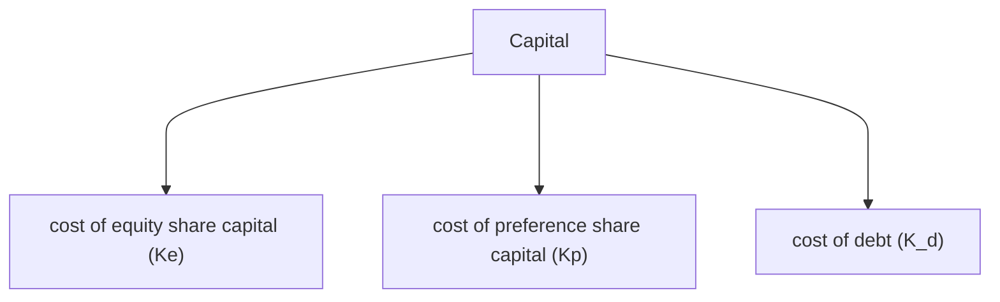
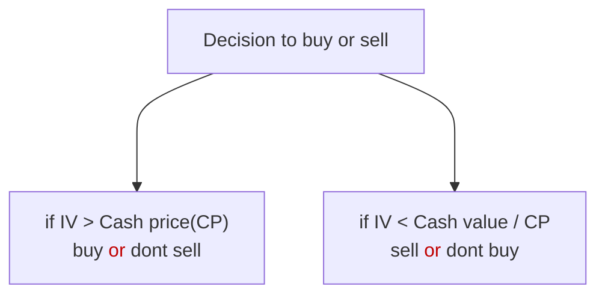
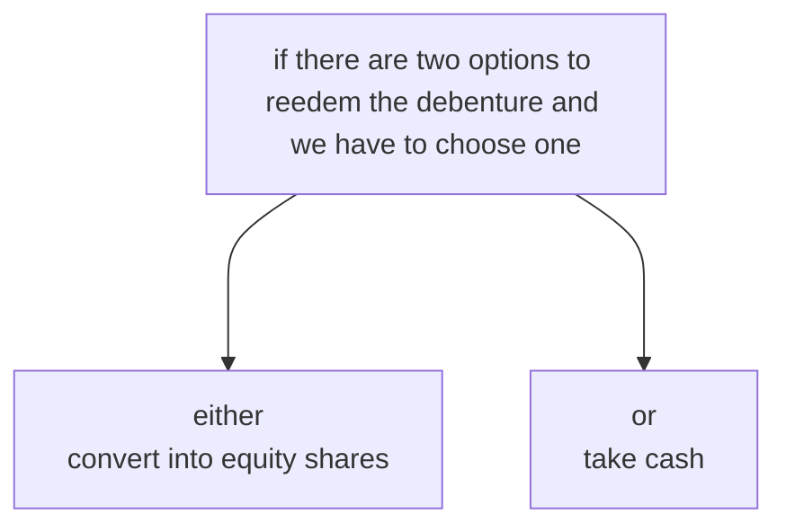
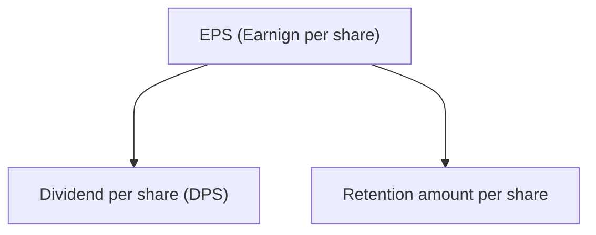

cost of capital = weighted(%) average of cost of various sources from which capital is raised

## Cost of Debt ($K_d$)

> cost of debt ($K_d$ ) = $\frac{Interest (1-t)}{P_o}$ 

where,
t = tax rate
$P_o$ = Net proceeds or market value/Issue price or Face value

Face value                                      xxx
$\begin{equation}\begin{cases}(+) Premium \\ or \\ (-) Discount\\\end{cases}\end{equation}\Biggl\}$                           <u>xxx</u>
Issue price/Market value               xxx
(-) Flotation cost on issue price     <u>xxx</u>
Net proceeds($P_{o}$)                           xxx

Interest is always on Face value of debenture
I = $x\%$ of fa ce value
t = $x\%$ of I
Discount & premium = $x\%$ of face value
Flotation cost = $x\%$ of issue price

> $$K_{d} \text{ of redeemable debt =} \frac{I(1-t) + \frac{RV - P_{o}}{n}}{\frac{RV + P_{o}}{2}}$$

-> If there is tax on capital gain

 > $$K_{d} \text{ of redeemable debt = } \frac{I(1-t) + \frac{RV - P_{o}}{n}(1-t_{x})}{\frac{RV + P_{o}}{2}}$$

<u>Zero coupon bond / Deep discount bond</u>
- No interest is paid on these securities
- These securities are issued at very huge discount
- These securities are redeemed at face value

*Above method is known as approx method of finding $K_{d}$*

<u>Yield(return) to maturity method (YTM)</u>

**Step-1:** Identify the net cash flow from the debt 
	CI = Cash Inflow = amount paid to investor
	CO = Cash outflow = amount received as debe ($P_o$ /NP)

**Step-2:** Calculate $K_{d}$ by using approximation method ( let $K_{d}$ = $x.y\%$ )

**Step-3:** Calculate Net Present Value (NPV) at $x\%$
	NPV = PVCI - PVCO
		=\[PV of interest + PV of redeemable value] - \[cost of security]

**Step-4:** Present value factor $\text{PVF  } \alpha \text{  }\frac{1}{(1+r)^n}$

**Step-5:** If NPV at $x\%$ (step-3) is +ve then increase the rate to (x+1)% so that NPV becomes -ve
or 
If NPV at $x\%$ (step-3) is -ve then decrease the rate to (x-1)% so that NPV becomes +ve

**Step-6:** Interpolate the 2 NPVs (-ve & +ve) to obtain cost of debt

>$$
K_{d} = \text{Lower rate } + \frac{\text{Lower rate NPV }}{\text{Lower rate NPV  - Higher rate NPV}}[\text{Higher rate - Lower rate}]
$$

<svg version="1.1" xmlns="http://www.w3.org/2000/svg" viewBox="0 0 675.8199768066406 196.99996948242188" width="675.8199768066406" height="196.99996948242188"><!-- svg-source:excalidraw --><metadata></metadata><defs></defs><rect x="0" y="0" width="675.8199768066406" height="196.99996948242188" fill="#ffffff"></rect><g stroke-linecap="round"><g transform="translate(48.399993896484375 95.60000610351562) rotate(0 292.8000030517578 0)"><path d="M-1.1 0.21 C96.5 0.17, 488.02 -0.59, 585.87 -0.8 M0.52 -0.73 C97.96 -0.59, 487.58 0.25, 585.07 0.32" stroke="#1e1e1e" stroke-width="2" fill="none"></path></g></g><mask></mask><g stroke-linecap="round"><g transform="translate(634 42.79998779296875) rotate(0 0 56.80000305175781)"><path d="M-0.44 1.17 C-0.59 20.3, 0.2 94.71, 0.18 113.59 M1.53 0.74 C1.14 20.17, -0.16 96.48, -0.68 115.12" stroke="#1e1e1e" stroke-width="2" fill="none"></path></g></g><mask></mask><g stroke-linecap="round"><g transform="translate(391.17511454532854 38.66956728552468) rotate(0 0 56.80000305175781)"><path d="M0.95 1.08 C0.92 19.9, -0.09 94.29, -0.04 113.06 M-0.02 0.6 C-0.21 19.57, -1.19 95.24, -1.01 114.31" stroke="#1e1e1e" stroke-width="2" fill="none"></path></g></g><mask></mask><g stroke-linecap="round"><g transform="translate(44.7751053900551 36.86957949255593) rotate(0 0 56.80000305175781)"><path d="M0.42 0.07 C0.07 18.83, -0.69 93.82, -0.95 112.62 M-0.81 -0.93 C-0.9 17.94, 0.93 94.52, 1.26 113.65" stroke="#1e1e1e" stroke-width="2" fill="none"></path></g></g><mask></mask><g transform="translate(39.59999084472656 14) rotate(0 12.789985656738281 12.5)"><text x="0" y="17.619999999999997" font-family="Excalifont, Xiaolai, sans-serif, Segoe UI Emoji" font-size="20px" fill="#1e1e1e" text-anchor="start" style="white-space: pre;" direction="ltr" dominant-baseline="alphabetic">LR</text></g><g transform="translate(383.9999694824219 18) rotate(0 11.779991149902344 12.5)"><text x="0" y="17.619999999999997" font-family="Excalifont, Xiaolai, sans-serif, Segoe UI Emoji" font-size="20px" fill="#1e1e1e" text-anchor="start" style="white-space: pre;" direction="ltr" dominant-baseline="alphabetic">Kd</text></g><g transform="translate(635.5999755859375 10) rotate(0 13.089988708496094 12.5)"><text x="0" y="17.619999999999997" font-family="Excalifont, Xiaolai, sans-serif, Segoe UI Emoji" font-size="20px" fill="#1e1e1e" text-anchor="start" style="white-space: pre;" direction="ltr" dominant-baseline="alphabetic">HR</text></g><g transform="translate(10 158) rotate(0 32.009979248046875 12.5)"><text x="0" y="17.619999999999997" font-family="Excalifont, Xiaolai, sans-serif, Segoe UI Emoji" font-size="20px" fill="#1e1e1e" text-anchor="start" style="white-space: pre;" direction="ltr" dominant-baseline="alphabetic">LRNPV</text></g><g transform="translate(358 158.19998168945312) rotate(0 31.35999298095703 12.5)"><text x="0" y="17.619999999999997" font-family="Excalifont, Xiaolai, sans-serif, Segoe UI Emoji" font-size="20px" fill="#1e1e1e" text-anchor="start" style="white-space: pre;" direction="ltr" dominant-baseline="alphabetic">NPV=0</text></g><g transform="translate(601.2000122070312 161.99996948242188) rotate(0 32.30998229980469 12.5)"><text x="0" y="17.619999999999997" font-family="Excalifont, Xiaolai, sans-serif, Segoe UI Emoji" font-size="20px" fill="#1e1e1e" text-anchor="start" style="white-space: pre;" direction="ltr" dominant-baseline="alphabetic">HRNPV</text></g><g transform="translate(182.79998779296875 65.20001220703125) rotate(0 22.319992065429688 12.5)"><text x="0" y="17.619999999999997" font-family="Excalifont, Xiaolai, sans-serif, Segoe UI Emoji" font-size="20px" fill="#1971c2" text-anchor="start" style="white-space: pre;" direction="ltr" dominant-baseline="alphabetic">60%</text></g><g transform="translate(495.60003662109375 66.00003051757812) rotate(0 21.769996643066406 12.5)"><text x="0" y="17.619999999999997" font-family="Excalifont, Xiaolai, sans-serif, Segoe UI Emoji" font-size="20px" fill="#1971c2" text-anchor="start" style="white-space: pre;" direction="ltr" dominant-baseline="alphabetic">40%</text></g></svg>

[Q6]{ch-1, lec-5} SK ltd. issued 10,00,000 , 10% debentures of face value 100 each, which are redeemable after 10 years. Current market price of debenture is 120 and flotation cost of 4% . If income tax rate is at 30% compute cost of debenture using YTM method 
\[note: take 3 digit after decimal]
(use YTM in amortizable debt)
Ans: 5.03%

<u>To find intrinsic value</u>

Intrinsic value = Present value of future cash inflows(PVCI)

<u>Convertible debenture</u>

Then choose whichever has higher value [Q]{lec-6,Q.no.11}

## Cost of preference share capital
- pay preference dividend to them
- Preference dividend is paid on face value ( i.e. PD = $x\%$ of FV)
	- it is appropriation of profit
	- it is paid after tax deduction (i.e. no tax saving)

<strong>method A :</strong> Approximation method 
1. Irredeemable preference share capital (PSC)
$K_{p} = \frac{\text{Preference dividend }} {\text{Net proceeds}}$

>or,  $K_{p} = \frac{\text{PD }} {P_o}$

2. Redeemable preference share capital (PSC)

> $$K_{p}  = \frac{ PD + \frac{RV - P_{o}}{n}}{\frac{RV + P_{o}}{2}}$$

**Method B :** YTM method

**Step-1** Find cashflow 
	- Preference dividend (PD)
	- Redeemable value (RV)

**Step-2** Find $K_{p}$ using approx method ( let $K_{p}$ = $x.y\%$ )

**Step-3** Find Net Present Value (NPV) at $x\%$
	NPV = PVCI - PVCO
		= \[ PD $\times$ $PVAF_{(r,n)}$] + \[ RV $\times$ $PVF_{(r,n)}$ ] - PVCO

**Step-4** If NPV at $x\%$ (step-3) is ==+ve== then ==increase the rate== so that NPV becomes -ve
or 
If NPV at $x\%$ (step-3) is ==-ve== then ==decrease== the rate so that NPV becomes +ve

**Step-5** Interpolate 

>$$
K_{p} = \text{Lower rate } + \frac{\text{Lower rate NPV }}{\text{Lower rate NPV  - Higher rate NPV}}[\text{Higher rate - Lower rate}]
$$

<u>Income Statement</u> ( #income_statement  )

` `Sales
<u>(-) Variable cost</u>
` `contribution
<u>(-) Fixed cost</u>
` `EBIT (operating cost)
<u>(-) Interest</u>
` `EBT
<u>(-) Tax</u>
` `EAT
<u>(-) Preference dividend</u>
` `EAE (earning available for equity)
$\div$ <u>no of equity share</u>
` `EPS (Earning per share)

## Cost of Equity
- Pay dividend to them
- Dividend is paid on face value ( D = $x\%$ of FV)
- Dividend is approximation of profit
- No tax saving on dividend 
- Amount of dividend may change or may remain same every year according to decision of company 
- $K_{e}$ = capitalization rate = rate of return of the security

**Method A :** Dividend approach (no growth in dividend)
> $$K_{e} = \frac{\text{D}} {P_o} = \frac{\text{dividned }}{\text{Net proceeds}}$$

**Method B :** Earning approach (no growth in earning)
> $$K_{e} = \frac{\text{EPS}} {P_o} = \frac{\text{ Earning per share }}{\text{Net proceeds}}$$

**Method C :**
> $$K_{e} = \frac{D_{1}} {P_o} + g$$

where,
g = growth rate = b $\times$ R

b = retention ratio
	= % not distributed by company 
	= 100 - dividend payout ratio
	= 100 - $\left( \frac{DPS}{EPS} \times 100 \right)$

**Method D :** Earning growth method (constant growth in earning)
> $$K_{e} = \frac{EPS_{1}} {P_o} + g$$

where,
g = growth on old retention ratio
$D_{1}$ = next expected dividend
D = current dividend
	= EPS $\times$ dividend pay out ratio
$EPS_{1}$ = next expected EPS = $EPS_{0}(1+g)$

<u>Risk</u>
**Systematic Risk**
- It is generated out of the system and affects all in the economy
- It is unavoidable in nature
- It is calculated through Beta ($\beta$)

**Unsystematic risk**
- It arise out of a particular group or organization 
- It is avoidable in in nature by using diversification of investment

Beta($\beta$) = It is a measure of systematic risk
$$\beta = \frac{\text{Standard deviation of stock}}{\text{ standard deviation of market}} \times \text{correlation coefficient}$$
$$\beta = \frac{\text{SD of Stock}}{\text{ SD of market}} \times \text{r}$$
$$\beta = \frac{\text{Percentage change in share price}}{\text{ Percentage change in market price}}$$

<u>Case I</u>
- If $\beta = 1.2$ (aggressive investment, $\beta > 1$) then,
- If market increase by 10% , share price increases by 12%

<u>Case II</u>
- If $\beta = 1$ (aggressive investment, $\beta = 1$) then,
- If market increase by 10% , share price increases by 10%

<u>Case I</u>
- If $\beta = 0.9$ (aggressive investment, $\beta < 1$) then,
- If market increase by 10% , share price increases by 9%

<u>Note</u>
$\beta$ of market = 1
$\beta$ of government securities = 0

**Method E :** Capital asset pricing model (CAPM)
>$k_{e} = R_{f} + (R_{m} - R_{f}) \beta$

where, 
$R_{f}$ = Risk free rate of return
	eg: government securities, T-bills, Treasury bills
$R_{m}$ = market rate of return
$R_{m} - R_{f}$ = Risk premium / market risk premium
$\beta$ = beta coefficient
	= volatility of securities return relative to the return of a board based market portfolio

**Method F :** Realized yield method

Realized => past period return generated 
yield => return on basis of market price

$P(1+r) = D_{1} + P_{1}$
$P(1+r) = \frac{{D_{1} + (P_{1} - P_{0})}}{p_{0}}$

> $$\therefore \text{rate of return} = \frac{\text{Dividend} + \text{capital appreciation}}{\text{investment}}$$

or
In case of more than 1 year

Step-1 Find (1+r) for different years as follows

for year 1 $\Rightarrow$ $1 + r_{1} = \frac{D_{1} + P_{1}}{P_{0}}$
for year 2 $\Rightarrow$ $1 + r_{2} = \frac{D_{2} + P_{2}}{P_{1}}$
for year 1 $\Rightarrow$ $1 + r_{3} = \frac{D_{3} + P_{3}}{P_{2}}$
and so on

step - 2 geometric mean of above rates is $K_{e}$
>$$K_{e} = [(1+r_{1})(1+r_{2})(1+r_{3}\dots(1+r_{n}))]^{\frac{1}{n}}-1$$

or,
In case only dividend of begining and end year is given
then,
>$K_{e}$ is calculated by using YTM method

## Cost of retained earning

- It is the amount other than Equity share capital at book value also known as Reserves and surplus (R&S)
- Retained Earning are not free of cost
- Amount of retained earning belong to Equity shareholder
- So generally, Equity shareholder will ask some return on retained earning as of equity
>i.e $K_{r} = K_{e}$

- Retained earning can't be issued in the market thus NP is not available for it. 
- Market value of retained earning is included in the market price of equity share.

1. If there is no flotation cost
i.e. NP cannot be calculated 
>$K_{r} = K_{e} \Rightarrow \frac{D_{1}}{MP/FV} = \frac{D_{1}}{MP/FV}$

2. If there is flotation cost 
i.e. NP can be calculated 
>$K_{r} \neq K_{e} \Rightarrow \frac{D_{1}}{MP/FV} \neq \frac{D_{1}}{MP/FV}$
>
>using opportunity cost view
>$K_{r} = K_{e} (1-t_{p})(1-B)$
>or
>$= K_{e} (1-t_{p})-B$

where, 
$K_{e}$ = Cost of Equity
$t_{p}$ = Personal tax
B = Brokerage (can be ignored if not provided in question)

>$\text{market value / market price} = \text{Retained earning/R\&S} + \text{Book value / ESC with capital appriciation}$

## Weighted average cost of capital (WACC or Ke)

- Capital in a business can be raised from various sources
- Weighted average of cost of all sources taken together is called overall cost of capital ($K_{o}$)
>$K_{o} = (K_{e} \times W_{e}) + (K_{d} \times W_{d}) + (K_{p} \times W_{p}) + (K_{r} \times W_{r})$

- Flotation cost are not to be considered for calculating market value weights
- Term loan does not have market value. If its market value is required, then consider book value as market value.
- Use market value for weight instead of book value, If nothing is mentioned in question.
- We will always use ex-dividend or  ex-interest values. If provides data as cum-dividen/cum-interest values then convert them into X values using
Ex-dividend = Cum-dividend - dividend amount Ex-interest = Cum-interest - interest amount
- Market value of an equity shares represents value towards face value and R&S.
- if $K_{r} \neq K_{e}$ , then distribute the total market value between face value and reserve & surplus in the ratio of their book value.

## Weighted marginal cost of capital

It is the cost of additional capital.

>$\text{Existing Capital + Additional capital = Total capital}$
$\therefore \text{WACC + WMCC = WACC}$
$i.e. 50l + 20l = 70l$

Breaking point: It is the level of total capital at which a particular source gets exhausted.

