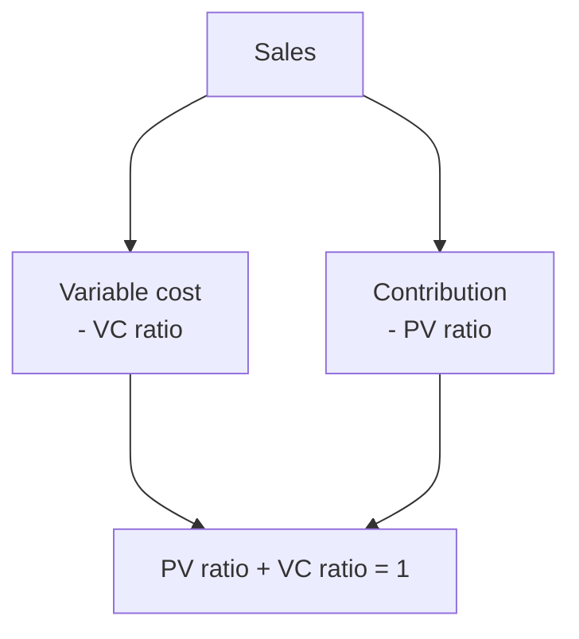
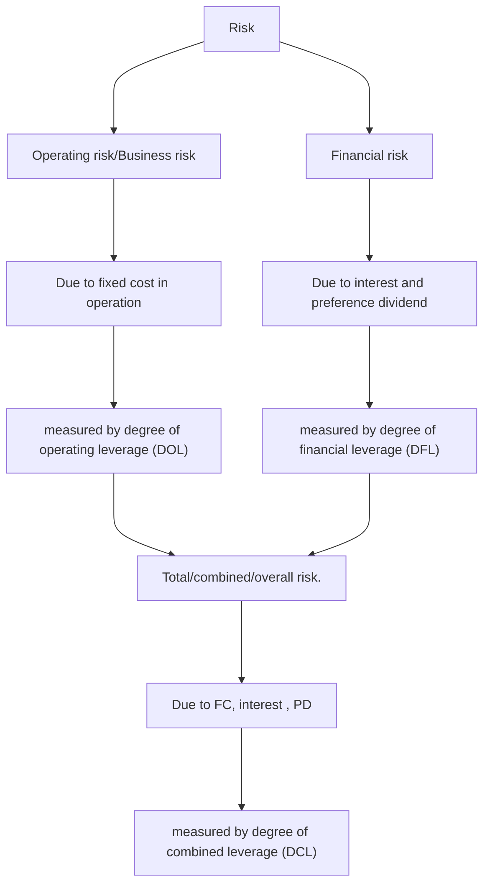
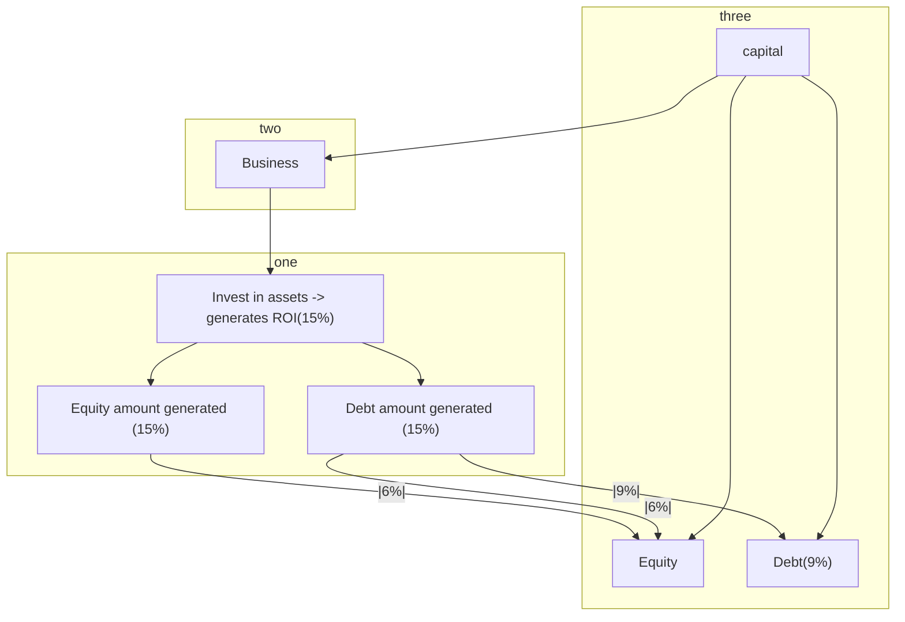

<u>Income statement</u> ( #income_statement )

$$
\begin{equation}
\begin{cases}
DCL = DOL \times DFL   \\
= \frac{\text{contribution}}{EBT - \frac{PD}{(1-t)}}  \\
= \frac{\%\Delta EPS}{\%\Delta sales}

\begin{cases}  
DOL = \frac{\%\Delta EBIT}{\%\Delta sales} 

 \begin{cases} 
\textbf{Particulars} \\
 \text{ Sales} \\
\underline{\text{(-)VC}} \Rightarrow \text{VC ratio} = \frac{VC}{Sales} \\
\text{ contribution} \Rightarrow \text{PV ratio} = \frac{\text{contribution}}{Sales} \times 100\%  \\
\underline{\text{(-)FC, (Lever)}} \Rightarrow DOL = \frac{\text{contribution}}{EBIT} \\
\text{ EBIT / operating cost}

\end{cases} \\

DFL = \frac{\%\Delta EPS}{\%\Delta sales} 

\begin{cases}  
\underline{\text{(-)Interest (Lever,)}} DFL = \frac{EBIT}{EBT} \\
\text{ EBT} \\
\underline{\text{(-) Tax}} \\
\text{ EAT} \\
\underline{\text{(-)PD  (lever)}} \Rightarrow DFL= \frac{\text{EBIT}}{EBT - \frac{PD}{(1-t)}} \\
\text{ EAE} \\
\underline{\div \text{no. of shares}} \\
\text{ EPS}
\end{cases}  \\

\end{cases}

\end{cases}
\end{equation}
$$

Note:
$\text{Profit volume ratio (PV ratio)} = \frac{\text{Contribution}}{\text{Sales}}\times 100\%$
$\text{Variable cost ratio (VC ratio)} = \frac{\text{Variable cost (VC)}}{\text{Sales}}\times 100\%$




$$\text{Return on equity} = \frac{\text{Earning available for equity}}{\text{Equity share capital}}$$
$$\text{ROE} = \frac{\text{EAE}}{\text{ESC}}$$


$$\text{Return on Shareholder fund} = \frac{\text{Earning after tax}}{\text{Equity share capital + Preference share capital}}$$
$$\text{ROSHF} = \frac{\text{EAT}}{\text{ESC + PSC}}$$


$$\text{Return on Capital employeed \\ Return on Investment} = \frac{\text{Earning available for equity}}{\text{Equity share capital}}$$
$$\text{ROI} = \frac{\text{EBIT}}{\text{ESC + PSC + Debt}}$$


$$\text{Assets turnover ratio} = \frac{\text{Sales}}{\text{Total assets}} = \frac{\text{Sales}}{\text{Total liability}}$$

$$\text{Capital turnover ratio} = \frac{\text{Sales}}{\text{Total capital}}$$





1. **Operating leverage :**
	It measures the firm's ability to use it's Fixed cost to magnify it's effect of change in sale on EBIT.
2. **Financial leverage :** 
	It measured the firm's ability to use fixed financial burden \[interest and preference dividend] to magnify the effect of change in EBIT on EPS.
3. **Combined leverage :** 
	It measures the firm's ability to use it's Fixed cost and financial burden to magnify it's effect of change in sale on EPS.
*Higher leverage indicates high level of that particular risk and vice-versa*

## operating break even point
It is that level of sale at which there is neither any profit nor any loss.

i.e. EBIT = o
or, contribution - FC = 0
$\therefore$  contribution = FC
--- start-multi-column: ID_v3gv
```column-settings
Number of Columns: 2
Largest Column: standard
```

contribution = FC
no. of units sold x contribution per unit = FC
or, no of units sold = $\frac{FC}{\text{contribution per unit}}$
$\therefore \text{BEP}_{units} = \frac{FC}{\text{contribution PU}}$


--- column-break ---

contribution = FC
$\frac{sales}{sales}$ x contribution per unit = FC
sales x PV. ratio = FC
or, Sales = $\frac{FC}{\text{PV.ratio}}$
$\therefore \text{BEP}_{sales} = \frac{FC}{\text{PV.ratio}} = \text{BEP}_{units} \times \text{selling price PU}$


--- end-multi-column
$\therefore \text{ FC } \alpha \text{ operating BEP } \alpha \text{ DOL }$

## Margin of Safety (MOS)
value of sales which is over and above the breakeven point sales


$$
\text{MOS ratio / percentage of MOS}
 \begin{cases} 
= \frac{MOS}{sales} \\
= \frac{\text{Sales - BES}}{sales} \times \frac{\text{PV.ratio}}{\text{PV.ratio}} \\
= \frac{{\text{sales} \times \text{PV.ratio} - \text{BES} \times \text{PV.ratio} }}{Sales \times PV.ratio} \\
= \frac{{\text{sales} \times \frac{\text{contribution}}{sales} - \text{BES} \times \frac{\text{FC}}{BES} }}{Sales \times \frac{\text{contribution}}{sales} } \\
\therefore \frac{\text{contribution}}{sales} = \frac{FC}{BES} = \text{PV.ratio} \\ 
\frac{\text{Contribution - FC }}{contribution}\\ 
\frac{\text{ EBIT }}{contribution} \\
\frac{1}{ \frac{\text{ contribution }}{EBIT} } \\

 = \frac{1}{DOL}

\end{cases} \\
$$


## Financial breakeven point
It is the level of EBIT at which EPS is zero.
In other words, it is the value of EBIT at which company is able to recover interest and PD
i.e. EPS = 0
$$or, \frac{[(\text{EBIT - Interest})(1-t)]-PD}{\text{no.of equity share}} = 0$$
$$ \therefore EBIT = \text{Interest} + \frac{PD}{(1-t)}$$
$$ \therefore \text{Financial BEP} = \text{Interest} + \frac{PD}{(1-t)}$$
$$ \therefore \text{ fixed financial cost } \alpha \text{ Financial BEP } \alpha \text{ DFL } $$

## Overall breakeven point
It is the level of sales at which EPS is zero.
$$\therefore \text{ contribution } = \text{FC + Interest} + \frac{PD}{(1-t)}$$
$$or, \frac{sales}{sales} \times \text{ contribution } = \text{FC + Interest} + \frac{PD}{(1-t)}$$
$$or, {sales } = \frac{\text{ FC + Interest} + \frac{PD}{(1-t)}}{\text{PV.ratio}}$$
$$or, \text{BEP}_{(sales)} = \frac{\text{ FC + Interest} + \frac{PD}{(1-t)}}{\text{PV.ratio}}$$
$$ \text{ contribution PU } \times \text{no.of units sold } = \text{FC + Interest} + \frac{PD}{(1-t)}$$
$$or,  \text{no.of units sold } = \frac{\text{ FC + Interest} + \frac{PD}{(1-t)}}{\text{contribution per unit}}$$
$$ \therefore \text{ BEP}_{(units)} = \frac{\text{ FC + Interest} + \frac{PD}{(1-t)}}{\text{Contribution PU}}$$


## Trading on equity




$\therefore$ Higher ROI gives higher advantage of trading on equity . If DFL is in Favour

<u>DCL analysis</u>

| <u></u><u>DOL</u> | <u>DFL</u> | <u>Result</u>                                         |
| ----------------- | ---------- | ----------------------------------------------------- |
| low               | low        | low risk                                              |
| high              | high       | high risk                                             |
| high              | low        | moderate risk but low advantage of trading equity     |
| low               | high       | moderate risk but high advantage of trading on equity |

