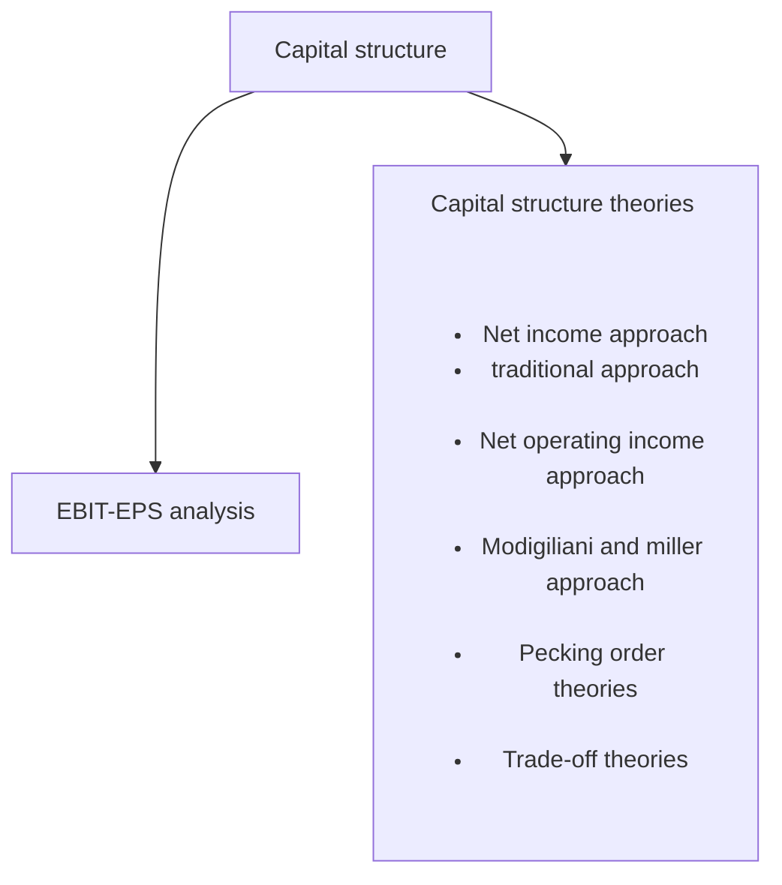
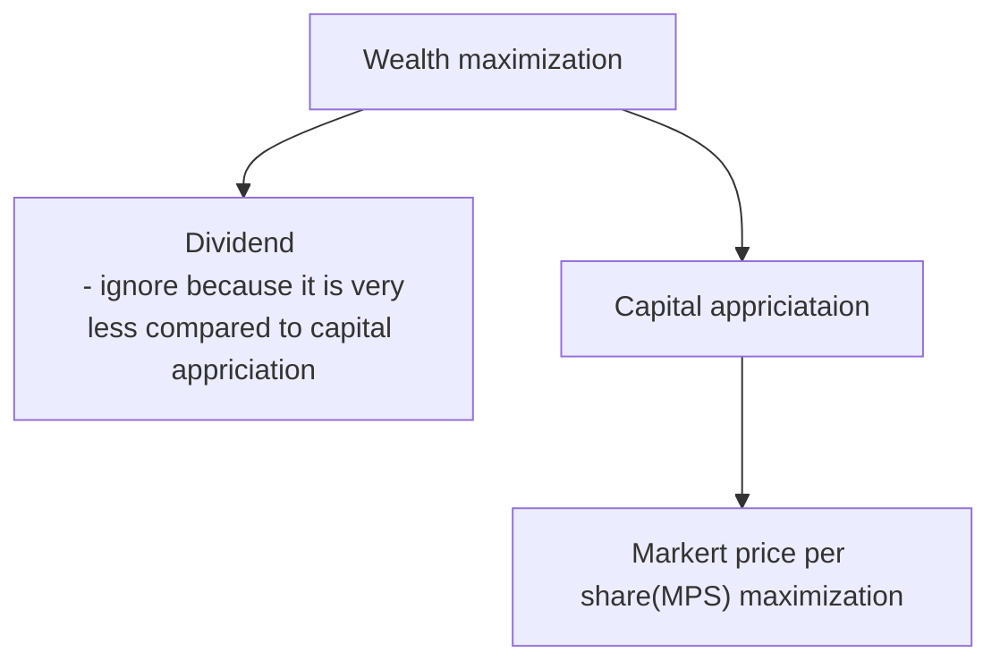

> Problem: what should be best/optimum mix of capital 

solution:

- Business collect capital from ESC, PSC and debt 
- Equity shareholders are the ultimate owners
- All decisions will be from point of view fo equity share holders
- Objective of equity shareholder is 
