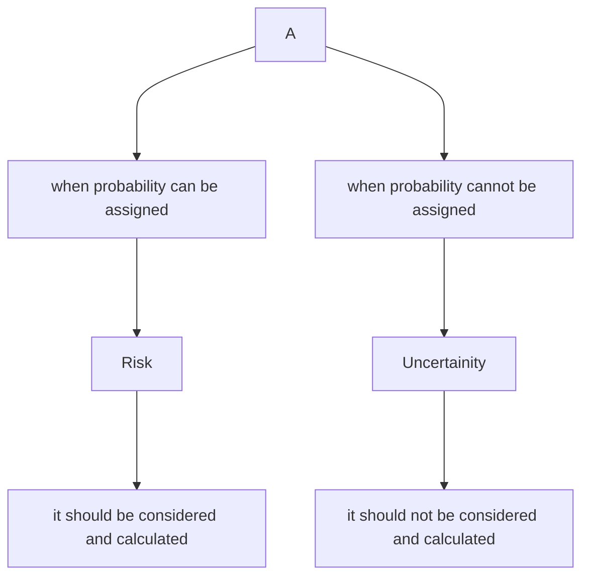

## Techniques used for Risk analysis

<table><tr><td rowspan="1" colspan="3" style="text-align : center">Techniques used for Risk analysis</td></tr><tr><td><strong>Statistical Techniques</strong></td><td><strong>Conventional technique</strong></td><td><strong>Other techniques</strong></td></tr><tr><td>Probability approach</td><td>Certainty equivalent approach</td><td>Sensitivity analysis</td></tr><tr><td>Variance & Standard deviation</td><td>Risk adjusted discount rate approach</td><td>Scenario analysis</td></tr><tr><td>Coefficient of variation</td><td></td><td></td></tr></table>

### Statistical Techniques

#### Probability approach

- In this case we will consider probability to calculate expected cash flows which in turn will be used to calculate expected NPV.
- Expected net cash flows of a year (ENCF) = $(CF_{1} \times P_{1}) +(CF_{2} \times P_{2}) + (CF_{3} \times P_{3}) + \dots + (CF_{n} \times P_{n})$
- Expected NPV = $(ENCF_{1} \times PVF_{1}) + (ENCF_{2} \times PVF_{2}) + \dots (ENCF_{n} \times PVF_{n})$

#### Variance & standard deviation

- This amount reflects the expected deviation from the mean(or average) amount
- variance ($\delta^2$) = $(X_{1}- \overline{X} )^2 (P_{1}) + (X_{2}- \overline{X} )^2 (P_{2}) + \dots (X_{n}- \overline{X} )^2 (P_{n})$
- Standard deviation ($\delta$) = $\sqrt{ \text{Variance} }$
- where , $\overline{X}$ = Mean value = $\sum \times P$

#### Coefficient of variation

- It measures the variation in relative terms
- COV = $\frac{SD}{\over{X}} \times 100$
- Higher the value of variation/standard deviation / COV, 
  higher will be the risk of project and vice-versa

### Conventional Techniques

#### Certainty equivalent approach (CE)
- in this case, cash flows are adjusted for the risk involved buy multiplying the cash flows with certainty equivalent (CE) factors
- in this case discount rate will not be adjusted for any project i.e. all projects will have same discount rate.
`Q6`
#### Risk adjusted discount rate approach (RADR)
- in this case, cash flows are not to be adjusted
- in this case, discount rate will be adjusted for the risk involved in a project i.e. different projects will have different discount rates.
- RADR = Risk free rate + Risk premium 
`Q5`
### Other Techniques

#### Sensitivity analysis
- in this case, we change the certain assumptions through "what if" type of questions 
- in this case, we try to analyze the impact of various factors which can bring NPV to 0 
`Q10`
`Q7`
#### Scenario analysis
- it overcomes the problem (only one factor is considered at a time) of sensitivity analysis
- it answers the question about "how bad" the project could look like
- it established worst and best scenario so that wide range of outcomes can be considered
`Q8`