# Chapter 1 : introduction

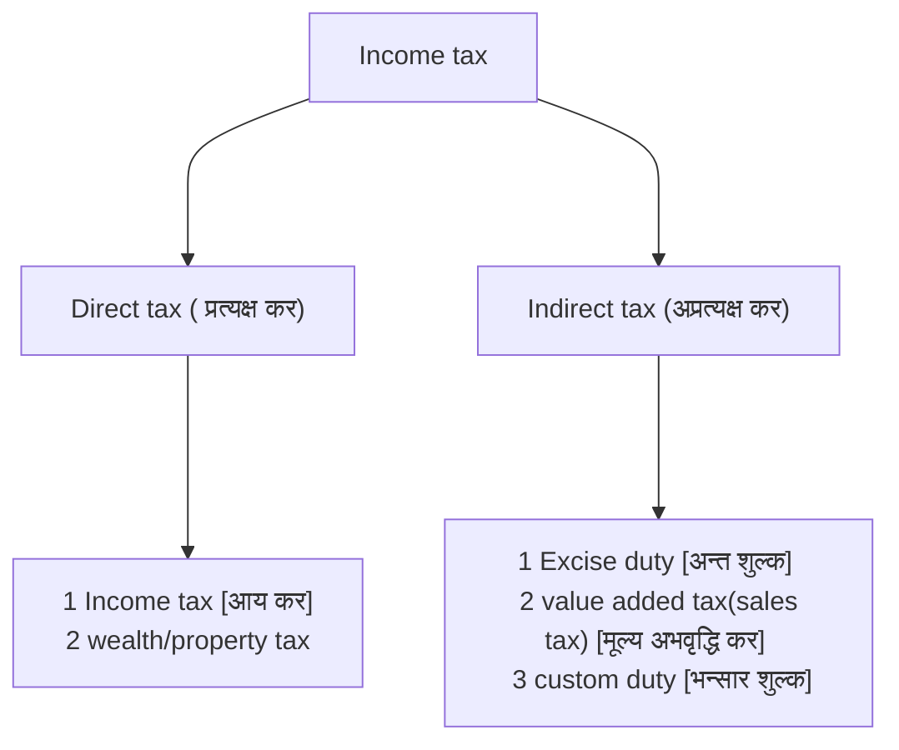

**Mechanism of VAT**

![[Pasted image 20250905060518.png]]

![[Pasted image 20250905071312.png]]


**Regulatory departments**
1. Inland Revenue department (IRD)
	- Income tax
	- VAT
	- Excise duty
2.  Custom Department
	- custom duty


**Sources of income**
1. Business
2. Employment
3. Investment
4. Windfall/casual gain

**Income tax rates**

<u>For natural person</u>

![[Income tax act 2002(2058)#IT act Schedule-1 sec-1 1]]


<u>For entity</u> : 25%

![[Sources of tax laws.png]]

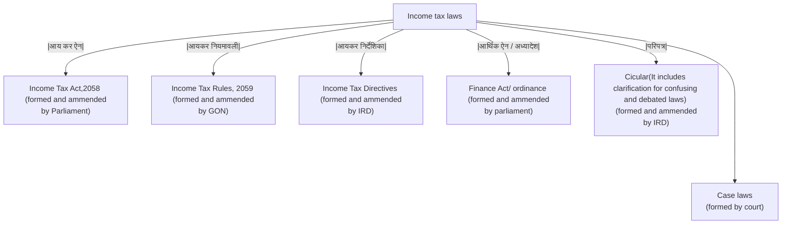

[Note]{If finance Act is signed by president without passing through parliament due to some emergency or other reason then it is known as ordinance }
Bill : विधायक
Preamble: प्रस्तावना => why act is made
Generally => amendment in direct tax is applied from 1st shrawan , and
		=> amendment in indirect tax is applied immediately


### Definition of a person


![[person definition png.png|697]]

![[Income tax act 2002(2058)#^3n7b48]]

![[Income tax act 2002(2058)#^kuq931]]

![[Income tax act 2002(2058)#^kcffu1]]

> [!note] mnemonics 
> ==partnerships== ==trust== their ==company== but ==government== allies with ==foreign government or its political subdivision== and make a ==public international organization via treaty== and also support ==foreign permanent establishment of non-residents==


# Chapter 2: Residential status and Assessable income
### Residential status
note : resident $\neq$ citizen

1. Natural person is resident if 
	1. Habitual /Normal place of abode is in Nepal =>where major economic activities are situated => जहाँ पैसा कमाउँछ  or,
	2. S/he is present in Nepal for $\geq$ 183 days during the income year or,
		note
		- आएको र गएको both count गर्ने
		- route/transit count नगर्ने 
		- if Qn is silent => 1 month = 30 days
	3. Deputed abroad by GON: eg: Nepali ambassador from foreign country
	note:
	- Residential status of proprietorship => same as that of proprietor
	- Residential status of couple => Always resident

2. partnership firm
	Resident if registered/working in Nepal

3. Trust
	Resident if 
	- established in Nepal or,
	- the trustee is resident in Nepal during the income year or,
	- if it is controlled by resident person(s) directly or through [[Income Tax#(Interposed control|interposed entities]] 

4. Company/ Entity of foreign government or its political sub-division
	- Established in Nepal
	- Place of effective management is in Nepal 

5. Government (central /state/ local) <br> public international organization established by treaty <br> Foreign PE of non- resident situated in Nepal

#### meaning: 

##### **control**
ownership(equity/capital): resident person owns $\geq$ 50% 
Income: $\geq$ 50% of company income is taken by resident person 
voting right:  $\geq$ 50% of company's voting right belongs to resident person

##### **Interposed control**
direct control: A ltd control PQR trust
interposed control: A ltd control B ltd . B ltd control PQR trust
only if control is $\geq$ 50%
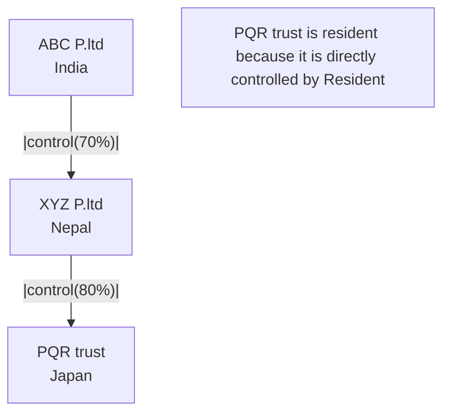

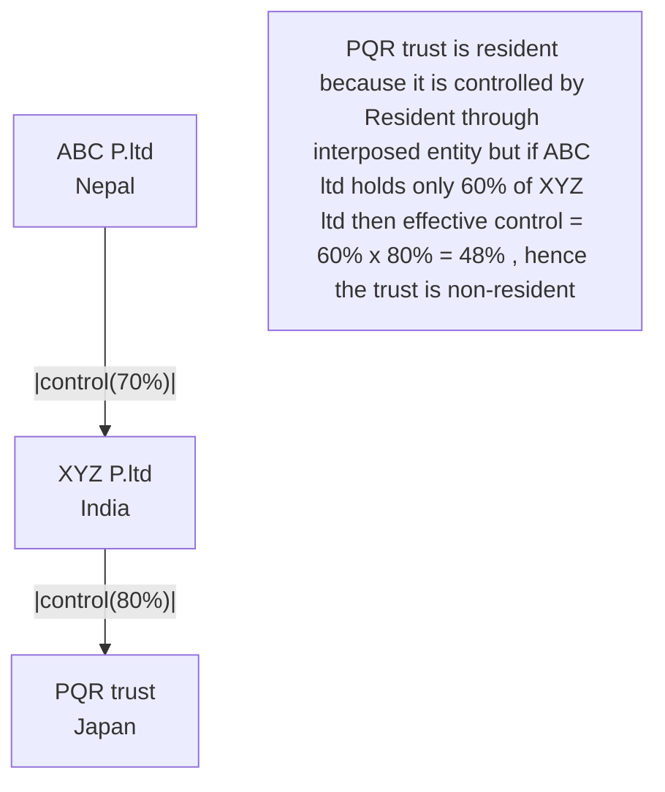

##### Effective place of management
The place of effective management generally refers to a place where the ==head and brain== is situated. It means it's a place where the directing power is situated. Thus, it's a place where major decision regarding policy, finance, disposal, profit and other vital things concerning it's management are taken from => ==जहाँ धेरै meeting हुन्छ==


### Assessable income 
[[Income tax act 2002(2058)#(IT act section 6) Assessable income]]
Income earned by 
1. Resident person =>irrespective of its source ( जहाँ पैसा कमाए पनि)
2. Non resident person => only if source is in Nepal (Nepal मा पैसा कमाए मात्र Nepal मा tax लाग्छ )

### Payment of tax 
[[Income tax act 2002(2058)#(IT act) Payment of income tax by installment]]

1. Advance tax 
	
| Due date | % of tax to be paid |
| -------- | ------------------- |
| poush    | 40%                 |
| chaitra  | 70%                 |
| Asadh    | 100%                |
	Except for [[Income tax act 2002(2058)#(IT act) Calculation of tax and tax rates|section4(4)]]
	Based on estimated income

2. Final tax 
	-  to be paid after finalization of income \[Due date → असोज end] =>Extension लिन पाईदैन
	- Return( विवरण ) file गर्ने
		- Income, expense, tax etc ko विवरण भर्ने  \[Due date → असोज end] => extension लिन पाईन्छ (up to पौष end)

3. withholding tax (TDS)
	- जस्ले payment गर्दछ उसले नै tax काटेर बुझैदिन्छ


Interest u/s 118 [[Income tax act 2002(2058)#(IT act section 118) Interest for understanding estimated tax payable by installment]]

| Due date | Advance tax to be paid (A) | 90% of A (B) | Tax paid in advance (C) | Difference (B-C) | interest |
| -------- | -------------------------- | ------------ | ----------------------- | ---------------- | -------- |
|          |                            |              |                         |                  |          |
Interest u/s 119 
![[Income tax act 2002(2058)#(IT act section 119) Interest for failure to pay tax]] 

![[Income tax act 2002(2058)#^wt1fnt]]


fee under sec 117: Return ढिलो तिरे बापत को  => 0.1% pa of sales ले fee लाग्छ 
![[Income tax act 2002(2058)#(IT act section 117) Penalty for failure to maintain documentation or file statements or return of income]] 


### Questions

>[!tip] How to write answer for case study
> 1. Provision
> 2. Given case
> 3. conclusion

 

> [!note] memorize
> sec 2(aab) :  Permanent establishment
> sec 2(ao) : Residential status
> You can write only the relevant point out of the four points given below
> generally july 14/15/16/17 lies on 31st asadh 


> Q.1 page: 2.9 (Hint)
> Answer: 
> As per section 2(aab) of Income Tax Act, 2058; Permanent establishment means a place where a person conducts business (fully/partly) and also includes a place where 
> - A person conducts business through agent (other than general agent; acting in independent manner) or,
> - main equipment, machinery of a person is kept, used or installed Or,
> - A person provides professional consultancy or technical service for more than 90 days in last 12 months or, 
> - A person provides construction, assembly, establishment project services or where its supervision activities are conducted for more than 90 days
> 
> In the given case, international consultancy group, New York \[ICGN] has provided consultancy services through out the year by deploying at least 2 employees . It means it has provided services for more than 90 days in last 12 months 
> Since, the consultancy services has been provided for more than 90 days in last 12 months , ICGN is said to haave permanent establishment in Nepal.
> 
> Since, it's a permanent establishment of a non-resident person, it's classified as a resident person. Thus it has to obtain PAN certificate from Inland Revenue Department (IRD).
> If it's registered in VAT, Bottlers Nepal lid is required to withhold tax @1.5%(advance). Otherwise, tax shall be withheld @15%


> Q.2a page: 2.9 (Hint)
> Answer: 
> As per section 2(aab) of Income Tax Act, 2058; Permanent establishment means a place where a person conducts business (fully/partly) and also includes a place where 
> - A person conducts business through agent (other than general agent; acting in independent manner) or,
> - main equipment, machinery of a person is kept, used or installed Or,
> - A person provides professional consultancy or technical service for more than 90 days in last 12 months or, 
> - A person provides construction, assembly, establishment project services or where its supervision activities are conducted for more than 90 days
> 
> In the given case, AMCO sports private limited has been appointed as a distributor for selling goods in Nepal by American sports Inc.
> Here, AMCO sports pvt.ltd is selling goods by determining price on its won. There's no ownership , restriction, special assistance from American co. on sales price and prospective customer
> It means AMCO sports private limited is functioning in an independent manner. Thus, it's general agent. Hence, American company can't be said to have permanent establishment in Nepal


> Q.2b page: 2.9 (Hint)
> Answer: 
> As per section 2(aab) of Income Tax Act, 2058; Permanent establishment means a place where a person conducts business (fully/partly) and also includes a place where 
> - A person conducts business through agent (other than general agent; acting in independent manner) or,
> - main equipment, machinery of a person is kept, used or installed Or,
> - A person provides professional consultancy or technical service for more than 90 days in last 12 months or, 
> - A person provides construction, assembly, establishment project services or where its supervision activities are conducted for more than 90 days
> 
> In the given case, American Sports Inc. has provided technical/consultancy services for 
> - 35 days in January
> - 30 days in July
> - <u>60 days in December</u>
> - 125 days in total
> Since , the company has provided services for more than 90days in last 12 months , the company is said to have permanent establishment in Nepal . The fact that the service are provided in 2 income years, does not change the answer.


> Q.2c page: 2.9 (Hint)
> Answer: 
> As per section 2(aab) of Income Tax Act, 2058; Permanent establishment means a place where a person conducts business (fully/partly) and also includes a place where 
> - A person conducts business through agent (other than general agent; acting in independent manner) or,
> - main equipment, machinery of a person is kept, used or installed Or,
> - A person provides professional consultancy or technical service for more than 90 days in last 12 months or, 
> - A person provides construction, assembly, establishment project services or where its supervision activities are conducted for more than 90 days
> 
> In the given case, the services has been provided for less than 90 days as the task was completed within 90 days
> Since, it has provided service for less than 90 days, singapore construction co. can't be said to have permanent establishment in Nepal


> Q.3 page: 2.9 (Hint)
> Answer: 
> As per section 2(ao) of Income Tax Act, 2058; a natural person is said to be resident of Nepal if any of the following conditions are satisfied;
> 1. His/her normal place fo abode is in Nepal. or,
> 2. He/she stays in Nepal for $\geq$ 183 days during the income year.or,
> 3. He/she is deputed abroad by GON
> 
> In the given case, R has major business at USA. It means his place of abode is not in Nepal
> Further, he is not deputed abroad by government of Nepal.
> His stays in Nepal can be calculated as 
> <u>For income year 2079-80</u>
> Baisakh 1, 2080 to Jestha 25, 2080       56 days
> 
> <u>For income year 2080-81</u>
> Ashwin 01,2080 to ashwin 15,2080        15 days
> Marga 10,2080 to Paush 29,2080            50 days
> Falgun 06,2080 to Baishak 10,2081         63 days
> Ashad 06,2081 to Asadh 26,2081            <u>21 days</u>
> total                                                         149 days
> 
> It means he has stayed in Nepal for less than 183 days in both the income year. 
> since, none of the conditions are satisfied. Mr. R is said to be non-resident in both the income year.
><u>note</u>
>As per income tax manual, the computation of 183 days has been made considering his stays during the income year
>Alternatively, it may be made by considering his stays during last 365 days
 

> Q.4 page: 2.9 (Hint)
> Answer: 
> As per section 2(ao) of Income Tax Act, 2058; a natural person is said to be resident of Nepal if any of the following conditions are satisfied;
> 1. His/her normal place fo abode is in Nepal. or,
> 2. He/she stays in Nepal for $\geq$ 183 days during the income year.or,
> 3. He/she is deputed abroad by GON
> 
> In the given case, no information regarding place of abode is given 
> Further, he is not deputed abroad by government of Nepal.
> His stays n Nepal is calculated as below
> <u>Income year 78-79</u>
> 1st january , 20323 to 16th july , 2023
> => 31 + 28 + 31 + 30 + 31 + 30 + 16 
> => 197 days 
> <u>Income year 79-80</u>
> 17th july,2023 to 31 december, 2023
> => 365 - 197
> => 168 days
> He has stayed in Nepal for more than 183 days in income year 2078-79. Thus, he is said to be resident for the income year
> However, none of the conditions are satisfied in income year 2079-80. Thus he is non resident in the income year


> Q.5a page: 2.9 (Hint)
> Answer: 
> As per section 2(ao) of Income Tax Act, 2058; a natural person is said to be resident of Nepal if any of the following conditions are satisfied;
> 1. His/her normal place fo abode is in Nepal. or,
> 2. He/she stays in Nepal for $\geq$ 183 days during the income year.or,
> 3. He/she is deputed abroad by GON
> 
> In the given case, no information regarding place of abode is given 
> Further, he is not deputed abroad by GON. 
> His stays in Nepal are calculated as:
> 1st shrawan, 2079 to 1st chaitra, 2079 => 8 $\times$ 30 + 1 => 241 days
> 1st Baisakh, 2080 to 30th Baisakh, 2080                       =><u> 30 days</u>
>                                               271 days
>  Since, he is present in Nepal for more than 183 days he is said to be resident in Nepal.
>  Further As per sec 6 of the act, assessable income of a resident person includes income earned by a person irrespective of the place of source of the income.
>  Thus, global income of Mr. shyam Khadka is taxable in Nepal


> Q.5b page: 2.9 (Hint)
> Answer: 
> As per section 2(ao) of Income Tax Act, 2058; a natural person is said to be resident of Nepal if any of the following conditions are satisfied;
> 1. His/her normal place fo abode is in Nepal. or,
> 2. He/she stays in Nepal for $\geq$ 183 days during the income year.or,
> 3. He/she is deputed abroad by GON
> 
> In the given case, Mr. Ram Bansal is present in Nepal for 180 days (i.e 6 months $\times$  30 days).
> Further, he is not deputed abroad by GON
> Further, he is earning his major income from Nepal. It means his place of abode is in Nepal. Thus, he is said to be resident in Nepal
> Further, as per section 6, his income includes income weather or not having source in Nepal. It means his global income is taxable in Nepal
> 
>  <u>Assumption</u>
> 1 month = 30 days


> Q.6 page: 2.10 (Hint)
> Answer: 
> As per section 2(ao) of Income Tax Act, 2058; a natural person is said to be resident of Nepal if any of the following conditions are satisfied;
> 1. His/her normal place fo abode is in Nepal. or,
> 2. He/she stays in Nepal for $\geq$ 183 days during the income year.or,
> 3. He/she is deputed abroad by GON
> 
> In the given case, no information regarding place of abode is given in the question
> Further, he is not deputed abroad by GON
> His stays in Nepal can be computed below:
> <u>For the income year 20xx-xx</u>
> September 10,2018 - December 20,2018 
> 	=> (30-10+1) +31+30+20
>	=> 102 days
>January 9,2019 - April 2, 2019 
>	=> (31-9+1)+28+31+2
>	=> 84 days
>it means he has stayed in Nepal for 186 days during the income year. Thus he is said to be resident in Nepal


> Q.7 page: 2.10 (Hint)
> Answer: 
> As per section 2(ao) of Income Tax Act, 2058; a natural person is said to be resident of Nepal if any of the following conditions are satisfied;
> 1. His/her normal place fo abode is in Nepal. or,
> 2. He/she stays in Nepal for $\geq$ 183 days during the income year.or,
> 3. He/she is deputed abroad by GON
> 
> In the given case, he is earning major income from London. It means his place of abode is not in Nepal 
> Further, he is not deputed abroad by government of Nepal
> His stays in Nepal can be computed as:
> <u>Income year 20x1-x2</u>
> Shrawan 1, 20x1 - Ashwin 1, 20x1 =>30 $\times$ 2 + 1 => 61 days
> Baisakh 1, 20x2 - Ashadh 31, 20x2 =>30 $\times$ 3       => 90 days
> 									   => 151 days
> It means he is present in Nepal for less than 183 days 
> Since, none of the conditions are satisfied, he is non-resident for the income year 20x1-x2
> 
> As per section 6 of the act, assessable income of non-resident person includes income earned by him having source in Nepal only.
> Since, Dr. Koirala is non-resident, only the income earned by him in Nepal is taxable in Nepal
> Thus, taxable income of Dr.koirala is => Rs 40,000 $\times$ 5 => Rs 2,00,000
> $\therefore$ tax liability @ 25% => 2,00,000 $\times$ 25% => Rs 50,000
> 
> <u>Assumption</u>
> 1 month = 30 days


> Q.7A page: 2.10 (Hint)
>  Answer: 
> As per section 2(ao) of Income Tax Act, 2058; a trust is said to be resident of Nepal if any of the following conditions are satisfied;
> 1. The trust is established in Nepal. or,
> 2. The trustee is resident in Nepal during the income year. or,
> 3. The trust is controlled by resident person, directly or through one or more interposed entities
> 
> In the given case, the trust is established in St. Kitts & Nevis i.e. not in Nepal 
> Further, no information regarding residential status of the trustee is provided.
> Further, the trust is controlled by X ltd , which is a non-resident person. X ltd is also controlled by C ltd, which is also a non-resident person. However, 60% shares of C ltd is controlled by Mr. Ramji Acharya (Resident person)
> It means that the trust is controlled \[90 $\times$ 100% $\times$ 60% => 54% ] by resident person through interposed entities (C ltd & X ltd). 
> Thus, the trust is said to be resident in Nepal


> Q.8 page: 2.10 (Hint)
>  Answer: 
> As per section 2(ao) of Income Tax Act, 2058; a company is said to be resident of Nepal if any of the following conditions are satisfied;
> 1. The company is  established in Nepal
> 2.  Place of effective management of the company is in Nepal 
> 
> In the given case , the company is operating it's business in Bhutan. It means it is not established in Nepal
> However, majority of board members are from Nepal and most of the meetings also took place in Nepal. Thus, we can conclude that effective management of the company is in Nepal.
> Hence , the company is resident in Nepal
> 
> Further , as per sec 6 of the act, assessable income of resident person includes it's income irrespective of it's place of source. It means global income of resident person is taxable in Nepal 
> Thus, taxable income of the company is computed as:-
> Income from Bhutan          10 million
> Income from India              30 million
> Income from Bangladesh   20 million
> income from Nepal            <u>10 million</u>
> Total taxable income          70 million


> Q.8 page: 2.10 (Hint)
>  Answer: 
> As per section 2(ao) of Income Tax Act, 2058; a company is said to be resident of Nepal if any of the following conditions are satisfied;
> 1. The company is  established in Nepal
> 2.  Place of effective management of the company is in Nepal 
> 
> In the given case , the company is not established in Nepal.
> Further, place of effective management of the company does not seem to be in Nepal
> Thus, the company is non-resident in Nepal
> 
> Further; as per section 2(aab) of the act, permanent establishment means a place where a person conducts business(fully/partly) and also includes, inter-alia
> - A person conducts business through agent (other than general agent; acting in independent manner) or,
> - main equipment, machinery of a person is kept, used or installed Or,
> - A person provides professional consultancy or technical service for more than 90 days in last 12 months or, 
> - A person provides construction, assembly, establishment project services or where its supervision activities are conducted for more than 90 days
> 
>   In the given case, the US based consulting company has provided services for more than 90 days in last 12 months. Thus, the company is said to have permanent establishment in Nepal
>   
> Further, a permanent establishment of entity which is not situated in a country of which it is resident is classified as entity
> Also section 2(ao) states that foreign PE of non-resident, situated in Nepal shall always be resident person.


# Chapter 3: Withholding Tax (TDS)

TDS = Tax Deduction at source = स्रोतमा कर कट्टी 

- Seller(withholdee) ले buyer संग VAT उठाएर pay गरीदिन्छ 
- Buyer(withholder) ले seller लाई pay गर्दा tax काटेर pay गर्छ 
The purpose of TDS is to keep seller(withholdee) accountable by receiving his tax and service records from Buyer(withholder)

<u>Journal entry</u>

**In the books of Buyer**
Audit service a/c Dr         1,00,000
VAT receivable a/c Dr       13,000
	To Bank a/c                           1,11,500
	To TDS a/c                              1500


**In the books of Seller**
Bank a/c Dr                              1,00,000
TDS receivable a/c Dr               13,000
	To Audit income a/c                           1,11,500
	To VAT payable a/c                              1500


**In the books of Seller**
Bank a/c Dr                                1,11,500 
TDS receivable a/c Dr               1500
	To Audit income a/c                           1,00,000
	To VAT payable a/c                              13,000
	

<u>TDS कहिले काटने हो ?</u>
Earlier of 
1. Date of Payment of expense , or
2. Date of Recording of expense
TDS कटेको next month को 25 गते सम्म TDS बुझाई सक्नु पर्छ , and
त्यही 25 गते सम्म मा TDS/withholding tax को return \[E-TDS] पनि file गर्नु पर्छ 

 ![[Income tax act 2002(2058)#IT act section 90 Statement and payment of tax withheld]]

<u>Note</u>
withholder is required to withhold tax @ as specified in the Act, while making payment/recording of expense in specified cases
Such tax shall be deposited within 25th of the following month
withholder is also required to file withholding tax return \[E-TDS] withing 25th of the following month (i.e. payment र return लाई same due date हो )

![[E-TDS form.png]]
यसरी XYZ ले Return file गर्ने (i.e. E-TDS)
Then automatically AB & associates को system मा 1,500 को TDS receivable देखाउछ 
Now, withholdee may claim credit of such TDS 
(it means AB ले आफ्नो tax liability म 1,500 deduct गरेर बाकी मात्र pay गर्ने )

<u>who should pay TDS</u>
- Payer must be resident
- Source of income should be in Nepal 
- payments should be covered by either sec 87-89

Types of TDS 
1. Advance withholding
2. Final withholding 
![[withholding tax.png]]


<u>Golden Rules</u>
1. Natural person is not required to withhold tax, while making any payment (which are not related to business). It means: 
	- proprietorship/entity ले => tax(TDS) deduction गर्ने , तर 
	- मान्छे (natural person) ले => कहिले पनि tax कटनू पर्दैन 
2. If any income are exempt form tax, TDS is not applicable but not vice-a-versa. it means
	- No tax / Exempt from tax = No TDS
	- No TDS $\neq$ No tax
3. Non resident person is not required to withhold tax \[किन :  बिचरा ......  non-resident लाई के थाहा , नेपाल को TDS को rules]
4. Any tax deducted while making payment to non-resident shall be final TDS (so that non-resident won't be burdened to pay tax in Nepal)

<u>Example</u>
Compute the tax liability of ABC P.ltd

| S.No | Particulars            | Inclusion | Deduction | Remarks            |
| ---- | ---------------------- | --------- | --------- | ------------------ |
| 1    | Sale of goods (exempt) | 80 lakh   | 60 lakh   | -                  |
| 2    | Sale of goods          | 70 lakh   | 54 lakh   | No TDS             |
| 3    | Sale of service        | 60 lakh   | 42 lakh   | 1.5% (advance) TDS |
| 4    | Dividend income        | 20 lakh   | 4 lakh    | 5% (final) TDS     |
Answer:
Computation of tax laibility
of ABC P.ltd

| Particulars                                                                                                                                                                      | Amount (in lakh) |
| -------------------------------------------------------------------------------------------------------------------------------------------------------------------------------- | ---------------- |
| A. <u>Inclusion</u>                                                                                                                                                              |                  |
| 1. Sale of goods - exempt<br>(यो त exempt from tax हो so नजोड्ने )                                                                                                               | 70               |
| 2. sale of goods                                                                                                                                                                 |                  |
| 3. Sale of service                                                                                                                                                               | 60               |
| 4. dividend<br>(यो त final TDS वाला income हो so नजोड्ने )                                                                                                                       |                  |
|                                                                                                                                                                                  | 130              |
| B. <u>Deduction</u>                                                                                                                                                              |                  |
| 1. sale of goods                                                                                                                                                                 |                  |
| 2. sale of services                                                                                                                                                              |                  |
| \[Exempt र final TDS वाला income जाेडीन्न so, यो संग related expense को deduction is not allowed]                                                                                |                  |
|                                                                                                                                                                                  |                  |
| C. <u>Taxable income \[A-B]</u>                                                                                                                                                  |                  |
| D. <u>Tax liability \[C x 25%]</u>                                                                                                                                               |                  |
| E. <u>TDS receivable</u><br>(60 lakh x 1.5% + ~~20 lakh x 5%~~ (Final TDS को credit पेईन्छ))<br>(अर्को party लाई त sales मात्र थाहा हुन्छ sales म TDS काटने हो  profit मा होइन ) |                  |


## section 87 Withholding tax on employment

![[Income tax act 2002(2058)#(IT act section 87) Withholding by employer]]

Methods of withholding tax
step 1 : Calculate total annual estimated salary and tax on it 
step 2 $\text{tax payable = }\frac{\text{total tax amount - tax paid}}{\text{12/ remaining month}}$

![[Tax/Tax notes/Questions#(IT) Illustration 1 (page 3.2)]]


<u>summary</u>
TDS on employment
		↓
	@ slab rate
		↓
	on `Estimated income` of the employees
		↓
	calculated at the beginning of the year
		↓
	If there's changes in estimated salary; adjustment shall be made considering
	→ remaining tax to be paid , &
	→ remaining months

## section 88 
### Withholding tax on service fee


Resident person VAT registered / unregistered(due to dealing in exempt goods) → 1.5% (advance)

others → 15%
- non resident (final)
- VAT unregistered person (advance) 


>[!note]
>1. VAT bill छ भने → TDS @ 1.5% (advance )
>2. VAT bill छैन भने 
>	1. VAT exempt service काे case → TDS 1.5% (advance )
>	2. VAT लाग्ने भए → TDS @ 15% (advance )
>3. Non resident → 15% (final)
>^r5hlst


![[Tax/Tax notes/Questions#IT Illustration 3 4 5 6 page 3 3]]

### Withholding tax on  rent

<u>rent meaning</u>
premium of lease of tangible property 
except : 
- payment for natural resources
- payment of house rent to/by natural person(except proprietorship)

house rent paid `or` received by natural person => TDS = no TDS
house rent paid `and` received by others => TDS = 10% (Advance) ^3w8cm4

<u>Summary</u>
TDS on rent
Rent =>
All the payment (including premium)
	+
In consideration of lease of tangible property
Except:
1. Natural resource payment => separately covered → TDS @ 15% (advance)
2. House rent earned by natural person (other than proprietorship)
	It means:
	

|                                                           | income tax / TDS | local tax |
| --------------------------------------------------------- | ---------------- | --------- |
| proprietorship/entity ले house rent कमाउदा                | ✔                | x         |
| मान्छेले house rent कमाउदा                                | x                | ✔         |
| जाेसुकैले house बाहेक अरू asset lease मा दिएर rent कमाउदा | ✔                | x         |

![[Tax/Tax notes/Questions#IT Illustration 7 8 page 3 4]]


### Withholding tax on interest

<u>interest meaning</u>
1. amount paid - principal → on obligation(debt)
2. discount, premium, swap etc on obligation(debt)
3. amount paid -  actual value → under annuity, installment , finance lease

1

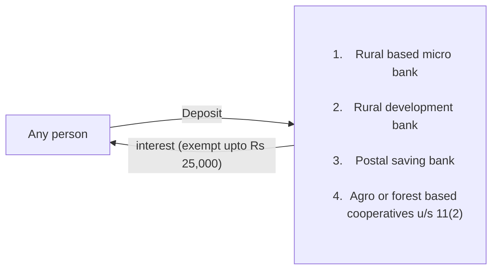
^j88eo8


<u>case-1</u>
If interest is more than 25,000
for natural person
	TDS = (interest amount - 25,000) x 6%(final)
for entity/proprietorship
	TDS = (interest amount - 25,000) x 15%(advance)

<u>case-2</u>
If interest of 24,000(ie less than 25,000) received from 4 rural bank
the recipient shall access its tax and pay on its own
tax = {(24,000 x 4 ) - 25,000 } x tax rate (6%/15%)

Sec 88(3)
2


If interest is paid by resident bank → Final withholding
>[!tip]-  why TDS on tax exempt entity
>Because tax is exempted only on the income generated as per it's objective.  Earning interest on cash is not the objective on a tax exempt entity . Therefore, TDS is deducted

![[Income tax act 2002(2058)#^eols4t]]


3


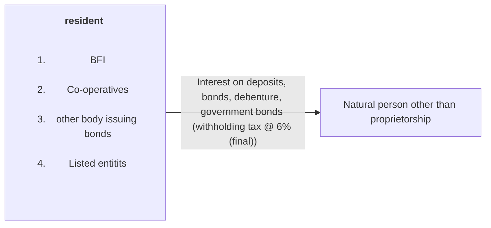
^rz4341


![[Tax/Tax notes/Questions#IT Illustration 9 10 page 3 6]]

![[Tax/Tax notes/Questions#IT Illustration 11 12 page 3 7]]


4


![[Tax/Tax notes/Questions#IT Illustration 13 page 3 7]]


5


^w1lveh

6


7


^e8vrln


8


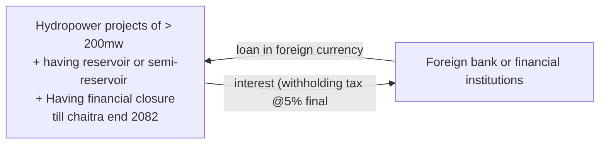
^ge8qc0


9.
in all other cases of interest payment : withholding tax 15% (advance)


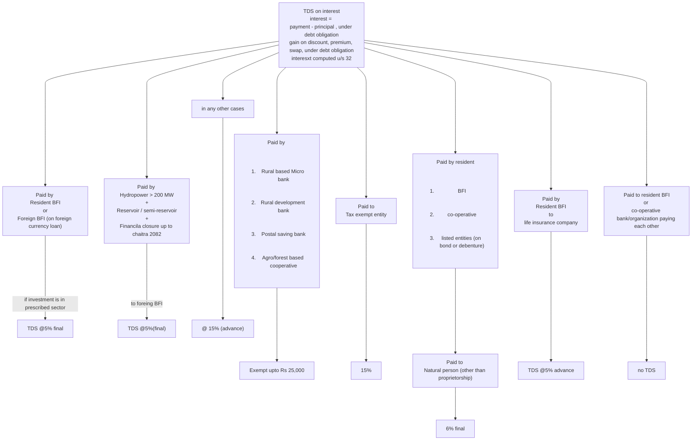

### Withholding tax on dividend

<u>Dividend meaning</u>
Any payment (cash/kind) {including bonus shares}
+
In the capacity of beneficiary
+
payment < market value of assets -  market value of liabilities - capital


![[Tax/Tax notes/Questions#IT Example 1 page 3 8]]


TDS on Dividend
	1. paid by resident entity
		- paid by company/partnership → 5%(final)
		- paid by other entities → exempt
	2. paid by non resident entity
		- Received by resident person → no TDS (because non resident can hold tax), but recipient have to include this income under investment income
		- Received by non-resident person → tax isn't leviable in such income ^4t92ix


Dividend shall be exempt from tax in following cases

|     |                                                                                                                                                |               |
| --- | ---------------------------------------------------------------------------------------------------------------------------------------------- | ------------- |
| 1   | Dividend distributed by agro/forest based co-operatives u/s 11(2)                                                                              | sec 11(2)     |
| 2   | Dividend distributed by industry in SEZ(Special Economic Zone) <br>→ first 5 years → 100% tax exempt<br>→ next 3 years → 50% tax exempt        | sec 11(3a)(c) |
| 3   | Bonus share distributed by Special industry(Agriculture, mineral , forest, manufacturing) or tourism industries, for expansion of its capacity | sec 11(3l)    |
| 4   | Didn't redistributed out of dividend income                                                                                                    | sec 54(3)     |
![[Tax/Tax notes/Questions#IT Illustration 14 page 3 9]]


![[Tax/Tax notes/Questions#IT Illustration 15 page 3 9]]


![[Tax/Tax notes/Questions#IT Illustration 16 page 3 9]]


![[Tax/Tax notes/Questions#IT Illustration 17 page 3 10]]


![[Tax/Tax notes/Questions#IT Illustration 18 19 20 page 3 10]]


### Withholding tax on transportation


| Particulars                                  | Transportation service | Rental of vehicles |
| -------------------------------------------- | ---------------------- | ------------------ |
| If service provider is registered in VAT     | 1.5%                   | 1.5%               |
| If service provider is not registered in VAT | 2.5%                   | 10%                |
if paid to natural person (other than proprietor) → final TDS
otherwise → advance TDS

### Other cases of withholding tax


1
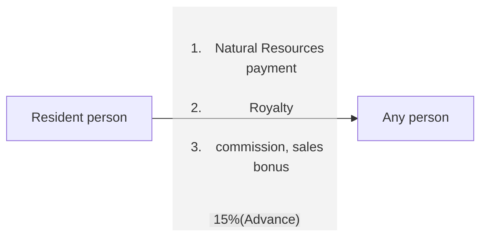

2


^1qkzgm

![[Tax/Tax notes/Questions#IT Question 21 chapter 3 page 3 18]]


3

^c5rvzh


4
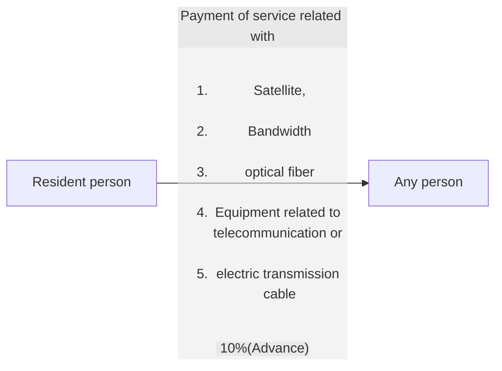
^layq6v


5

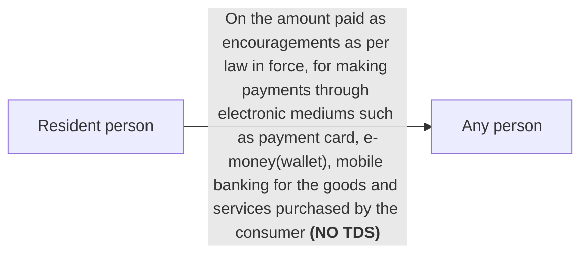
^xk5z9k


5A

```mermaid
flowchart LR
A["Resident person"] --Return payment ( 5% final)--> B["individual"]
```
However, return payment to entity shall attract 15%(advance) withholding tax

6

```mermaid
flowchart LR
A["Resident person"] --<ol> <li>Registration fee</li> <li>education fee</li> <li>exam fee</li> 5%(final) </ol>--> B["foreign university or school"]
```
^srqfdm


7

```mermaid
flowchart LR
A["Resident person"] --Meeting allowances up to Rs 20,000/meeting (15% final)--> B["Natural person"]
```

![[Tax/Tax notes/Questions#IT Illustration 22 page 3 12]]


8

```mermaid
flowchart LR
A["Resident person"] --<u>payment for</u> <ol> <li>Part time teaching</li> <li>preperation of question paper</li> <li>checking of answer copies</li> 15% (final) </ol>--> B["Natural person"]
```

> [!NOTE] 
> if payment is received form employing organization for doing same work , then it is employment income , and TDS shall be deducted as [[Income Tax#section 87 Withholding tax on employment]]


9

```mermaid
flowchart LR
A["Resident person"] --Payment for litrature articles/creation (1.5% advance)--> B["Resident person"]
```

^pxawf4


10

```mermaid
flowchart LR
A["Resident person"] --Payment for article published in newspaper (NO TDS)--> B["Resident person"]
```
^n19trt

11
```mermaid
flowchart LR
A["Resident person"] --Interregional interchange fee (NO TDS)--> B["Credit card issuing bank"]
```
^zebn7b


12

```mermaid
flowchart LR
A["Resident insurance company"] --proceeds of inventment insurance (5% final on gain amount)--> B["Natural person"]
```
^la569i


> [!NOTE] following investment insurance proceeds are exempt from tax
> 1. If received by resident natural person on accident/physical injury
> 2. if received by natural person on death 


![[Income tax act 2002(2058)#^1smxbf]]
![[Income tax act 2002(2058)#^q630mw]]


![[Income tax act 2002(2058)#(IT act section 88) Withholding from investment returns and service Fees]]


## section 88A

![[Income tax act 2002(2058)#(IT act section 88A) Tax withholding on windfall gain]]


## section 89


```mermaid
flowchart LR
A["Resident contractee"] --payment > 50,000 under a contract (1.5% advance VAT मा registered भएपनि/नभएपनि)--> B["Resident contractor"]
```


<u> note</u>
How to calculate the payment of Rs 50,000 ?
**Answer:** 
Payment made by contractee or it's associated person 
to 
contractor or it's associated person

| During             | Amount  |
| ------------------ | ------- |
| Today              | xxx     |
| + previous 10 days | xxx     |
| **Total payment**  | **xxx** |
if **Total payment** is > 50,000 , then TDS @1.5%


```mermaid
flowchart LR
A["Resident contractee"] --payment under a contract (5% final)--> B["Non-Resident contractor"]
```


Resident insurance company ले non-resident insurance company सँग reinsurance गराउँदा 
```mermaid
flowchart LR
B --Premium (TDS @1.5% final)--> A
A["Non-resident insurance company"] --commission (no TDS)--> B["Resident insurance company"]
```

In any other case if IRD issue written notice
		↓
TDS @ as specified by the notice 

```mermaid
flowchart LR
A["GON, state gov, local gov"] --payment > 50 lakh  (1.5% advance)--> B["consumer committee (उपभोक्ता समिती)"]
```


![[Tax/Tax notes/Questions#IT Question 31 chapter 3 page 3 19]]


![[Income tax act 2002(2058)#(IT act section 89) withholding from contract payment]]


## Section 90


![[Income tax act 2002(2058)#(IT act section 90) Statement and payment of tax withheld]]


## section 91

![[Income tax act 2002(2058)#(IT act section 91) withholding certificate]]


## Section 92

![[Income tax act 2002(2058)#(IT act section 92) Final withholding payment]]


## section 93


![[Income tax act 2002(2058)#(IT act section 93) Inclusion and credit for non-final withholding tax]]


# Chapter 4 : Advance collection of tax


## Types of assets

<table border="1" style="border-collapse: collapse; text-align: center; width: 100%;">
  <thead>
    <tr>
      <th colspan="5" style="padding: 10px; background-color: #f2f2f2; color: black">Assets</th>
    </tr>
  </thead>
  <tbody>
    <tr>
      <td colspan="3" style="font-weight: bold; padding: 10px; width: 60%;">Assets Related to business</td>
      <td colspan="2" style="font-weight: bold; padding: 10px; width: 40%;">Assets not related to business (investment related)</td>
    </tr>
    <tr style="vertical-align: top;">
      <td style="padding: 10px; width: 20%;">
        <strong>Trading Assets</strong><br>
        (Raw Material, Finished goods or WIP)
      </td>
      <td style="padding: 10px; width: 20%;">
        <strong>Depreciable Assets</strong><br>
        (Eg: Building, Office Equipment, Vehicle, Machinery etc.)
      </td>
      <td style="padding: 10px; width: 20%;">
        <strong>Business Assets</strong><br>
        (Eg: Land, Debtors, Receivables)
      </td>
      <td style="padding: 10px; width: 20%;">
        <strong>Depreciable assets</strong><br>
        (Eg: Building, Office Equipment, Vehicle, Machinery etc.)
      </td>
      <td style="padding: 10px; width: 20%;">
        <strong>Other Assets (NBCA)</strong><br>
        Eg: Land, Shares
      </td>
    </tr>
  </tbody>
</table>

NBCA
- for natural person
	1. Land
	2. Building (natural person cannot claim depreciation for building, so it is NBCA)
	3. Shares
	- any asset of natural person except land, building and shares are personal asset
- for entity
	1. Land 
	2. Shares


**Following asset is not NBCA** 
$\therefore$ no tax in following asset
![[not NBCA assets.png]]

>[!note] Private building meaning
> **Sale of only land** → ==not== private building
> **Sale of only building** → ==always== private building (eg: apartments in colony)
> 
> **Sale of land and building**
> - **Building** → ==always== private building
> - **Land** → private up to lower of :
> 	- 2 $\times$ of land occupied by building
> 	- Total land sold (including land covered by building)
> 	- 1 ropani (16 aana, $508.7370 m^{2}$) ^noi0ql


![[Tax/Tax notes/Questions#IT Illustration 1 page 4 1]]


![[Income tax act 2002(2058)#^igw33q]]

## Disposal of asset (section 40)


![[Income tax act 2002(2058)#(IT act section 40) Disposal of assets and liabilities]]

![[Tax/Tax notes/Questions#IT Illustration 2 3 page 4 3]]


![[Tax/Tax notes/Questions#IT Illustration 4 page 4 3]]

![[Tax/Tax notes/Questions#IT Illustration 5 page 4 4]]

![[Tax/Tax notes/Questions#IT Illustration 6 page 4 4]]

![[Tax/Tax notes/Questions#IT Illustration 7 page 4 4]]


## calculation of net gain from disposal (section 39,38,37,36)


### section 39 : net gain

![[Income tax act 2002(2058)#(IT act section 39) Incoming and incoming from assets and liabilities]]

### Section 38 : outgoing


![[Income tax act 2002(2058)#(IT act section 38) Outgoing and net outgoings for assets and liabilities]]

![[Tax/Tax notes/Questions#IT Illustration 8 page 4 5]]
### section 37 : incoming


![[Income tax act 2002(2058)#(IT act section 37) Gain and loss from Assets and liabilities]]

### section 36(1) : set-off of loss from profit of business asset disposal


Section 36(1): Computation of Net Gain from Disposal of Business assets

| Particulars                                                          | Amount       |
| -------------------------------------------------------------------- | ------------ |
| Total gain from disposal of each business assets/liability           | XXX          |
| Less: Total loss from disposal of each business assets/liability     | XXX          |
| Less: Unrelieved loss from any other business during the income year | XXX          |
| Less: Unrelieved loss from any business during the previous years    | <u> XXX </u> |
| Net gain u/s 36(1) → to be included in business income u/s 7         | XXX          |

![[Tax/Tax notes/Questions#Question 10 chapter 4 page 4 12]]
### section 36(2) : set-off of loss from profit of NBCA disposal

Section 36(2): Computation of Net Gain from Disposal of Non - Business Chargeable assets

| Particulars                                                                                            | Amount       |
| ------------------------------------------------------------------------------------------------------ | ------------ |
| Total gain from disposal of Non-Business Chargeable Assets                                             | XXX          |
| Less: Total loss from disposal of Non-Business Chargeable Assets                                       | XXX          |
| Less: Unrelieved loss from other investment or business during the income year                         | XXX          |
| Less: Unrelieved loss from any investment or business during the previous years                        | <u> XXX </u> |
| Net Gain from disposal of Non - Business Chargeable Assets → to be included in investment income u/s 9 | XXX          |
![[loss set off on disposal gain.png]]

![[Tax/Tax notes/Questions#Question 11 chapter 4 page 4 12]]


![[Income tax act 2002(2058)#(IT act section 36) Net gain from assets and liabilities]]

## Advance tax 


1. Advance Tax on Disposal of Land and/or Building (Section 95A)
<table border="1">
  <thead>
    <tr>
      <th>Category of Disposal</th>
      <th>Conditions / Ownership</th>
      <th>Advance Tax Rate</th>
      <th>Basis of Tax</th>
    </tr>
  </thead>
  <tbody>
    <tr>
      <td rowspan="2">Natural Person (Disposal of NBCA*)</td>
      <td>Ownership ≥ 5 years</td>
      <td>5%</td>
      <td>On gain amount</td>
    </tr>
    <tr>
      <td>Ownership < 5 years</td>
      <td>7.5%</td>
      <td>On gain amount</td>
    </tr>
    <tr>
      <td>Other Cases (Natural person selling trading/business/depreciable assets OR Disposal by entity)</td>
      <td>N/A</td>
      <td>1.5%</td>
      <td>On disposal value (Applicable even in loss)</td>
    </tr>
  </tbody>
  <tfoot>
    <tr>
      <td colspan="4">
        *NBCA: Non-Business Chargeable Asset. <br>
        Note: Tax is deducted by the Land Revenue Office (LRO).<br>
        Gain means total gain computed u/s 37
      </td>
    </tr>
  </tfoot>
</table>


![[Tax/Tax notes/Questions#IT Illustration 9 page 4 7]]

### Section 95A

![[Income tax act 2002(2058)#(IT act section 95A) To recover advance tax]]


![[Tax/Tax notes/Questions#IT Illustration 10 page 4 8]]


>[!note] cost of bonus share 
>Issued before 2058.12.19 → market value on 2058.12.19
>Issued after 2058.12.19 → Rs 100 per share


![[Tax/Tax notes/Questions#IT Illustration 11 page 4 8]]


![[Tax/Tax notes/Questions#Question 15 chapter 4 page 4 12]]

## Final tax

![[Income tax act 2002(2058)#IT act Schedule-1 sec-1 3]]

![[Income tax act 2002(2058)#IT act Schedule-1 sec-1 4]]


![[Tax/Tax notes/Questions#Illustration final tax page copy]]

![[Tax/Tax notes/Questions#Question 14 chapter 4 page 4 12]]


# Chapter 5 : Retirement fund

contribution in retirement fund is 
- compulsory for employee
- voluntary for other persons

![[Retirement fund.png]]

![[Tax/Tax notes/Questions#IT Illustration 1 page 5 1]]


![[Income tax act 2002(2058)#IT act Chapter-12 Special Provisions on Retirement Saving]]

![[Tax/Tax notes/Questions#IT Illustration 2 3 4 page 5 2]]

![[Tax/Tax notes/Questions#IT Question 4 chapter 5 page 5 6]]

![[Tax/Tax notes/Questions#IT Illustration 5 6 7 page 5 3]]
# Chapter 6: Imposition and computation of tax


![[Income tax act 2002(2058)#IT act Imposition of tax in Nepal]]


![[Income tax act 2002(2058)#IT act Calculation of tax and tax rates]]


![[Tax/Tax notes/Questions#Chapter 06]]


# Chapter-7: Installment tax


 ![[Income tax act 2002(2058)#(IT act section 94) Payment of income tax by installment]]


![[Tax/Tax notes/Questions#IT Question 1 chapter 7 page 7 10]]


![[Tax/Tax notes/Questions#IT Question 2 chapter 7 page 7 10]]


![[Tax/Tax notes/Questions#IT Question 3 chapter 7 page 7 10]]


![[Tax/Tax notes/Questions#IT Question 4 5 chapter 7 page 7 10]]


![[Income tax act 2002(2058)#(IT act section 95) Statement of estimated tax payable]]


![[Income tax act 2002(2058)#IT act Chapter-19 Income Return and Assessment of Tax]]

![[Income tax act 2002(2058)#IT act Chapter-20 Collection Remission and Refund of Tax]]


![[Income Tax Rule 2059 (2002) (Unofficial Translation)#IT rule 26 Tax clearance certificate]]


# chapter 8 : computation of tax

<u>Tax computation of natural person covered u/s 4(2)</u>

Part 1: Determination of Assessable Income

| Particulars                                                                                                                                                                                                                                                                            | Amount  |
| -------------------------------------------------------------------------------------------------------------------------------------------------------------------------------------------------------------------------------------------------------------------------------------- | ------- |
| Income from Employment u/s 8                                                                                                                                                                                                                                                           | XXX     |
| → 8(1) use cash basis of accounting<br>→ 8(2) Amounts to be included<br>→ 8(3) Amounts not to be included<br>→ Quantification  under chapter 7                                                                                                                                         |         |
| (+) Income from Business u/s 7                                                                                                                                                                                                                                                         | XXX     |
| Amounts to be included u/s 7(2)<br>Amounts not to be included u/s 7(3)<br>i.e. exempt amounts u/s 10<br>    dividend amounts u/s 54<br>    income of controlled foreign entity u/s 69<br>    final withholding income , deduction under chapter 5                                      |         |
| (+) Income from Investment u/s 9                                                                                                                                                                                                                                                       | XXX     |
| Amounts to be included u/s 9(2)<br>Amounts not to be included u/s 9(3)<br>i.e. exempt amounts u/s 10<br>    dividend amounts u/s 54<br>    income of controlled foreign entity u/s 69<br>    final withholding income<br>    employment/business income, deduction under chapter 5<br> |         |
| (+) Income from Casual/Windfall Gain (Note 1)                                                                                                                                                                                                                                          | XXX     |
| **Total Assessable Income**                                                                                                                                                                                                                                                            | **XXX** |
Note 1: If received from a Non-resident, it is a final TDS (Tax Deducted at Source) and should not be included in the income.


Part 2: Reductions and Deductions

| Particulars                                                                              | Amount         |
| ---------------------------------------------------------------------------------------- | -------------- |
| **Total Assessable Income**                                                              | **XXX**        |
| <u>Less: Reduction from Assessable Income u/s 63,12</u>                                  |                |
| a) Contribution to approved retirement fund u/s 63                                       | (XXX)          |
| b) Donation to tax-exempt entity u/s 12                                                  | (XXX)          |
| c) Preservation of heritage & sports development u/s 12A<br>(available only to Company ) | Not Applicable |
| d) Donation to PM disaster relief/reconstruction fund u/s 12B                            | (XXX)          |
| e) Seed capital provided as donation to start-ups u/s 12C                                | (XXX)          |
| **Taxable Income**                                                                       | **XXX**        |
| <u>Less: Deductions / Non-taxable / Zero-rated Income under schedule 1</u>               |                |
| a) Remote area allowances (section 1(5) of sch 1)                                        | (XXX)          |
| b) Foreign allowances (section 1(6) of sch 1)                                            | (XXX)          |
| b1) tax paid in Foreign country (section 71(4))                                          |                |
| c) Pension income allowances (section 1(9A) of sch 1)                                    | (XXX)          |
| d) Differently abled allowances (section 1(10) of sch 1)                                 | (XXX)          |
| e) Investment insurance premium (Life Insurance) (section 1(12) of sch 1)                | (XXX)          |
| f) Health insurance premium (section 1(16) of sch 1)                                     | (XXX)          |
| g) House insurance premium (section 1(16A) of sch 1)                                     | (XXX)          |
| **Balance Taxable Income**                                                               | XXX            |

Part 3: Tax Liability and Net Payable

| Particulars                                                                                  | Amount  |
| -------------------------------------------------------------------------------------------- | ------- |
| a) Tax on Income (other than gain on disposal of NBCA) <br>{@ slab rates}                    | XXX     |
| b) Tax on gain on disposal of NBCA (Non-Business Chargeable Assets) <br>{@ 5%, 7.5%, or 10%} | XXX     |
| **Total Tax Liability**                                                                      | **XXX** |
| Less: Tax Credits                                                                            |         |
| a) Medical Tax Credit u/s 51                                                                 | (XXX)   |
| b) Foreign Tax Credit u/s 71                                                                 | (XXX)   |
| c) Female Tax Credit u/s 1(11) of Sch. 1                                                     | (XXX)   |
| **Net Tax Liability**                                                                        | **XXX** |
| Less: Payments & Adjustments                                                                 |         |
| a) Advance tax paid earlier                                                                  | (XXX)   |
| b) TDS receivable                                                                            | (XXX)   |
| c) Excess Tax paid in previous years                                                         | (XXX)   |
| **Net Tax Payable**                                                                          | **XXX** |


<u>Tax Computation of Entity (Covered u/s 4(2))</u>

| Particulars                                                                                             | Amount  |     |
| ------------------------------------------------------------------------------------------------------- | ------- | --- |
| a) Income from business                                                                                 | xxx     |     |
| b) Income from investment                                                                               | xxx     |     |
| c) Income from casual gain <br>(Only if received from NR, casual gain from resident attracts final TDS) | xxx     |     |
| **Total Assessable Income**                                                                             | **xxx** |     |
|                                                                                                         |         |     |
| <u>Less: Reductions from assessable income u/s 12</u>                                                   |         |     |
| a) Donation to tax exempt entity u/s 12                                                                 | (xxx)   |     |
| b) Exp. on preservation of heritage & sports development u/s 12A <br>(Only in case of company)          | (xxx)   |     |
| c) Donation to PM disaster relief fund or reconstruction fund estd. by GON u/s 12B                      | (xxx)   |     |
| d) Seed-capital provided as donation to Start-ups u/s 12C                                               | (xxx)   |     |
| **Taxable Income**                                                                                      | **xxx** |     |
|                                                                                                         |         |     |
| <u>Less: Deduction under schedule 1</u>                                                                 |         |     |
| a) tax paid in Foreign country (section 71(4))                                                          |         |     |
|                                                                                                         |         |     |
| <u>Tax Computation</u>                                                                                  |         |     |
| [@ 25% or 30% or rate derived after concession u/s 11]                                                  | xxx     |     |
| **Total Tax Liability**                                                                                 | **xxx** |     |
|                                                                                                         |         |     |
| <u>Less: Tax Credit</u>                                                                                 |         |     |
| a) Foreign tax credit u/s 71                                                                            | (xxx)   |     |
| **Net Tax Liability**                                                                                   | **xxx** |     |
|                                                                                                         |         |     |
| <u>Less: Prepaid Taxes</u>                                                                              |         |     |
| a) Advance tax                                                                                          | (xxx)   |     |
| b) TDS receivable u/s 87,88,88A,89 (advance withholding only)                                           | (xxx)   |     |
| c) Excess Tax paid in previous years                                                                    | (xxx)   |     |
| **Net Tax Payable**                                                                                     | **xxx** |     |


## Tax rates for natural person \[schedule 1, section 1]

1. Resident natural person
a. on income (other than disposal of NBCA

![[Income tax act 2002(2058)#IT act Schedule-1 sec-1 1]]

\* 27% tax मा 2% surcharge लागेर 29% भाकाे हाे 

surcharge = additional charge for person earning more than 20lakh in Nepal

1% tax (SST = social security tax) is levied only on employment income
Except:
	a. pension having contribution to Social security fund (SSF) or contribution pension fund
	or
	b. pension income


>[!note]
>If employment income $\geq$ 5L => tax 1% (SST)
>if employment income < 5L => Tax on remaining amount(from pension , business income etc) up to 5L = 0%
>or
>if individual is investing in SSF => Tax 0% up to 5L

![[1% SST.png]]

>[! warning] Doubt
 May be pension income is included under investment income 
 **Answer**:  refer section 8(2f)
 

  
 


**Example**:
Compute tax liability of Mr. Raman on the basis of following information:-

|                          | Case A   | Case B   |
| ------------------------ | -------- | -------- |
| Income from employment   | 1,20,000 | 7,00,000 |
| (+) Income from business | 7,00,000 | 1,20,000 |
| Total assessable income  | 8,20,000 | 8,20,000 |

Answer:

|                         | Case A   | Case B   |
| ----------------------- | -------- | -------- |
| Total assessable income | 8,20,000 | 8,20,000 |
|                         |          |          |
| Tax computation         |          |          |
| 0-5L                    | 1,200    | 5,000    |
| 5L-7L                   | 20,000   | 30,000   |
| 7L-8.2L                 | 24,000   | 24,000   |

b.
![[Income tax act 2002(2058)#IT act Schedule-1 sec-1 4]]

2. non resident person
![[Income tax act 2002(2058)#IT act Schedule-1 sec-1 8 Tax rate for non resident natural person]]

## Tax rate for entity \[schedule 1, section 2]

![[Income tax act 2002(2058)#IT act Schedule-1 sec-2 Rate for entity]]


![[Tax/Tax notes/Questions#IT Question 1 chapter 8 page 8 13]]


![[Tax/Tax notes/Questions#IT Question 2 chapter 8 page 8 13]]


![[Tax/Tax notes/Questions#IT Question 3 chapter 8 page 8 13]]


![[Tax/Tax notes/Questions#IT Question 4 chapter 8 page 8 13]]

![[Tax/Tax notes/Questions#IT Question 5 chapter 8 page 8 13]]


![[Tax/Tax notes/Questions#IT Question 6 chapter 8 page 8 13]]


## Tax credit \[(schedule 1 section 1(11)), section 51,71]

![[tax credit.png]]

![[Tax/Tax notes/Questions#IT Question 7 chapter 8 page 8 13]]

![[Tax/Tax notes/Questions#IT Question 8 chapter 8 page 8 13]]


3. Foreign tax credit u/s 71
	- Resident person
	- may claim tax credit for
	- tax paid in foreign country

Step 1 : Compute assessable income of the person ( income earned in both Nepal and foreign)
Step 2 : Compute tax liability 
		natural person → slab rate
		entity → 25%/30%
Step 3 : Compute average tax rate
		= $\frac{\text{Step 1}}{\text{Step 2}} \times 100\%$
Step 4 : compute tax credit as below

| Country | Income                                                             | foreign tax paid <br>+<br>Previous year C/F | Average tax                                           | Credit allowed      | C/F to next year      |
| ------- | ------------------------------------------------------------------ | ------------------------------------------- | ----------------------------------------------------- | ------------------- | --------------------- |
| A       | B = sum of income earned in both Nepal and ~~foreign countries~~ A | C                                           | D =$\frac{\text{Step 1}}{\text{Step 2}} \times 100\%$ | E = lower of C or D | F = unallowed portion |
> C/F of one country cannot be added on credit allowed of another country next year

<u>Section 71(4)</u>
Any person may claim deduction of tax paid in foreign country as expenses
instead of claiming credit as above 
(बिदेश तिरकाे ) tax लाइ खर्च मानेर income बाट घटाइदिने , foreign tax credit  न लिने )

![[Tax/Tax notes/Questions#IT Question 9 10 chapter 8 page 8 13]]

![[Tax/Tax notes/Questions#IT Question 11 chapter 8 page 8 13]]


1. Female tax credit

notes: 

| Resident women having income from                | Female tax credit |
| ------------------------------------------------ | ----------------- |
| Employment + Business income                     | not Allowed       |
| Employment + Income subject to final withholding | Allowed           |
| Employment + House rent income                   | Allowed           |
| Employment + Investment income                   | not Allowed       |

**Example** 
Calculate female tax credit if a resident female has following details

|                                                                                   |                                                         |
| --------------------------------------------------------------------------------- | ------------------------------------------------------- |
| Tax liability (for income from employment)                                        | 52,000                                                  |
| Less: Medical tax credit                                                          | 750                                                     |
| Less: foreign tax credit                                                          | 20,000                                                  |
| Less: female tax credit <span style="color:rgb(0, 176, 80)">(52,000 x 10%)</span> | <u><span style="color:rgb(0, 176, 80)">5,200</span></u> |
| Net tax payable                                                                   | <span style="color:rgb(0, 176, 80)">26,050</span>       |

## Deductions / Non-Taxable Income / Zero Rated Income  \[schedule 1, section 1]

![[Income tax act 2002(2058)#IT act Schedule-1 sec-1 5 Remote area allowance]]

![[Income tax act 2002(2058)#(IT act Schedule-1 sec-1(6)) Foreign allowance]]


![[Income tax act 2002(2058)#IT act Schedule-1 sec-1 9A Pension exemption]]


![[Income tax act 2002(2058)#IT act Schedule-1 sec-1 10 Handicap allowance]]


![[Income tax act 2002(2058)#IT act Schedule-1 sec-1 12 Life insurance premium]]


![[Income tax act 2002(2058)#IT act Schedule-1 sec-1 16 Health insurance premium]]

![[Income tax act 2002(2058)#IT act Schedule-1 sec-1 16A Private house insurance premium]]

![[Income tax act 2002(2058)#IT act Schedule-1 sec-1 13 Presumptive taxation for vehicle owner]]


## Reduction \[section 12, 63]

![[Income Tax Rule 2059 (2002) (Unofficial Translation)#IT rule 21 Threshold of retirement contribution]]


![[Income tax act 2002(2058)#(IT act section 12) Donation and gifts to exempt organization]]

 <u>Note: Adjusted Taxable Income (A.T.I.)</u>
Adjusted Taxable Income (A.T.I.) for the purpose of Section 12 shall be computed as:
**i. For Natural person having employment income only**
 * Total Assessable Income:                      **XXX**
 * *Less:* Allowable contribution to A.R.F: <u>(XXX)</u>
 * **Adjusted Taxable Income:                     XXX**
**ii. For other person:** Refer chapter "Income from business".

## amounts Exempt from tax \[section 10]


![[Income tax act 2002(2058)#(IT act section 10) Exemptible amounts]]


# chapter 9: income from employment

## inclusion u/s 8(2)
<u>Section 8(2)</u>
Income from employment is computed by including the following amounts:

| Particulars                                                                      | Amount  |
| -------------------------------------------------------------------------------- | ------- |
| Basic salary + Grade                                                             | xxx     |
| (+) Wages                                                                        | xxx     |
| (+) Over-time payment                                                            | xxx     |
| (+) Bonus                                                                        | xxx     |
| (+) Sales - bonus, target commission                                             | xxx     |
| (+) Allowances:                                                                  |         |
|     i) Dearness Allowances (D.A.)                                                | xxx     |
|     ii) House rent allowances (HRA)                                              | xxx     |
|     iii) Cost of Living Allowances (COLA)                                        | xxx     |
|     iv) Festival Allowances                                                      | xxx     |
|     v) Uniform Allowances                                                        | xxx     |
|     vi) Transportation allowances                                                | xxx     |
| (+) Gift received from any person in connection with employment                  | xxx     |
| (+) Amount received for accepting any condition relating to employment           | xxx     |
|     (e.g., Extra money paid to doctors for not practicing outside)               |         |
| (+) Employer's contribution to retirement fund (approved/unapproved)             | xxx     |
| (+) Amount received on termination/loss of employment                            | xxx     |
|     (If not in the nature of retirement payment, i.e., final TDS not applicable) |         |
| (+) Leave encashment (If received during the employment)                         | xxx     |
| (+) Pension income                                                               | xxx     |
| (+) Re-imbursement of personal expenses                                          | xxx     |
| (+) Facilities / Perquisites:                                                    |         |
|     i) Vehicle facility                                                          | xxx     |
|     ii) House accommodation facility                                             | xxx     |
|     iii) Concessional loan facility                                              | xxx     |
|     iv) Other facilities                                                         | xxx     |
| (+) Any other amount to be included under chapter 6 or 7                         | xxx     |
|     (Tax Accounting & Quantification)                                            |         |
| Income from Employment                                                           | **XXX** |

<u>Section 8(3)</u>
The following amounts shall not be included while computing income from employment:
 * a) Any amount which are ==exempt== from tax ==u/s 10.== (e.g., pension of foreign army/police, salary received by foreign ambassadors)
 * b) Any amount which are subject to ==final withholding.==
 * c) Any amount/re-imbursement of expenses which meets the ==business purpose== of the employer. (e.g., money received for traveling on official business/office work)
 * d) Meal / refreshment
   Provided to all the employees at the place of work.
   Provided on equal terms.
 * e) Payment up to Rs. 500 at a time for:
   → Tea, Stationery, Emergency medical cost, tips/rewards 
   whose accounting is impractical for administration.


<u>Notes</u>
a) Income from employment is accounted for by following ==Cash Basis.==
 * Advance salary $\rightarrow$ include गर्ने (Include it).
 * However: Accounts shall be maintained as per ==accrual basis== if a person receives a ==lump-sum amount== in respect of previous year’s employment, ==after settlement of cases by court.== \[FA 2080]
![[Income tax act 2002(2058)#IT act section 22 Basis of tax accounting and timming]]

b) Income from employment includes payment made by:
 * Past, present, or future employer.
 * Person associated (related) with the employer.
 * Third person as per the agreement with the employer.

c) Grade
 * Definition: Annual increment in salary.

 * Example: Mr. Raman joined a company with a salary structure of 20,000 - 4,000 - 40,000 on 1st Shrawan, 2079.
   * 2079-80: 20,000 $\times$ 12
   * 2080-81: 24,000 $\times$ 12
   * 2081-82: 28,000 $\times$ 12 & so on.

 * What if he joined on 1st Falgun, 2079?
   * 2079-80: 20,000 $\times$ 5 (Falgun to Ashadh)
   * 2080-81: (20,000 $\times$ 7) + (24,000 $\times$ 5)
   * 2081-82: (24,000 $\times$ 7) + (28,000 $\times$ 5) & so on.

d) Travelling and Daily Allowances (TADA)
 * These are allowances provided to employees to meet their daily expenses while they are travelling for official purposes.
 * They aren't expected to make any profit out of it.
 * So, नजोड्ने (Do not add/include).

## Quantification u/s 27

<u>Section 27: Quantification</u>
This section is applicable to quantify the facilities provided by any person (not just Employer-Employee).

A. <u>Transfer of Assets (With ownership)</u>

 * Quantification = Market Value
Example: ABC P. Ltd. provided a car (market value = 80 lakh) to:

| To | Treatment |
|---|---|
| i) Employee | Rs. 80 lakh shall be included in the income from employment of the employee. |
| ii) Dealer | Rs. 80 lakh shall be included in the income from business of the dealer (for meeting certain targets). |

B. <u>Vehicle Facility</u>
(Note: Provided for use, not ownership)

| receiver       | If provided by employer to emplolyee  | If provided to other person<br>(eg: to dealer, customer, supplier, consultant) |
| -------------- | ------------------------------------- | ------------------------------------------------------------------------------ |
| Quantification | 0.5% of (basic salary + grade)        | 1% per annum of market value                                                   |
| note:          | market value of the car is irrelevant | market value of the car is relevant                                            |
Notes:
1. The quantification is applicable when vehicle facility is provided for 
   → Personal use only
   → official & personal use
   → ~~official use only~~

Q. Raman Co. Ltd provided car's facility to its employees whose basic salary is Rs 12L p.a. Market value of the car is Rs 20 Lakh.
**Answer**

|                | If provided by <br>employer to emplolyee | If provided for <br>official purpose 60%,<br>personal use 40% |
| -------------- | ---------------------------------------- | ------------------------------------------------------------- |
| Quantification | 0.5% of 12L = Rs 6,000                   | 0.5% of 12L x ~~40%~~ = Rs 6,000                              |

2. The quantification is said to include 
   → driver's salary
   → fuel expenses
   → maintenance 
   it means , if these are re-imbursed by employer
   no separate additions has to be made

The quantification shall be same even if certain amount is recovered from the person receiving facility.

**example**
In above example, if Raman Co. ltd deducts Rs 5,000/month from the employee's salary, in lieu of car's facility
Quantification = 12L $\times$ 0.5% - ~~5,000 x 12~~ = Rs. 6,000

It means vehicle facility (with or without driver/fuel/repair facility) whether or not certain amount is deducted from salary
↓
Quantification सधैनै 0.5% of (basic + grade)


3. Vehicle means car, jeep, van and similar other vehicles.
   It means bike/cycle काे facility provide गर्याे भने, no quantification, means income मा केहि जाेडिन्न, तर सधैलाइ दियाे भने त bike/cycle मात्र हैन tyer मात्रै दिएपनि, त्यस्काे market value जाेडन पर्छ । 

C. <u>House accommodation facility</u>
eg: quarter

|                | If provided by employer to employee                  | If provided in any other cases      |
| -------------- | ---------------------------------------------------- | ----------------------------------- |
| Quantification | 2% of (Basic salary + grade)                         | 25% of rent paid or prevailing rent |
|                | market value of the house or rent paid is irrelevant |                                     |
notes:
1. The above quantification is for furnished building only. 
   Thus, separate additions has to be made for:
   → security guard's facility etc.
   → Cook's facility
   → Telephone/wifi facility etc
   `It means यसकाे लागी छुटै पैसा जाेडने`

2. The quantification shall be same even if:
   → certain amount is deducted from employee's salary
   → The house is shared with other person 

3. House rent of employee paid by employer
   याे त employee बसिराकाे घरमा employer ले rent pay गरिदिएकाे हाे 
   so, it's reimbursement of personal expense हाे 
   so, पुरा rent paid नै income मा जाेडने

D. <u>Concessional loan facility</u>
Quantification = Loan amount $\times$ saving in interest rate


E. <u>Other facilities</u>

| Amount paid by employer/person providing facility          | xxx          |
| ---------------------------------------------------------- | ------------ |
| (-) amount proportionated for official purpose             | (xxx)        |
| (-) amount recovered by employer/person providing facility | <u>(xxx)</u> |
|                                                            | xxx          |
**Example**
If employee काे गाडिमा employer ले Rs 12,000/month काे driver र Rs. 1,00,000 p.a. काे repair pay गर्छ भने 
Quantification = 12,000 x 12 + 1,00,000 = Rs 2,44,000

Further, if त्याे गाडि is used for official purpose (60%) also?
Quantification = 2,44,000 x 40% = 97,600

further, if Rs 5,000 is also being deducted from employee's salary?
Quantification = 97,600 - 5,000 x 12 = 37,600

Unlike in point B यहाँ गाडिकाे facility दिएकाे हैन, बरू employee काे गाडीमा driver/fuel facility देकाे हाे 
so, B हैन E काे rule लाग्छ

## How we calculate taxable income in real life

Ans: We use reconciliation method

<u>method used in exam & methods used in real life</u>

|     | Particulars         | Amount |     |     | Particulars                                                                             | Amount |
| --- | ------------------- | ------ | --- | --- | --------------------------------------------------------------------------------------- | ------ |
|     | Income              |        |     |     | Profit as per books of account                                                          |        |
| -   | Expense             |        |     | -   | Income unallowed under IT act / expense to be decucted under IT act but not as per book |        |
| =   | Accessable income   |        |     | +   | Expense unallowed under IT act / income to be added under IT act but not as per book    |        |
| -   | Reduction/deduction |        |     | =   | Accessable income                                                                       |        |
| =   | Taxable income      |        |     | -   | Reduction/deduction                                                                     |        |
| x   | Tax rate            |        |     | =   | Taxable income                                                                          |        |
| =   | Tax liability       |        |     | x   | Tax rate                                                                                |        |
|     |                     |        |     | =   | Tax liability                                                                           |        |


# Chapter 10: Income from business

### Section 7(2): Inclusions in Business Income

|     |                                                                                                                                                                                                                                                                                      |            |
| --- | ------------------------------------------------------------------------------------------------------------------------------------------------------------------------------------------------------------------------------------------------------------------------------------ | ---------- |
|     | <u>Section 7(2): Inclusions in Business Income</u><br>The following amounts are included while computing income from business:                                                                                                                                                       |            |
|     | Service Fees                                                                                                                                                                                                                                                                         | xxx        |
| +   | Amount received on disposal of trading assets <br> (i.e., sale of goods)                                                                                                                                                                                                             | xxx        |
| +   | Net gain on disposal of business assets or liability u/s 36(1)                                                                                                                                                                                                                       | xxx        |
| +   | Balancing charge on disposal of depreciable assets<br>*Note: Profit made from selling depreciable assets. Please refer to Sec. 19 for details.*                                                                                                                                      | xxx        |
| +   | Gift received from any person in connection with the business.                                                                                                                                                                                                                       |            |
| +   | Amount received on accepting any restriction relating to business.<br> *Note: If money is received for NOT doing a certain business, that is also considered business income.*                                                                                                       | xxx        |
| +   | Amount received which is directly connected/related with business and would otherwise have been investment income.<br>*Example: Interest received from a customer for late or delayed payment.*                                                                                      | xxx        |
| +   | **Any other amount** under Chapter 6 or 7, or Section 56 or 60:<br>    **Section 56:** Transactions between entity and beneficiary.<br>    **Section 60:** Insurance business.<br>    **Chapter 6:** Tax Accounting (Sec. 22–26).<br>    **Chapter 7:** Quantification (Sec. 27–35). | <u>xxx</u> |
| =   | **Inclusions**                                                                                                                                                                                                                                                                       | **xxx**    |


### Section 7(3): Exclusions (Non-Inclusions)
The following amounts are **not** included while computing income from business:
**a) Any amount which is exempt from tax:**
 * u/s 10
 * u/s 54 (Dividend income)
 * u/s 69 (Controlled foreign entity)
**b) Any amount which is subject to final withholding tax.**

### Deductions under chapter 5

| Sections | Particulars            | Applicable to         |
| -------- | ---------------------- | --------------------- |
| **13**   | General Deductions     | Business / Investment |
| **14**   | Interest Expenses      | Business / Investment |
| **15**   | Cost of Trading Assets | Business              |
| **16**   | Repair & Maintenance   | Business / Investment |
| **17**   | Pollution Control Cost | Business              |
| **18**   | R & D Cost             | Business              |
| **19**   | Depreciation           | Business / Investment |
| **20**   | Losses                 | Business / Investment |
#### Section 13: General Deductions
Expenses incurred for earning business or investment income are allowed as a deduction under Section 13 **if**:
 1. **They are not covered specifically by any other provisions** (i.e., Sections 14–20).
   * *Examples: Salary, Admin expenses, Office expenses, Rent, Audit fees, etc.*
 2. **Incurred for the income year:**
   * **Cash Basis:** Must be paid this year.
   * **Accrual Basis:** Must be accrued this year.
   * *Note: Prior period expenses are disallowed.*
 3. **Incurred by the person:**
   * Must be real payments. Creating provisions alone is not enough for a deduction.

![[Income tax act 2002(2058)#IT act Section 13 General deduction]]

#### Interest deduction u/s 14

![[Income tax act 2002(2058)#IT act section 14 Interest deduction]]


![[Income Tax#Computation of Adjusted Taxable Income ATI]]

**Example question**
ABC private limited obtained al loan of Rs. 1crore @ 12% p.a. Out of this Rs 80 lakhs has been used by director for his personal purpose. Calculate allowable interest expenses u/s 14?
What shall be implications if the company has not obtained any loan but director has used Rs. 80 lakh for his personal purpose.

**Answer**
Case A:
Since, only Rs 20L has been used for earning business/investment income,
→ Rs 20L x 12% = Rs 2.4L is allowed as deduction

Case B:
Even in this case, company shall charge interest to the director as per prevailing interest rate 

![[Tax/Tax notes/Questions#IT Question 1 chapter 10 page 10 19]]


![[Tax/Tax notes/Questions#IT Question 2 chapter 10 page 10 19]]


![[Tax/Tax notes/Questions#IT Question 3 chapter 10 page 10 19]]

![[Tax/Tax notes/Questions#IT Question 4 chapter 10 page 10 19]]


#### COGS u/s 15

![[Income tax act 2002(2058)#IT act section 15 Cost of trading stock]]


![[Tax/Tax notes/Questions#IT Question 5 chapter 10 page 10 19]]


![[Tax/Tax notes/Questions#IT Question 6 chapter 10 page 10 20]]


#### Repair and Maintenance (R&M) u/s 16

![[Income tax act 2002(2058)#IT act section 16 Repair and improvement cost]]


![[Tax/Tax notes/Questions#IT Question 7 chapter 10 page 10 20]]


#### Depreciation u/s 19

![[Income tax act 2002(2058)#IT act section 19 Depreciation expense]]


![[Tax/Tax notes/Questions#IT Question 8 chapter 10 page 10 20]]


![[Tax/Tax notes/Questions#IT Question 15 chapter 10 page 10 22]]

##### Additional/ accelerated depreciation
Following ==entities== ~~may~~ / shall claim additional depreciation 
(schedule 2 → may, section 19 → shall )
($\therefore$ Decide by the court in case of reliance cement limited that section will prevail over schedule)

1. Public infrastructure project under BOOT model (i.e. Build, own, operate, transfer) with GON
2. Project relating to construction of power houses and generation/transmission of power
3. Special industry
	- Agriculture industry
	- manufacturing industry
	    (excluding proprietorship and tobacco/liquor/beverage industry), 
	- mineral based industry, 
	- forest based industry.
4. Entity operating tram or trolley bus
5. Entity building & operating ropeway, cable car, sky bridge, road, bridge, tunnel, railway, airport.
6. Entity producing fruit based brandy, cider, wine in very undeveloped area or undeveloped area
7. co-operative


<u>Example</u>
A machine (used under BOOT model) has become obsolete and is replaced by new machinery costing Rs. 100 lakh. Book value of the old machine was Rs 40 lakh. opening balance of block D was Rs 250 lakh

**Answer**

|     | Particulars                                                                           | Amount<br>(In lakhs) |
| --- | ------------------------------------------------------------------------------------- | -------------------- |
|     | opening                                                                               | 250                  |
| +   | Additions                                                                             | 100                  |
| -   | Terminal depreciation<br>(i.e. book value of machine replaced under BOOT model)       | <u>(40)</u>          |
| =   | Depreciable base                                                                      | 310                  |
|     | Depreciation @ ~~15%~~ 20%<br>(industry under BOOT model gets 1/3 extra depreciation) | 62                   |


<u>Example</u>
ABC co. ltd installed generator on 14th Baisakh, 2080 amounting to Rs 90lakh. Opening balance of Block-D for the year is Rs 260 lakh. Compute depreciation

**Answer**

|     | Particulars                                                 | Amounts<br>(in lakhs) |
| --- | ----------------------------------------------------------- | --------------------- |
|     | Opening                                                     | 260                   |
| +   | period wise purchase absorbed/allowed<br>\[90L x 50% x 1/3] | 15                    |
|     | Depreciable base                                            | 275                   |
|     |                                                             |                       |
|     | Depreciation @ 15%                                          | 41.25                 |
| +   | 50% of 90L                                                  | <u>35</u>             |
|     | Total depreciation allowed                                  | 86.25                 |


#### section 17,18

|                           | PCC                                                                                | R&D                                                               |
| ------------------------- | ---------------------------------------------------------------------------------- | ----------------------------------------------------------------- |
| ii. Purpose               | To control pollution and promote sustainable development                           | To develop/improve new current products or process                |
| iii. Accounting treatment | capitalize गर्ने                                                                   | Research → P/L मा charge गर्ने<br>Development → capitalize गर्ने  |
| iv. Tax treatment         | it is allowed as expense upto lower of <br>→ 50% of ATI<br>or<br>→ Actual expense  | SAME                                                              |
|                           | unallowed cost shall be added to opening depreciation base of block-D in next year | SAME                                                              |


#### Computation of Adjusted Taxable Income (ATI)

| Particulars                             | Sec. 12                 | Sec. 14(2)                                                                                  | Sec. 17                 | Sec. 18                 |
| --------------------------------------- | ----------------------- | ------------------------------------------------------------------------------------------- | ----------------------- | ----------------------- |
| Income from employment                  | xxx                     | Not Allowed                                                                                 | नजोड्ने (Do not add)    | नजोड्ने (Do not add)    |
| (+) Income from investment              | xxx                     | xxx<br>*[Note: Interest income and interest expenses are not to be included/deducted here]* | नजोड्ने (Do not add)    | नजोड्ने (Do not add)    |
| (+) Income from business                |                         |                                                                                             |                         |                         |
| Inclusion u/s 7(2)                      | xxx                     | xxx<br>*\[note: do not add interest income]*                                                | xxx                     | xxx                     |
| **Less: Expense**                       |                         |                                                                                             |                         |                         |
| i) General dedⁿ u/s 13                  | (xxx)                   | (xxx)                                                                                       | (xxx)                   | (xxx)                   |
| ii) Interest exp. u/s 14(1)             | (xxx)                   | नजोड्ने (Do not add)                                                                        | (xxx)                   | (xxx)                   |
| iii) Interest exp. u/s 14(2)            | (xxx) — full            | नजोड्ने (Do not add)                                                                        | (xxx) — full            | (xxx) — full            |
| iv) Cost of trading assets u/s 15       | (xxx)                   | (xxx)                                                                                       | (xxx)                   | (xxx)                   |
| v) Repair u/s 16                        | (xxx)                   | (xxx)                                                                                       | (xxx)                   | (xxx)                   |
| vi) PCC u/s 17                          | (xxx) — full            | (xxx) — full                                                                                | नघटाउने (Do not deduct) | (xxx) — full            |
| vii) R & D u/s 18                       | (xxx) — full            | (xxx) — full                                                                                | (xxx) — full            | नघटाउने (Do not deduct) |
| viii) Depⁿ u/s 19                       | (xxx)                   | (xxx)                                                                                       | (xxx)                   | (xxx)                   |
| ix) Losses u/s 20                       | (xxx)                   | (xxx)                                                                                       | (xxx)                   | (xxx)                   |
| **Less: Reductions**                    |                         |                                                                                             |                         |                         |
| a) Allowable contribution to ARF u/s 63 | (xxx)                   | Not Applicable                                                                              | (xxx)                   | (xxx)                   |
| b) Donation to tax exempt entity u/s 12 | नघटाउने (Do not deduct) | नघटाउने (Do not deduct)                                                                     | नघटाउने (Do not deduct) | नघटाउने (Do not deduct) |
| c) Reduction u/s 12A, 12B & 12C         | नघटाउने (Do not deduct) | नघटाउने (Do not deduct)                                                                     | नघटाउने (Do not deduct) | नघटाउने (Do not deduct) |
| **Adjusted Taxable Income**             | **xxx**                 | **xxx**                                                                                     | **xxx**                 | **xxx**                 |
| Allowed = Lower of                      | 5% of ATI               | 50% of ATI + interest income                                                                | 50% of ATI              | 50% of ATI              |
**Notes:**
 1. **त्यो exp. जुन income बाट घट्छ; ATI मा पनि त्यही income मात्रै जोड्ने**
   *(The expense which is deducted from a specific income; for ATI, only that specific income should be added.)*
   * **Sec 12 मा सबै** (In Sec 12, all)
   * **Sec 14 मा B & I** (In Sec 14, Business & Investment)
   * **Sec 17/18 मा B मात्रै** (In Sec 17/18, Business only)
 2. **खर्चमा / redⁿ मा (In Expenses / Reductions):**
   * **आफू नघटाउने** (Do not deduct itself, i.e., 14 in 14; 17 in 17 etc.)
   * **जहाँ-जहाँ cross ref. आउँछ** (Wherever cross-reference occurs) $\rightarrow$ **Full घटाउने** (Deduct in full)
   * **12, 12A, 12B & 12C कहीँ नघटाउने** (Do not deduct 12, 12A, 12B & 12C anywhere)

### 

![[Tax/Tax notes/Questions#IT Question 23 chapter 10 page 10 23]]


#### losses u/s 20

![[Income tax act 2002(2058)#IT act section 20 Loss setoff carried forward and set off]]


<u>Example</u>
ABC Pvt. Ltd. has following unrelieved losses 

|         |     |
| ------- | --- |
| 2078-79 | 6L  |
| 2079-80 | 14L |
further following is details during 2080-81:

|                         | Business 1 | Business 2 |
| ----------------------- | ---------- | ---------- |
| Inclusion u/s 7(2)      | 52L        | 70L        |
| (-) deduction u/s 13-19 | 54L        | 60L        |
compute taxable income for the year

**Answer**

|                                   | Business 1      | Business 2     |
| --------------------------------- | --------------- | -------------- |
| Inclusion u/s 7(2)                | 52L             | 70L            |
| (-) deduction u/s 13-19           | (54L)           | (60L)          |
| (-) deduction u/s 20              |                 |                |
| 1. current year loss of business  |                 | (2L)           |
| 2. Previous year loss of business |                 |                |
| - 2079 /79                        |                 | (6L)           |
| - 2079/80                         |                 | (2L)           |
| (+) set-off of losses             | <u>   2L   </u> | <u>   .   </u> |
| = Taxable income/ unrelieved loss | 0               | 0              |

unrelieved loss of 2079/80 = 14L - 2L = 12L
set off loss of 2079/80 within 2086/87

>[!note]
>first deduct current year loss 
>then deduct previous year loss on FIFO basis

![[Tax/Tax notes/Questions#IT Question 24 chapter 10 page 10 24]]


### Section 21 Non-Deductible Expense

![[Income tax act 2002(2058)#IT act section 21 Deduction not allowed]]

>[!Question]
>Eg: fast travel private limited of courier service provider company could not deliver a courier at stipulated time . As per agreement it has to pay fine of 20,000 to its customer is it allowable under income tax act 2058?
>
Ans: Yes, it is allowed as deduction because 
It is not paid to government for violation of law 
It is just expense of breach of contract

![[Tax/Tax notes/Questions#IT Question 22 chapter 10 page 10 23]]


![[Tax/Tax notes/Questions#IT Question 23 chapter 10 page 10 23]]


![[Tax/Tax notes/Questions#IT Question 25 chapter 10 page 10 24]]

![[Tax/Tax notes/Questions#IT Question 26 chapter 10 page 10 24]]


# Chapter 11
## tax accounting method u/s 22,23,24


![[Income tax act 2002(2058)#IT act section 22 Basis of tax accounting and timming]]


| S.No | Person (Tax Payers)               | Head of Income           | Basis of Tax Accounting     |
| ---- | --------------------------------- | ------------------------ | --------------------------- |
| 1    | Natural person (single or couple) | Employment or Investment | Cash Basis                  |
| 2    | Proprietorship Firm               | Business                 | Cash Basis or Accrual Basis |
| 3    | Company (Section 2. dda)          | Business or investment   | Accrual                     |
| 4    | other Entity                      | Business or Investment   | Cash Basis or Accrual Basis |


![[Income tax act 2002(2058)#IT act section 23 Cash basis of accounting]]


![[Income tax act 2002(2058)#IT act section 24 Accrual basis of accounting]]


**Section 24(4) example**

**A & Co. (proprietorship)** purchased goods worth **$1 lakh** on **15th Jestha, 2080** and payment was made on **15th Bhadra, 2080**.

**Exchange Rates:**

| Date              | Exchange Rate           |
| ----------------- | ----------------------- |
| 15th Jestha, 2080 | 1 $\Rightarrow$ Rs. 120 |
| Ashadh End, 2080  | 1 $\Rightarrow$ Rs. 124 |
| 15th Bhadra, 2080 | 1 $\Rightarrow$ Rs. 126 |
* Show how it's accounted under cash/accrual basis?

 **Solution:**
 
 If Cash Basis is Followed

**For Income Year 2079-80**
**$\Rightarrow$ X (No Record)**
> *Note: यहाँ त payment नै भा'छैन so, income मा record हुन्न।*

**For Income Year 2080-81**
**Payment**  $\Rightarrow 1 \text{ lakh} \times 126$
  $\Rightarrow$ **Rs. 126 lakh**
$\therefore$ Thus, Rs 126 lakh shall be allowed as deductions u/s 15 (assuming there's no opening and closing stock)

If accrual basis is followed

| Date       | In accounting                                                                         | In Taxation                                                                               |
| ---------- | ------------------------------------------------------------------------------------- | ----------------------------------------------------------------------------------------- |
| 2080/02/15 | Purchase a/c Dr   120L<br>To creditor a/c        12L                                  | 2079/80 मा : purchase recorded @ Rs. 12L <br>\[Deduction allowed u/s 15]                  |
| 2080/03/31 | P/L a/c Dr           4L<br>To creditor a/c      4L                                    | ~~Exchange loss of Rs 4L allowed in 79/80~~<br>याे त unrealized loss हाे , so not allowed |
| 2080/05/15 | Creditor a/c Dr   124L<br>P/L a/c Dr            2L<br>To Bank a/c                126L | Rs 6L is allowed as deduction u/s 13                                                      |


![[Tax/Tax notes/Questions#IT Question 1 chapter 11 page 11 7]]


![[Tax/Tax notes/Questions#IT Question 2 chapter 11 page 11 7]]


![[Tax/Tax notes/Questions#IT Question 3 chapter 11 page 11 7]]


![[Tax/Tax notes/Questions#IT Question 4 chapter 11 page 11 7]]

![[Tax/Tax notes/Questions#IT Question 5 chapter 11 page 11 8]]


![[Tax/Tax notes/Questions#IT Question 6 chapter 11 page 11 8]]


![[Tax/Tax notes/Questions#IT Question 7 chapter 11 page 11 8]]


<table border="1" style="width: 100%; border-collapse: collapse; font-family: sans-serif;">
  <thead>
    <tr style="background-color: #f2f2f2;">
      <th colspan="3" style="padding: 10px; text-align: center; color: black;">Exchange Gain/Loss</th>
    </tr>
  </thead>
  <tbody>
    <tr>
      <td colspan="2" style="padding: 10px; vertical-align: top; width: 60%;">
        <strong>Realized Gain/Loss</strong><br>
        <small>(Payment गर्ने बेलामा हुने real gain or loss)</small>
      </td>
      <td style="padding: 10px; vertical-align: top; width: 40%;">
        <strong>Unrealized Gain/Loss</strong><br>
        <small>(Revaluation/Restatement मा आउने gain/loss)</small>
      </td>
    </tr>
    <tr>
      <td style="padding: 10px; vertical-align: top; width: 30%;">
        <strong>Gain</strong><br>
        Included in income u/s 7(2) or 9(2)
      </td>
      <td style="padding: 10px; vertical-align: top; width: 30%;">
        <strong>Loss</strong><br>
        Allowed u/s 13
      </td>
      <td style="padding: 10px; vertical-align: top;">
        <strong>Ignore गर्ने</strong><br>
        (केही treatment हुन्न)
      </td>
    </tr>
  </tbody>
</table>


## bad debt and other expense recovered u/s 25


![[Income tax act 2002(2058)#IT act section 25 Reserves of amounts including bad debt]]


## Long term contract u/s 26 (दीर्घकालीन करार)


![[Income tax act 2002(2058)#IT act section 26 Long term contract]]


A **Long-term Contract** means a contract for production, installation, or construction, or the discharge of similar services, which runs for **more than 12 months**.
### Includes
**Deferred Return Contract**
A contract can be called a deferred return contract if a party to a contract doesn't declare information regarding estimated profit/loss for every 6-month period from the commencement of the contract.
### Excludes
**Excluded Contract**
A contract executed solely because/in the capacity of:
 1. Entity and its beneficiary **OR**
 2. Retirement fund & its beneficiary **OR**
 3. Life (investment) insurance company & insured person.
### Income Measurement & Methods of measurement
In the case of a long-term contract, income can be reliably measured only after the completion of the contract. Thus, **Section 26** has prescribed the **% Completion Method**.
There are two primary methods used under this approach:

| Method       | Description / Formula                                                             |
| ------------ | --------------------------------------------------------------------------------- |
| **Method 1** | **Engineer's Valuation Method**                                                   |
| **Method 2** | $\frac{\text{Cost incurred till date}}{\text{Total estimated cost}} \times 100\%$ |

### Income Calculation from Long-Term Contract

The income from a long-term contract shall be calculated as follows:

| Particulars | Year 1 | Year 2 |
|---|---|---|
| **A. Contract Revenue** |  |  |
| Original Contract Revenue | XXX | XXX |
| (+) Escalations | XXX | XXX |
| (+) Variation order | XXX | XXX |
| (±) Price Adjustment | XXX | XXX |
| **Total Contract Revenue (A)** | **XXX** | **XXX** |
|  |  |  |
| **B. Total Estimated Cost** |  |  |
| Original Estimated Cost | XXX | XXX |
| (+) Escalations | XXX | XXX |
| (±) Variation order | XXX | XXX |
| (±) Price Adjustment | XXX | XXX |
| **Total Estimated Cost (B)** | **XXX** | **XXX** |
|  |  |  |
| **C. Cost Incurred Till Date** |  |  |
| Cost incurred till previous year | — | XXX |
| (+) Cost incurred in current year | XXX | XXX |
| **Total Cost incurred till date** | **XXX** | **XXX** |
|  |  |  |
| **D. % Completion till date (C/B \times 100\%)** | **XX** | **XX** |
|  |  |  |
| **E. Amount to be included in income till date (A \times D)** | **XXX** | **XXX** |
|  |  |  |
| **F. Income till Date (E - C)** | **XXX** | **XXX** |
|  |  |  |
| **G. Income till last year** | — | **XXX** |
|  |  |  |
| **H. Income in the current year (F - G)** | **XXX** | **XXX** |
|  |  |  |
| **I. Carry forward/backward & Set-off of losses** | **XXX** | **XXX** |
|  |  |  |
| **J. Taxable income (H - I)** | **XXX** | **XXX** |


### Carry backward of losses

In case of **long term contract** (under int'l competitive bidding procedures) i.e. global contract को case मा:
i) Losses may be **carried forward** & set-off with income of subsequent year.
**and**
ii) **Remaining** losses may be **carried backward** & set-off with income of previous year.
 
**Key Points** 
 * शुरुमा **carry forward** गर्ने अनि अझै loss बाँकी छ भने बल **carry backward** गर्ने।
 * It means **last yr. मा मात्रै** carry backward गर्न मिल्छ।
 * अघिल्लो years को tax त तिरिसक्या होला, so, अब **refund claim** गर्ने।
 

 **Example: Details of Global Contract**

| Particulars                                                                                            | Year 1        | Year 2        | Year 3        |
| ------------------------------------------------------------------------------------------------------ | ------------- | ------------- | ------------- |
| Profit / (loss)                                                                                        | Rs. 60 lakh   | (Rs. 80 lakh) | Rs. 30 lakh   |
| Carried forward and Set-off of losses<br>(30L profit of Y3 is used to set of loss 30L of Y2)           | —             | Rs. 30 lakh   | (Rs. 30 lakh) |
| Carried backward and set-off of losses<br>(60L profit of Y1 is used to set of 50L leftover loss of Y2) | (Rs. 50 lakh) | Rs. 50 lakh   | —             |
> **Note:** The losses can first be carried forward and only the remaining losses are carried backward.

### long term contract questions

![[Tax/Tax notes/Questions#IT Question 8 chapter 11 page 11 8]]


![[Tax/Tax notes/Questions#IT Question 9 chapter 11 page 11 9]]


![[Tax/Tax notes/Questions#IT Question 10 chapter 11 page 11 9]]


![[Tax/Tax notes/Questions#IT Question 11 chapter 11 page 11 9]]


![[Tax/Tax notes/Questions#IT Question 12 chapter 11 page 11 9]]


![[Tax/Tax notes/Questions#IT Question 14 chapter 11 page 11 10]]


![[Tax/Tax notes/Questions#IT Question 15 chapter 11 page 11 10]]


# chapter 12


## Quantification of Facilities for Tax Purposes

![[Income tax act 2002(2058)#IT act Section 27 Quantification of amounts]]

>[!Illustration 1: Quantification of Facilities (Employee)]

**Target:** Facilities received by an **employee** from his employer.
**Annual Salary (Basic + Grade):** Rs. 800,000

| Particulars                                                                                                                         | Quantification / Amount                                                                         |
| ----------------------------------------------------------------------------------------------------------------------------------- | ----------------------------------------------------------------------------------------------- |
| Car with market value of Rs. 30 lakh for personal purpose                                                                           | 800,000 \times 0.5\%                                                                            |
| Car with market value of Rs. 30 lakh for official purpose                                                                           | X (Exempt/Not quantified)                                                                       |
| Car with market value of Rs. 30 lakh for official (40%) and personal use (60%)                                                      | 800,000 \times 0.5\% (Note: personal % is not multiplied)                                       |
| Car with market value of Rs. 30 lakh for personal purpose. Driver's salary of Rs. 12,000/month has been reimbursed by the employer. | 800,000 \times 0.5\% + 12,000 \times 12                                                         |
| Bike with market value of Rs. 5 lakh                                                                                                | X                                                                                               |
| House facility (Market value = Rs. 2 crore & rent = Rs. 20,000/month)                                                               | 2\% \text{ of } 800,000                                                                         |
| House facility (Market value = Rs. 2 crore & rent = Rs. 20,000/month) with a cook on monthly salary of Rs. 12,000/month             | 2\% \text{ of } 800,000 + 12,000 \times 12                                                      |
| Monthly house rent of employee of Rs. 10,000 has been paid by the employer.                                                         | 10,000 \times 12 (This is a rent reimbursement, not a provided facility, so full rent is added) |
| Concessional loan facility of Rs. 20 lakh @ 4% p.a. (market interest rate @ 14% p.a.)                                               | $20 \text{ lakh} \times (14\% - 4\%)$                                                           |

>[!Illustration 2: Quantification of Facilities (Consultant)]

**Target:** Facilities received by a **consultant**.

| Particulars | Quantification / Amount |
|---|---|
| Car with market value of Rs. 30 lakh for personal purpose | 1\% \text{ p.a. of Rs. 30 lakh} |
| Car with market value of Rs. 30 lakh for official purpose | X |
| Car with market value of Rs. 30 lakh for official (40%) and personal use | 1\% \times 30 \text{ lakh} (Personal % not specifically applied) |
| Car with market value of Rs. 30 lakh for personal purpose. Driver's salary of Rs. 12,000/month has been reimbursed by the employer. | 1\% \text{ p.a. of Rs. 30 lakh} (Driver salary not added separately) |
| Bike with market value of Rs. 5 lakh | X |
| House facility (Market value = Rs. 2 crore & rent = Rs. 20,000/month) | 25\% \times 20,000 \times 12 |
| House facility (Market value = Rs. 2 crore & rent = Rs. 20,000/month) with a cook on monthly salary of Rs. 12,000/month | (25\% \times 20,000 + 12,000) \times 12 |


## Section 28 : exchange rate

1. If nay income/inclusion/deduction amount 
   is quoted in foreign currency
   it shall be converted into NPR
   By using exchange rate prevailing on that date(i.e. spot rate)
2. IRD may by notice in writing 
   give permission for using average exchange rate as prescribed

<u>Note</u>
Section 28 → NPR मा convert गर 
Section 24(4) → NPR मा convert गर्दा हुने realized gain/loss लार्इ मात्र record गर

![[Income tax act 2002(2058)#IT act Section 28 Quantification in rupees Exchange rates]]


## Indirect payment

1. If
	- any person gets indirect benefit from payment made by payer/associated person 
	  (eg: insurance premium of employer is paid by employee)
	`or`
	- Specifies/directs the payment to another person 
	  (अाफुले पाउने payment अरूलाइ transfer गरिदिदा)
	IRD may, by notice in writing, treat such other person/specified person as payee
	(जाे चै real beneficiary हाे / जस्काे income हाे खासमा, उस्लाइ नै payee treat गर्न सक्छ)

![[section 29 examples.png]]


## Section 30 : Investment under joint ownership

Any person shall allocate the amount of inclusion/deduction from investment under joint ownership with another person 
↓
on the basis of their respective/proportionate interest in the investment

## Section 31 : Compensation payment (including insurance claim)

1. If any person/his associated person receives any compensation 
   for the income earned / likely to be earned or 
   loss suffered / likely to be suffered 
   ↓
   It shall be included in respective income 
   ↓
   at the time of receipt of the amount
2. Amount received by resident natural person on physical injury/accident
   `or`
   amount received by natural person (Resident/Non-resident) on death
   ↓
   are ==exempt==
<u>meaning</u>
Physical injury/accident मा 
→ Resident ले पैसा पाउदा → tax exempt
→ Non-Resident ले पैसा पाउदा → taxable
Death मा 
→ Resident ले पैसा पाउदा → tax exempt
→ Non-Resident ले पैसा पाउदा → tax exempt

>[!note]
>every individual and entity should follow ==cash basis== in section 31


Based on the image provided, here is the conversion of the handwritten notes regarding **Section 32** of the Income Tax Act (likely referring to the Nepal Income Tax Act, given the script used) into a structured format.

## Section 32: Payment under Annuities, Installment Sales, or Finance Lease

### 1.
Any payment made under these arrangements shall be divided into **two parts**: the Principal portion and the Interest portion.

**Payment Breakdown Table**

|**Feature**|**Principal Portion**|**Interest Portion**|
|---|---|---|
|**Definition**|Market value of the assets|Total payment - Principal portion|
|**Calculation**|Equivalent to the **Present Value** of all payments|Residual amount after deducting principal|
|**Lessor / Seller Treatment**|Considered the price at which the asset is sold (_यो price मा assets बेचेको मानिन्छ_)|Considered **Interest Income** under Section 7(2) / 9(2)|
|**Lessee / Buyer Treatment**|Considered the price at which the asset is purchased (_यो price मा assets किनेको मानिन्छ_)|Considered **Interest Expense** under Section 14|

<u>Key Takeaways</u>
- **Present Value Concept:** For tax purposes, the "Principal" isn't just a random number; it must align with the market value or the $PV$ (Present Value) of the future lease/installment payments.
    
- **Dual Nature of Payments:** Every installment you pay (or receive) is treated as part "paying off the debt" and part "paying for the cost of financing" (interest).
    
- **Tax Implications:**
    
    - The **Seller** must report the interest as taxable income.
        
    - The **Buyer** can generally claim the interest portion as a deductible expense under Section 14.

### 2. 
The schedule segregating principal and interest portion shall be prepared at the beginning  
↓
If it can't be prepared, it shall be treated as blended loan with interest compounding on semi annual basis 
\[i.e. $A = P \left( 1 + \frac{R}{200} \right)^{2T}$ formula बाट principal र interest segregate गर्ने ]

### 3. 
![[section 32(5) finance lease defn.png]]

### 4. 
In case of finance lease

| For lessor                                                                                                          | For lessee                                       |
| ------------------------------------------------------------------------------------------------------------------- | ------------------------------------------------ |
| Actual disposal of assets u/s 40(1)                                                                                 | Assets are deemed to be acquired at market value |
| gain compute गर्ने and shall be included in income ( i.e. tax तिर्ने)                                               | Depreciation and repair claim गर्न पाइन्छ        |
| Rent/lease payment by lessee shall be treated as installment payment having principal and interest portion as above | ← same                                           |
![[Tax/Tax notes/Questions#IT Question 2 chapter 10 page 10 19]]

![[Income tax act 2002(2058)#IT act Section 32 Characterization of payment under annuities installment sale and financial lease]]

## Section 33 : Transfer pricing

When any transaction occur between associates 
(within country or cross border transaction)
↓
IRD may by notice in writing
distribute, appropriate or allocate the amount to be included/deducted by 
→ re-characterizing the income, loss, amount, source or type in such a manner as to reflect as if the transaction was carried out at arm's length price 
`or`
→ Allocating head office expenses between associated person on the comparative basis of turnover

<u>Rule 15</u> : Advanced pricing agreement
one or more tax payer can apply for clarification on distribution, apportion, allocation of inclusion/deduction as per arm's length pricing
↓
IRD may issue notice in writing 
↓
It's valid for 5 years `and` may be renewed/cancelled at the request of tax payer


## Section 34: Income splitting / division of income 

If 
1. Any person attempts to split income with another person 
or
2. One or more interposed entities are formed to transfer the amount of inclusion, deduction while computing income 
with a view of lowering the tax liability
↓
IRD may, by notice in writing, adjust the amount of inclusion/deduction
↓
by considering market value

>[!Example]
>
>1. Ram & co., a proprietorship firm has taxable income of Rs. 6 lakhs. Thus, it decided to record a salary expenses of Rs. 5 lakhs to the brother of the proprietor even though he was not an employee of the firm.
  >   **↓**
  >  * **Section 34 shall be applicable**
>
>2. Unlucky brothers private limited is suffering loss since several years. Total carried forward unrelieved loss of the company was Rs. 40 lakhs. The director of the company made an arrangement with Happy faces & company, a partnership firm under which the company to issue invoice to the firm without rendering any goods/supplying services.
>    **↓**
 >   * **Section 34 shall be applicable**


## Section 35 : General Anti-Avoidance Rule (GAAR)

|**Specific Anti Avoidance Rule (SAAR)**|**General Anti Avoidance Rule (GAAR)**|
|---|---|
|**sec. 33** → Transfer pricing|If any person involves in any transaction, the sole/main purpose of which is tax evasion|
|**sec. 34** → Income Splitting|↓|
|**sec. 58** → Dividend Stripping|which isn't specifically covered by any other provision of the Act|
|**sec. 14(2)** → Thin capitalization|↓|
|**sec. 29** → Indirect payment|IRD may issue written notice, disregarding / recharacterizing the transn or its part, the substance of which doesn't reflect its form.|

![[Tax/Tax notes/Questions#IT Question 7 chapter 12 page 12 11]]


# Chapter 13 : Income from Investment


## Section 9: Income from Investment

### Sec. 9(2) Following amounts shall be included:

| **Particulars**                                                  | **TDS Rate / Type** | **Notes**                                                                                | Amounts    |
| ---------------------------------------------------------------- | ------------------- | ---------------------------------------------------------------------------------------- | ---------- |
| Dividend                                                         | 5% (Final)          | #                                                                                        | XXX        |
| (+) Interest                                                     | -                   |                                                                                          | XXX        |
| (+) Natural Resources                                            | 15% (Adv)           |                                                                                          | XXX        |
| (+) Rent                                                         | 10% (Adv)           | Natural person ले कमाएको घर भाडा बाहेक (Excluding house rent earned by a natural person) | XXX        |
| (+) Royalty                                                      | 15% (Adv)           |                                                                                          | XXX        |
| (+) Gain on/from investment insurance                            | 5% (Final)          | #                                                                                        | XXX        |
| (+) Gain on unapproved RF                                        | 5% (Final)          | #                                                                                        | XXX        |
| (+) Amount received from approved RF                             | 5% (Final)          | #                                                                                        | XXX        |
| (+) Gain on disposal of NBCA                                     | -                   | Non-Business Chargeable Assets                                                           | XXX        |
| (+) Balancing charge on disposal of depreciable assets           | -                   | Investment related                                                                       | XXX        |
| (+) Gift relating to investment                                  | -                   |                                                                                          | XXX        |
| (+) Amount received for accepting investment related restriction | -                   |                                                                                          | XXX        |
| (+) Other amt. u/s 56 or chapter 6 or 7                          | -                   | 56: Transⁿ betⁿ entity & beneficiary, <br>6: Tax Accounting,<br>7: Quantification        | <u>XXX</u> |
| **Total Inclusions**                                             |                     |                                                                                          | **xxx**    |

> **Note:** 
> **#** (NR ले pay गर्दा मात्रै जोड्ने) 
> means they should only be included when paid by a Resident Person.


### Sec. 9(3) Following amounts shall not be included:

- **a) Amount exempt u/s 10, 54, or 69.**
    
    - _u/s 10:_ (Refers to point 13 / (m) no. सम्म)
        
    - _u/s 54:_ Dividend
        
    - _u/s 69:_ CFE ले दिने dividend (Dividend distributed by a Co-operative)
        
- **b) Any amount which are subject to final withholding.**
    


![[Tax/Tax notes/Questions#Chapter 13]]


# Chapter 14 : International taxation

## Section 67 : Source of income, loss, profit and payment


a) Inclusion having source in Nepal.

b) Deduction having source in Nepal.

1. If **a > b**; it's income having source in Nepal.
    
2. If **b > a**; it's loss having source in Nepal.
    


3. An amount to be included in income is said to have source in Nepal if:
	- Net gain on disposal of business assets/liability or Non-Business Chargeable Assets (**NBCA**) in case of property situated in / liability borne in Nepal.
	    
	- **OR** Balancing charge on disposal of depreciable property situated in Nepal.
    

 Property situated in Nepal includes:
- Land/building situated in Nepal.
    
- Any assets of a resident person.
    
- Interest in controlled foreign entity.
    

Liability borne in Nepal includes:
- All the liabilities of a resident person.
    


Payment having source in Nepal

|**Category**|**Type of Payment**|**Condition for Nepal Source**|
|---|---|---|
|**1**|Dividend, Interest, Life insurance premium, Annuities, Retirement contribution/payment|If paid by a **resident person**.|
|**2**|Rent, Royalty, Natural resources payment, General insurance premium|If paid for **assets situated in Nepal**.|


 3. Transportation Services
	- **In case of carriage of Goods, Mail, or Livestock:** If dispatched from Nepal 
	    
	- **In case of carriage of Passengers:** If departed from Nepal.
	    
	(except in case of transit/transshipment).


4. Dispatchment of Information / News through wire, radio, optical fiber, or satellite:
	- If dispatched through networks established in Nepal.


5. Service Fee (including Employment)
	- **If paid by Government of Nepal (GON):** Always considered Nepal source.
	    
	- **If paid by others:** If services are performed in Nepal.


6. In Any Other Cases
	- If activities are carried out in Nepal.


---
4. An amount to be deducted from income is said to have source in Nepal if:

The following items are deductible if they are related to **assets having source in Nepal**:

- **i)** Cost of Trading Assets u/s 15.
    
- **ii)** Repair u/s 16.
    
- **iii)** Depreciation u/s 19.
    


 5. Source Outside Nepal

- If any income, loss, gain, or payment does not have a source in Nepal, it is said to have a **source outside Nepal**.
    
- If the specific country in which the income, loss, gain, or payment is sourced needs to be determined, the **same provisions as above** (the rules for determining Nepal source) shall be applied.
    

 **Example (E.g.)**

Naresh earns Rs. 20 lakh by letting out his house situated in Switzerland.

- Since the property is situated in Switzerland, the source of that rental income will also be Switzerland.
    

**Note**

If there are any losses having source in Japan, those losses are allowed to be set-off against that specific foreign income.


## Section 68 : Foreign permanent establishment


## Section 69 : Controlled foreign entity

![[section 69 meaning of controlled foreign entity.png]]


Following steps shall be followed in case of controlled foreign entity:

1. Proportionated amount of associated income of controlled foreign entity shall be included in income of resident person
   associated income = income of controlled foreign entity calculated as if it was resident entity
   i.e. 
eg:
Nepal's ABC pvt. ltd. → controls 80% of → Japan's XYZ Incorporation 
regardless of income year or income tax act followed in japan
associated income =  income calculated as per income tax act 2058, for the period between shrawan to ashadh. 
if associated income = 1Cr
Then ABC pvt ltd. shall include Rs. 100L x 80% , i.e. Rs 80L in it's income

2. No other amount (except proportionated amount of associated income) shall be included in the resident's income with respect to income earned by controlled foreign entity
eg: 
In above example, if XYZ incorporation distributes dividend of Rs 60L in 2023 august (i.e. 2080-81) 
ABC shall receive 60L x 80% = Rs 48L
This 48L shall not be included in income of ABC pvt ltd 
Because , we already added 80% of associated income in income of ABC pvt ltd . Adding the dividend will make it double taxed

3. Proportionate amount of tax paid by controlled foreign entity may be availed as foreign tax credit by resident person  u/s 71
eg:
In above example if XYZ incorporation paid corporate tax and dividend tax of Rs 24 lakh and 6lakh respectively.
Ans: ABC pvt ltd may avail foreign tax credit of Rs (24L + 6L) x 80% = Rs 24L
Rs 24L tax credit shall be availed in IY 2080-81( in the year when actual foreign tax is paid)

4. Indirect control
eg:

Nepal's ABC pvt. ltd. → controls 80% of → Japan's XYZ Incorporation →70% → Switzerland's PQR incorporation
ABC pvt ltd has 56% (80% x 70%) control in PQR incorporation. Thus, both ABC pvt ltd & PQR incorporation are controlled foreign entity 
If XYZ incorporation and PQR incorporation earns Rs 90L and Rs60L respectively
Amount to be included in income of ABC pvt ltd = 90L x 80% + 60L x 56% = 105.6L

what if income earned by XYZ incorporation includes Rs 20L distributed by  PQR ltd
Ans: Amount to be included in income of ABC pvt ltd 
	= (90-20)lakh x 80% + 60L x 56% = Rs 89.6L

![[Tax/Tax notes/Questions#IT Question 16 chapter 14 page 14 8]]

![[Tax/Tax notes/Questions#IT Question 17 chapter 14 page 14 8]]

## Section 70 : Non-resident providing transportation or telecommunication service


<html lang="en">
<head>
    <meta charset="UTF-8">
    <title>Taxation on Non-residents (Nepal)</title>
    <style>
        body { font-family: Arial, sans-serif; margin: 20px; }
        table { border-collapse: collapse; width: 100%; margin-bottom: 20px; table-layout: fixed;}
        th, td { border: 1px solid black; padding: 10px; text-align: left; vertical-align: top;}
        th { background-color: #f2f2f2; }
        h1, h2 { text-align: center; text-decoration: underline;}
        .note { border: 1px solid black; padding: 10px; background-color: #fafafa; }
        .sub-list { margin-left: 20px; padding-left: 0; }
        .sub-list li { list-style-type: lower-roman; }
        .hindi { font-family: 'Devanagari', serif; } /* For Hindi text */
    </style>
</head>
<body>
    <h2>1. Non-resident providing transportation (air/water) Services</h2>
    <table>
        <thead>
            <tr>
                <th>Service Type</th>
                <th>Conditions / Details</th>
                <th>Tax Rate / Treatment</th>
            </tr>
        </thead>
        <tbody>
            <tr>
                <td rowspan="2"><b>Transportation services</b></td>
                <td>
                    If embarkment/departure is from Nepal.<br>
                    Other than in case of transit / transhipment.
                </td>
                <td><b>5% on amount received.</b></td>
            </tr>
            <tr>
                <td>
                    If embarkment/departure isn't from Nepal.<br>
                    <span class="hindi">(तर ticket चै' Nepal मा काट्‌या छ)</span><br>
                    [Translation: (But if the ticket is cut/issued in Nepal)]
                </td>
                <td><b>2% on amount received.</b></td>
            </tr>
            <tr>
                <td colspan="3" style="text-align: center;">
                    <b>&rdsh; <span class="hindi">तर खर्च घटाउन चै पाईदन है</span> &ldsh;</b><br>
                    [Translation: But expenses are not allowed to be deducted]
                </td>
            </tr>
            <tr>
                <td><b>Other Business income</b></td>
                <td>
                    Examples:<br>
                    <ul class="sub-list">
                        <li>Restaurant business</li>
                        <li>Ground handling services etc.</li>
                    </ul>
                </td>
                <td>
                    <b>25% on taxable income</b><br>
                    <span class="hindi">(i.e. normal तरिकाले tax लाग्छ)</span><br>
                    [Translation: (i.e. taxed in the normal way)]
                </td>
            </tr>
        </tbody>
    </table>

    <br>

    <h2>2. Non-resident providing telecommunication services</h2>
    <table>
        <thead>
            <tr>
                <th>Description</th>
                <th>Tax Rate</th>
            </tr>
        </thead>
        <tbody>
            <tr>
                <td>Non-resident providing telecommunication services (through networks/ apparatus estd. in Nepal)</td>
                <td><b>5% on amount received.</b></td>
            </tr>
        </tbody>
    </table>

    <br>

    <div class="note">
        <strong>Note:</strong> Non-resident for the purpose of this section means resident entity having head office outside Nepal.
    </div>

</body>
</html>


![[section 70 mnemonics.png]]


# Chapter 15 : 

