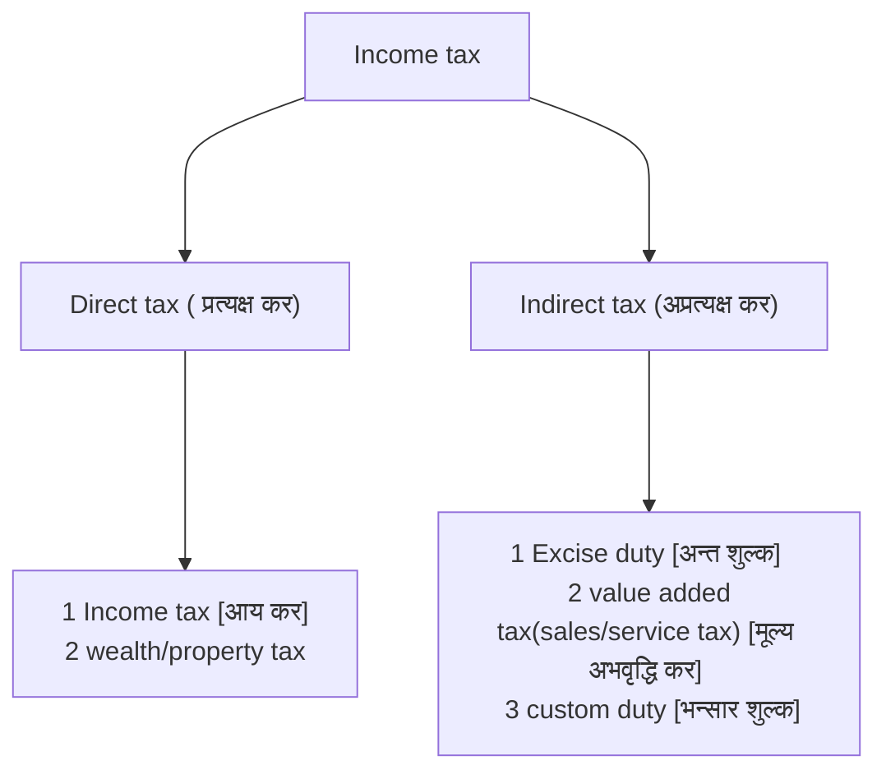
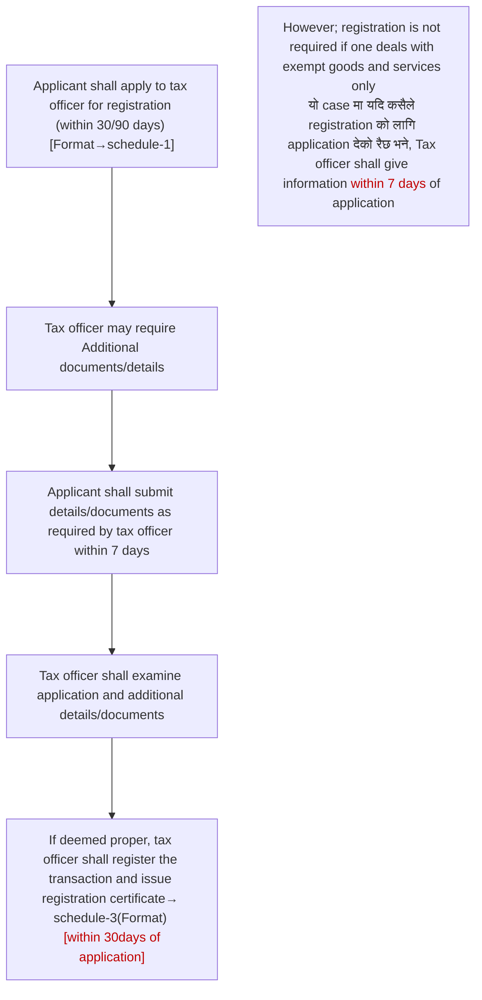

**Mechanism of VAT**

![[Pasted image 20250905060518.png]]

![[Pasted image 20250905071312.png]]

enacted form mangsir 1, 2054
	VAT act ,2052 ⇒ By parliament 
	VAT rules, 2053. ⇒ By GON. \[using the powers conferred u/s 41 of the Act]
Note: The provision of VAT act shall prevail over provision of VAT rules in case of conflict

<u>Section 3</u> GON may [नयाँ officer appoint गर्न नी सक्छ , आरु government officer लाई tax officer बनाउन नी सक्छ]
- appoint tax officers (or)
- Designate any office of GON as tax officer
[[vat act unofficial translation#Tax Officer may be appointed or designated]]

<u>Section 4</u> Jurisdiction(कार्य क्षेत्र) of the [Tax officer appoint गर्ने MOF ले तर DG ले चाहिँ jurisdiction change गर्न सक्छ]
- as decided by MOF(ministry of finance)
- DG may appoint the officer in other jurisdiction also
[[vat act unofficial translation#Jurisdiction of a Tax Officer]]

## Registration
1. **Compulsory registration:** when it is compulsory to get registered under VAT
2. **Voluntary Registration:** There is not compulsion but one may apply for registration voluntarily
3. **Temporary Registration:** For some time , eg: joint venture , Fair exhibition

### voluntary registration

<u>Section 10</u> : [[vat act unofficial translation#Registration]]
10(1): Person desiring to involve in business shall apply to tax officer in the prescribed form for registration. \[Format → schedule 1 of the rule]

| Application for registration                                       |                                                                                         |
| ------------------------------------------------------------------ | --------------------------------------------------------------------------------------- |
| a. If goods/services are transacted before commencement of the act | ⇒ within 90 days of commencement                                                        |
| b. If goods/service are transacted after commencement of the act   | ⇒ within 30 days form  - date of transaction  or  - date of business operation |

Procdure for registration

<u>Rule 6</u>
1. Person carrying on transaction with turnover not exceeding 50/30 lakh in last 12 months not required to get registered in VAT.
where,
- turnover means→ higher of :
	- VAt लाग्ने goods/services को Purchase or,
	- VAt लाग्ने goods/services को sales
- last 12 month→ त्यो particular month भन्दा आगाडि को  month end बट last 12 months हेर्ने
Eg:
![[Pasted image 20250905083049.png]]
note: 
- however if any person imports taxable goods of $\geq$ 10,000 at a time ⇒ compulsory registration for VAT  (not required if it's for personal use)
- Even if turnover is less than above threshold, one may apply for registration voluntarily.(यदि कसैले voluntary application दिन्छ भने normal case मा जस्तै registration हुन्छ)
- limit of $\geq$ 30L/50L
	- goods→ 50L
	- service→ 30L
	- goods/Services→ 30L

<u>Rule 7</u>
1. if there is presumption that the turnover shall exceed the threshold, or 
2. The transaction exceeds the threshold
the person carrying out the transaction shall apply for registration 

### Temporary registration 
`page : 19`

#### Fair exhibition (section - 10A)
Purpose : to balance out the price of goods for both VAT registered and unregistered businesses 

1. The unregistered entrepreneur dealing in taxable goods/services
   in temporarily held fair, exhibition etc
   shall get temporary registration
2. Such person shall apply to IRO or TSO along with the recommendation letter from organizer.
3. While applying for temporary registration , 2% of estimated sales shall be deposited.
4. Before the stock transfer for such fair, exhibition, details of following shall be submited
	- Details of stock transfer
	- First and last number of invoice or abbreviated tax invoice
5. After completion of fair, details of following shall be submitted (within 7 days)
	- Details of stock transferred 
	- Unused invoice
6. within 7 days of completion of fair, 
	- transaction details shall be submitted 
	- tax shall be paid
7. within 7 days of completion of fair
	- submit VAT return
	- Deposit VAT amount
	- apply for cancellation of registration
	  along with 
		- copy of PAN certificate
		- Tax clearance certificate of temporary registration (यसले tax तिरी सको भनेर दिएको प्रमाण पत्र )
		- Recommendation letter from organizer

![[vat act unofficial translation#Special provision relating to temporary registration]]

Offices under IRD
- Large tax payer office
- Medium level tax payer office
- Inland revenue office
- Taxpayer service office

#### Registration of Joint venture  (section - 10B)
1. JV shall apply for registration in VAT to the tax office where any of the co-venturer are registered (A र B मिलेर AB JV खोल्छ भने AB either A or B register भएको ठाऊ मा register गर्नु पर्छ )
2. JV shall cancel the registration after completion of the prescribed work/time
3. The co-venturer shall jointly and severally liable to pay tax

![[vat act unofficial translation#Special provision relating to registration of joint venture]]

#### Updating old fingerprints digitally

![[vat act unofficial translation#Special provision relating to update of registered record]]

#### Registration of non resident providing electronic services(section 10B1)
`Page no: 20`
1. Non- resident providing electronic services  + Having annual turnover > 30 lakh 
   ⇒ shall be registered in VAT
2. Registration procedure for such person shall be as prescribed
3. Cancellation of registration may be done with prescribed procedures

![[vat act unofficial translation#Registration of Non-resident providing electronic services]]

### Compulsory registration

#### Circumstances where transaction has to be registered

![[vat rule unofficial translation#Special conditions to register a transaction]]

#### Forced registration (section 5B)
`page : 18`
1. Where the tax officer has a reasonable ground to believe that 
   a person required to be registered 
   is carrying out any transactions without getting registered, 
   Tax officer may order such person to get registered
   \[यदि त्यो मान्छे लाई आफ्नो दर्ता हुनु पर्दैन जस्तो लाग्छ भने 30 days from the order मा inform गर्नु ]

![[vat act unofficial translation#Power to order for registration Forced registration]]

## Duties of Registered person

<u>Section 10(5) :</u>
Display of Registration certificate → at conspicuous place 
- at principal place of transaction ⇒ original certificate राखने 
- other places of transaction ⇒ copy of the certificate (attested by Tax Officer)

<u>Section 10(6) :</u>
Use of registration number 
Registration number shall be used for all transactions relating to 
- VAT
- Excise duty
- Import and export
- Income tax
- Documents relating to loan > 1 lakh from bank or financial institution

<u>Section 10(7) :</u>
Change in the details/information given at the time of registration 
- Change of place : 
  Change of nature/objective : 
	- ⇒ inform tax officer 15 days prior to such change
	  ( if place change भएर आर्को tax office को jurisdiction मा जाने भए , tax officer shall inform the concerned tax office (नया वाला office) within 7 days)
- other changes 
	- ⇒ within 15 days of such change

<u>Section 10(5) :</u>
**Display certificate everywhere**
![[vat act unofficial translation#^4brfbk]]

<u>Section 10(6) :</u>
**Use registration number everywhere**
![[vat act unofficial translation#^0v0tvv]]

<u>Section 10(7) :</u>
**Inform the tax officer in 15 days if change in details used in registration** 
![[vat act unofficial translation#^4t3631]]

<u>Rule 14</u> Duplicate Registration certificate
If Registration certificate is torn, lost or otherwise destroyed 
⇒  apply for duplicate copy (fee: Rs100)
⇒ Tax officer shall provide duplicate copy within 15 days

<u>Rule 14A</u> Tax plate

| Nature of person                    | Types of tax plate |
| ----------------------------------- | ------------------ |
| 1. Registered person                | green              |
| 2. Unregistered→ due to threshold | yellow             |
| 3. Exempt transaction only          | white              |

<u>Rule 14B</u> Menu, Tag price etc to be inclusive of VAT
- Sales price, tag price, menue, self price etc to be inclusive of VAT
  (menu मा भएको price मा पहिलाई VAT जोडेर राख additional VAT लिना पेईदैन )

<u>Rule 14</u>
![[vat rule unofficial translation#To issue duplicate copies]]

<u>Rule 14A</u>
![[vat rule unofficial translation#Provision regarding tax board]]

<u>Rule 14B</u>
![[vat rule unofficial translation#Price inclusive of tax to be mentioned]]

## Cancellation of registration (Section 11)
`page: 21`
Tax officer shall cancle the registration in following cases
a.

| Nature                 | Cases of cancellation                                                                                                                                                                                                                                                                                                       |
| ---------------------- | --------------------------------------------------------------------------------------------------------------------------------------------------------------------------------------------------------------------------------------------------------------------------------------------------------------------------- |
| 1. Body corporate      | - closed down - transferred - ceases to exist (any reason)                                                                                                                                                                                                                                                            |
| 2. proprietorship firm | - death of proprietor                                                                                                                                                                                                                                                                                                       |
| 3. Partnership firm    | - Dissolution - death of partner                                                                                                                                                                                                                                                                                         |
| 4. Registered person   | - ceases to deal in taxable transaction                                                                                                                                                                                                                                                                                     |
| 5. Any person          | - submits "zero tax return" or does not submit return for continuous 12 month - Transaction is less than threshold (50l/20l) for last 12 month  (voluntary registration को case मा चाही : if application is filed along with tax return from last 12 months  , registration cancel हुदैन ) - Registered by mistake |
b. Procedure for cancellation of registration 
- Tax payer should submit document for cancellation within 15 days of filing return(as prescribed in schedule 11) - within 30 days from occurrence of event
- Tax officer shall verify documents , and within 3 months
	- cancel the registration or,
	- Inform tax payer that registration can't be cancelled 
note: 
- if 3 months भित्र tax officer ले registration cancel पनि गरेन र cancel नगर्ने पनि भनेन भने , it shall be considered to be cancelled.
- cancellation को लागि apply गरेपनी return भर्नुपर्छ `तर`  cancellation को बारेमा 3 months सम्म पनि tax officer ले केही भनेन भने चाही no return 
- If taxpayer ले apply गरेन भने tax officer ले आफैले पनि registration cancel गराई दिन सक्छ । 

<u>Subsection-4 :</u> Stock and capital goods remaining after cancellation of registration 
- if any stock goods or capital goods are remaining after cancellation of registration (जसमा tax credit लिएको थियो )
- shall be considered as supply at market value
- and , tax shall be collected accordingly
note : यो taxable goods/ capital goods मा मात्र applicable हुन्छ 
Eg: 
ABC Pvt Ltd , registered person, purchased following on Baisakh 
1. 100 laptops @ 50k each (stock)
2. 20 furniture @ 1lakh each (capital assets)
Sales during Baisakh
- 20 laptops @ 60K each 
Registration was cancelled during Jestha. Market value of laptop and furniture was Rs. 60K and 120K each 
-> Solution :
<u>Baisakh month return</u>
VAT on sales (20 x 60k) x 13%                              = 156k
less: VAT on purchase (100 x 50k + 100k) x 13% = <u>663k</u>
VAT (payable/receivable)                                     = (507k)

<u>At cancellation: </u>
Laptop and furniture are deemed to be sold at market value; 
VAT on sales (120k + {(100 - 20) x 60k}) x 13% = 639.6k
less: VAT on purchase                                        = -
less: opening credit                                           = <u>507k</u>
Payable at cancellation                                    = 132.6

<u>subsection -5</u>
Registration हुने बेलाको कुनै liability रहे छ भने deregistration भईसके पछि पनि release हुदैन 

![[vat act unofficial translation#Cancellation of Registration]]

![[17_dec#Question no. 6 (IT & VAT)✓]]

## Special provision for CONTRACT and CONSTRUCTION CONTRACT

### Provisions relating to government contract (rule 6A)
`Page : 12`
1. following person 
	- government body
	- Public institution 
	- Any registered person 
	should pay VAT to the contractor only after informing IRO
	while making contract or acquiring consultancy for more than 5 lakh annually 
	⇒ must do so from registered person 

![[vat rule unofficial translation#Provision regarding contract]]

### Special provision for construction contract (rule 6B, section 8(3))

<u>Rule 6B : </u>
1. Any person (Registered/unregistered)
   construction contract for commercial purpose
   for cost > 50 lakh 
   must be done through registered contractor
   (50 lakh भन्दा बढ़ी को commercial building बनाउद registered contractor सँगै बनाउनु पर्छ )

![[vat rule unofficial translation#Special provision regarding construction service]]

<u>section 8(3)</u>
1. Any person 
   construction contract for commercial purpose
   cost > 50 lakh 
   from unregistered person 
   ⇒ The contractee shall deposit the tax amount
2. while calculating 50 lakh
   All the capital expenditure `Except following` shall be added
	1. Financial cost (i.e. interest cost)
	2. Expenses incurred before construction . eg:
		- mapping expenses
		- Expenses to approve map
		- survey expenses to third party
3. section 8(3) मा reverse charge मा तिरेको tax को credit पाउने की नाई भन्ने कुरा debatable छ because no provision regarding it is given

![[vat act unofficial translation#^swgcbf]]

## Reverse charge on supply to government 
`page: 12`
1. following persons
	- government body
	- public institution 
	- government owned entity
	shall deposit 30% of VAT amount with IRD with concerned revenue head in the name of supplier/contractor 
	while making payment to any supplier or contractor
2. The supplier/contractor can take credit of such amount `and` may also apply for refund of the amount

![[vat rule unofficial translation#Special provision regarding tax payment for supply of goods and services under contract]]

# Levy of Tax (taxable goods)
`page: 4`

<u>Section 5(1)</u>
VAT shall be levied on following transactions 
1. on goods/services supplied within Nepal
   where, supply means the act of : 
	- selling of goods/services
	- exchange of goods/services
	- transferring of goods/services
	- licensing 
	- contracting
	(with or without consideration)
	note: 
	- it means VAT sell मा मात्र होइन , barter system मा goods/services exchange गर्दा पनि लाग्छ 
	- consideration लिए पनि न लिए पनि , means free मा goods/services supply गर्दा पनि VAT लाग्छ 

2. on goods and services imported into Nepal
   "imported" means The act of bringing goods/service in Nepal

3. on goods/services exported from Nepal
   "exported" means the act of taking goods/services to 
	- outside Nepal
	- export house
	- special economic zone

>It means नेपाल भित्र supply गर्दा , नेपाल बाहिर बाट import गर्दा र नेपाल बाट बाहिर export गर्दा VAT लाग्छ 

![[vat act unofficial translation#^5snhgk]]

![[vat act unofficial translation#^1v8amt]]

![[vat act unofficial translation#^roqwig]]

<u>section 5(2)</u> : Rate x value

<u>Section 7</u>
1. Rate of tax shall be as mentioned in finance act of concerned year ⇒ 13%
2. However; schedule 2 मा भएको transaction of goods and services मा चाही ⇒ 0% 

<u>Section 5(3)</u> : 
No VAT on goods/services as referred to in schedule-1

|            | Exempt goods/services                       | Zero rated transaction                    |
| ---------- | ------------------------------------------- | ----------------------------------------- |
| covered by | schedule 1 of the act                       | Schedule 2 of the act (export)         |
| VAT ?      | VAT shall not be levied                     | Vat shall be levied @ 0%                  |
| credit     | Tax paid on purchase को क्रेडिट लिन  पाईदैन | Tax paid on purchase को credit लिन पाईन्छ |

![[vat act unofficial translation#Value Added Tax to be levied]]

![[vat act unofficial translation#Rate of tax]]

`Page: 5`
<u>Section 5A</u> Transfer of ownership
- Where business/ownership/transaction is transferred 
	- By a registered person to another registered person or, 
	- To his legal heir(may or may not be registered) on his death
	⇒ No tax shall be levied on such transfer
- The transferor shall give details of such transfer to IRO
  within 7 days in the format referred in schedule-4
- All the rights, power and liabilities shall be transferred to transferee.
- The transferee shall be liable for the tax on such transaction (मानऊ आगड़ीको  कुनै tax liability रैछ भने पनि त्यो अब transferee ले तिर्छ )
- The transferee shall be liable to keep books of accounts, register, document etc. even for the period before the transfer for the period prescribed(6 years) under the act 

![[vat act unofficial translation#Tax not to be levied on transfer of ownership of transaction]]

# Charging of Tax (ch-3) (who Will pay tax)
`page: 8`

<u>Section 8(1)</u> : Assessment and collection of tax
- Registered person shall
- assess and collect tax
- at the taxable value
- in accordance with provision of the Act and Rules
Note:
1. Registered person ले taxable goods/services को supply मा सधै VAT collect गर्नुपर्छ , 
   weather it's supplied to registered/unregistered person
2. तर unregistered person ले VAT collect गर्नुपर्दैन 

<u>Section 8(2)</u> : Reverse charge on import of service
- The recipient of services, whether or not registered
  importing services from a person outside Nepal (who is unregistered)
  shall deposit VAT 
  At the earlier of :-
	- time of payment or, 
	- time of receipt of service
(in case of import of goods , VAT will be paid at custom point)
Note:
it means reverse charge को VAT पहिला आफैले तिरने अनि credit claim गर्ने  (VAT नतिरने credit पनि claim नगर्ने भन्न पाईदैन  ) 
Reverse charge को VAT लाई आगड़ीको credit संग set-off गर्न पाईदैन  (it must be paid first, and then credit can be claimed later )

![[vat act unofficial translation#Assessment and recovery of tax]]

<u>Section 15</u> : Unregistered person not to collect tax
1. Unregistered person 
	- shall not issue tax invoice or other document showing tax collection and,
	- shall not collect tax
2. However, if such unregistered person collects tax, it shall be deposited with IRD within 15 days 
3. 
	- Government of Nepal,
	- provincial government,
	- local bodies or
	- international
	    - institution,
	    - organization or
	    - body situated in Nepal or
- a public corporation involved in transaction of VAT exempted goods
- shall have to recover tax at the time of sale of taxable goods or services.
eg: District administration office sold old furniture and collected VAT

![[vat act unofficial translation#Unregistered person not to collect tax]]

# Time and place of supply

## Place

<u>Section 6(1)</u> : Place of supply
- Place of supply of goods (Rule 15)
- Place of supply of services (Rule 16)
- Place of supply of Electronic services (Rule 16A)

<u>Rule 15</u> : Place of supply of ==goods==

| S.N. | Particulars      | Place of supply                                   | Example                                                                                                                    |
| ---- | ---------------- | ------------------------------------------------- | -------------------------------------------------------------------------------------------------------------------------- |
| 1    | Moveable goods   | where such goods are sold/transferred             | Ktm को मान्छे ले pokhara को मान्छे लाई mobile बेचदा , place of supply ⇒ ktm                                                |
| 2    | Immoveable goods | where such goods are situated                     | pokhara मा भएको factory ktm को मान्छे ले biratnagar को मान्छे लाई बेच्यो भने , place of supply ⇒ pokhara                   |
| 3    | Import of goods  | At the custom point from where goods are imported | ktm को business ले birgunj हुदै delhi को goods import गर्यो भने , place of supply ⇒ Birgunj                                |
| 4    | self consumption | where seller/manufacturer is situated             | if Hulas steel (simara) मा manufactured जस्ता बाट hulas ले ktm मा नयाँ factory set-up गर्यो भने , place of supply ⇒ simara |

<u>Rule 16</u> : Place of supply of ==services==
The place where benefits are taken 
Note: 
1. त्यो services बाट जहा benefit पाएको छ , i.e place of supply

<u>Rule 16A</u> : Place of supply for ==electronic services==
place of supply is said to be in Nepal if any of the following conditions are satisfied:
- Services are received in Nepal
- Invoice is issued in the address of Nepal 
- Payment is made through bank account operated in Nepali bank or through institution or entity authorized for payment 
- Payment is made through debit, credit or similar other cards issued by Nepali bank or institution or entity authorized for payment
- Service is received using Internet Protocol address in Nepal 
- Service is received using Sim card or landline having code of Nepal

## Time

<u>Section 6(2)</u> : Time of supply
A. In case of ==goods==
	which ever is earlier :-
1. Date of issue of invoice 
   \[Invoice को date]
2. Date when goods are [received]{when  बाटो को risk seller को छ , i.e. seller ले goods पठाई दिन्छ }/[taken]{when बाटो को risk buyer को छ , i.e. buyer आफै goods किन्न आएको छ भने } by buyer
   \[Basically, it's the time when ownership is transferred]
3. Date when [consideration]{payment against value of supplied goods/service(कुनै certain goods/services को लागि payment गर्छ भने त्यो )} is received
   eg:
	- advance payment with list of goods/services ⇒ consideration 
	- random/ad-hoc advances ⇒ not a consideration

B. In case of ==services==
	whichever is earlier
1. Date of issue of invoice or,
2. Date of rendering of service
	   \[जून दिन services render(end/complete) हुन्छ ]
	   eg: In case of audit, date on which audit report is received 
3. Date of consideration 

<u>Section 6(3)</u> : Time of supply in case of ==special circumstances==

| S.N. | cases                                                                                                 | Time of supply                                                                                                                            |
| ---- | ----------------------------------------------------------------------------------------------------- | ----------------------------------------------------------------------------------------------------------------------------------------- |
| 1    | Telecommunication services or similar public services (eg: subscription internet, water, electricity) | The date on which invoice is issued                                                                                                       |
| 2    | When payment for value is made in installment (eg: Hire purchase)                                     | whichever is earlier - payment date - due date for payment (प्रत्येक period को installment को लागि छुट्टै time of supply हुन्छ ) |
| 3    | where tax credit is not available (कसैले credit claim गरेर पछि self consumption गर्यो भने )        | when such goods/services are used                                                                                                         |
<u>Section 6(4)</u> : Where there is more than one time of supply 
Director General may decide it objectively 
(त्यो particular case हेरेर Director general ले decide गर्नुहुन्छ )

![[vat act unofficial translation#Place and time of supply]]

# Taxable value

<u>Section 12 </u> : Taxable value
1. where only cash is consideration 
   Taxable value ⇒ price taken by supplier
   It includes :
	1. Transportation, distribution or other similar expenditure borne by supplier
	2. Profit
	3. Excise duty and all other tax imposed (except VAT)
	   (it means first x% excise duty is added and then 13% VAT will be added on amount derived after adding excise duty)
	It excludes
	-  Trade discount (it means trade discount should be deducted before calculating VAT amount)
	- commission or similar other rebates 

<u>Section 12(4)</u> : Valuation in case of exchange/Barter
Taxable value ⇒ [[VAT#Market value|Market value]] of the goods exchanged
Barter मा normally दुबई सामान को market price same हुन्छ , but if there is any difference , [आफूले]{the registered person who is supposed to collect VAT} जून goods दिरहेको छ , त्यसको market value हेर्ने हो .

## In case of import

<u>Section 12(5)</u> : Valuation in case of import

|     | Particulars                                                                                    | Amount       |
| --- | ---------------------------------------------------------------------------------------------- | ------------ |
|     | cost fixed by custom officer (if it is not given , invoice value)                           | xxx          |
| +   | Insurance, freight and other incidental charges incurred to bring the goods up to custom point | xxx          |
| +   | Port clearing expenses                                                                         | <u> xxx </u> |
|     | **custom valuation**                                                                           | xxx          |
| +   | custom/import duty (rate is as per custom act)                                                 | xxx          |
| +   | Excise duty (tax on production of goods)                                                       | xxx          |
| +   | प्रज्ञापन पत्र fee                                                                             | xxx          |
| +   | other tax and fee paid at custom                                                               | <u> xxx </u> |
|     | **Taxable value for VAT**                                                                      | xxx          |
Notes:
1. custom valuation गर्दा custom point सम्म ल्याउन को लागि लगने खर्च मात्र जोड़ने , custom point बाट business place सम्म को खर्च ignore गर्ने 
2. Generally, invoice value नै लिने हो for valuation . But if it has been revised/fixed by custom officer ,then त्यही लिने 
3. If custom point मा excise duty र custom duty both लगने छ भने 
	- 1st custom duty x%
	- 2nd excise duty y%
	- 3rd VAT 13%

![[Tax/Tax notes/Questions#Question 10 page 35 june-2009]]

![[Tax/Tax notes/Questions#Question 11 page 35]]

![[vat act unofficial translation#Taxable value]]

![[Tax/Tax notes/Questions#Question 6 page 31 dec-2009]]

![[Tax/Tax notes/Questions#Question 7 page 32 june-2013]]

![[Tax/Tax notes/Questions#Question 8 page 32]]

<u>section 28 </u> : Provision relating to imports
1. custom officer shall recover VAT on the goods imported into Nepal. \[tax rate→ as in case of supply of goods in Nepal i.e. 13%]
2. Valuation for this purpose shall be done as per [section 12(5)]{import valuation} and [section 12(6)]{under invoicing} 
   however if valuation can't be fixed at importation :
  → permission shall be given to import , on deposit of sufficient sum to recover all taxes and charges
   (it means valuation fix नभाको भएर आहिले sufficient amount deposit गरेर , समान लिएर जाऊ , पछि हिसाब गरौला भनेर )
   (यस्तो deposit को credit लिन पाईदैन , किनकि यो deposit मात्र हो , VAT त तिरेकै छैन )
3. when valuation is fixed, 
  → the VAT amount is adjusted from deposit . If any excess , shall be refunded 
  → यसरी valuation fix भएको 1 year भित्र मा credit claim गर्न पाईन्छ 

<u>section 20(1a)</u> : 
goods exported from Nepal
		+
Re-imported due to rejection by party or other reason 
		+
same goods are exported within 3 months of import
		↓
The goods shall be released against deposit of VAT. (अहिले deposit को रूप मा देऊ )
		↓
which shall be refunded when the goods are re-exported within 3 month

![[vat act unofficial translation#Provision relating to imports]]

<u>Section 25(B)</u> : 
1. यस sec-20(1a) मा deposit गरेको पैसा  re-export गर्ने time मा refund पाईन्छ । 

<u>Section 25(C)</u> :
यस्तो case मा त्यो goods को  against(लागि) मा कुनै purchase हरु गरेको छ भने , त्यस्तो purchase मा तिरेको VAT को पनि credit पाईन्छ→ only if payment is received in advance in convertible foreign exchange
\[eg: new parts purchased to repair the goods imported for re-export]

![[IMG_20251103_160945.jpg]]

![[vat act unofficial translation#Refund of tax at customs point for re-export]]

![[vat act unofficial translation#Refund of tax for re-export]]

![[vat rule unofficial translation#Provision regarding temporary imports]]

<u>Rule - 50 </u> 
1. Tax to be collected u/s 28 को supervision & management Director General ले गर्छ & may give order to tax officer 
	- to ascertain imposition of tax on sample basis
	- to enter/inspect/search any places and enquire concerned person
	- to seize, take copy, inspect document related with purchase/sales/import

<u>Rule - 51</u>
1. custom office ले collect गरेको सबै VAT daily basis मा VAT fund मा राख र within 3 days nearest IRO मा information देऊ 
*If  कुनै refund  दिनु छ भने , refund  दिएर बाकी  बचेको  amount*

![[vat rule unofficial translation#Power of Director General to supervise and manage]]

![[vat rule unofficial translation#Special provision on amounts received from imports]]

 [[19_dec#Question no. 6 (IT & VAT)✓]]
 ![[19_dec#Question no. 6 (IT & VAT)✓]]

## In case of wood

<u>Section 12A</u> : Valuation in case of wood
1. sale of wood from national forest
   a. At the earlier of 
	   → Auction 
		   or 
	   → Release letter
		   or 
	   → order to saw the wood from national forest
	b. On the amount 
	higher of :
		→ Royalty
			or
		→ Auction amount
2. Sale of wood from 
   → privately cultivated land 
	   or 
   → private forest 
	   or 
   → community forest 
   +
   for commercial purpose 
	   ↓
   Tax shall be levied @ 13% on higher of 
   → Royalty amount 
	   or 
   → Auction amount

Note:
1. National forest बाट wood किन्दा  छुटै  tax invoice पाईनन . Tax pay गरेको revenue voucher को आधार मा credit claim गर्न पाईन्छ । 
2. Fire wood , woods in chips/ particles , saw dust, wood waste etc मा tax लाग्दैन 
   (Exempt under schedule 1)

![[vat act unofficial translation#Tax applicable on transaction of timber]]
fuel woods(fire woods, woods in chips or in particles, saw dust and wood waste and scrap etc) is schedule 1 goods

##  In case of second hand goods

<u>Section 17(5)</u> : Credit of tax paid on used goods
In case of sales of used goods(second hand goods) by a person dealing in used goods
↓
The VAT is levied on 
↓
Sales price - cost price - VAT paid on purchase
\[VAT paid on purchase shall not be allowed as tax credit]

Notes:
1. This provision is applicable only for person dealing with used goods
   (जसको काम नै second hand goods बेचने हो , त्यसलाई यो provision लाग्छ , `but` बाकी ले आफ्नो पुरानो asset बेचदा normal rule  नै लाग्छ  )
2. If sales price is less than cost price 
   ↓
   no VAT is levied
3. The VAT should be calculated separately for each item.
   eg:
   

| Particulars | cost price      | Sales price        | VAT           |
| ----------- | --------------- | ------------------ | ------------- |
| Furniture   | 1L              | 1.2L               | 2.6K          |
| computer    | <u>   2L   </u> | <u>    1.9L   </u> | <u>  -   </u> |
|             | 3L              | 3.1L               | 2.6k          |
(3.1L-3L)x13% = Rs.1300 is wrong VAT amount

4. such person dealing with used goods shall maintain following records
	(a) Relating to Purchase:
		(1) Date of Purchase,
		(2) Particulars giving full information of the goods,
		(3) Cost price excluding tax,
		(4) Rate of tax,
		(5) Tax amount,
		(6) Total amount paid.
	(b) Relating to Sale:
		(1) Date of sale,
		(2) Selling price excluding tax,
		(3) Difference between the cost price and the selling price,
		(4) Rate of tax,
		(5) Tax amount,
		(6) Total amount received.
	यदि यसरी full details/documents maintain गरेन भने tax officer ले normal taxpayer जसरी नै tax तीर भनेर order issue गर्न सक्छ । 

![[vat rule unofficial translation#Method of tax assessment of used goods]]

![[Tax/Tax notes/Questions#Question 13 page 37 dec-2011]]

![[Tax/Tax notes/Questions#Question 14 page 37]]

> [!note] questions
> `page: 38 Q15,`

![[Tax/Tax notes/Questions#Question 15 page 38]]

## Market value 

<u>Section 13</u> : Market value
1. Market value of any goods/services
   shall be determined 
   taking into account
   consideration received from similar goods/services
   freely supplied between unconnected parties

2. **Rule 22(1)** : Tax officer shall determine market value by 
	   - studying the transaction and price of similar other sellers in similar transactions

3. If market value cannot be determined as above 
   **Rule 22(2)**
   Director general shall determine market value on the basis of price of similar sellers
Note : 
- Tax officer ले चाही similar transaction मा अरुको कति छ भनेर हेरछ
- DG ले चाही similar seller ले कति charge गर्छ भनेर हेरछ
- it means DG has more power 

![[vat act unofficial translation#Market value]]

# Tax credit / Tax deduction

<u>Section 17 </u>: Tax deduction/credit
1. A Registered person may deduct the amount of tax which s/he has collected
   against
   Tax paid/payable in 
	- Acquisition of goods/services or
	- Import of goods/services
	Related with his own taxable transactions
notes: 
- Net payable tax निकालने तरीका 

|       | Particulars                                                                      | Details    | Amount       |
| ----- | -------------------------------------------------------------------------------- | ---------- | ------------ |
|       | Tax collected on supply of goods/services                                        |            | xxx          |
| Less: | <u>input tax credit</u>                                                          |            |              |
|       | 1. Acquisition of goods/service  		   (as per tax invoice)                    | xxx        |              |
|       | 2. Import of goods                     		   (as per vat paid at custom point) | xxx        |              |
|       | 3. Import of services          		   (as per reverse charge paid on import)    | <u>xxx</u> | <u>(xxx)</u> |
| =     | Net VAT payable/ receivable  for the month                                       |            | xxx          |
| Less: | opening credit                                                                   |            | <u>(xxx)</u> |
| =     | Net VAT payable/(receivable)                                                     |            | xxx          |

![[Tax/Tax notes/Questions#Question 2 page 39]]

> [!note] questions
> `page: 39 Q1,`

![[Tax/Tax notes/Questions#Question 2 page 39]]

> [!note] questions
> `page: 39 Q2,`

<u>Section 17(2)</u>
2. No deduction/partial deduction shall be granted in case of specified goods (Business मै use गरेपनी )
<u>Rule 41</u>
No tax deduction shall be allowed for tax paid/payable on
	1. Beverages : coke, fanta, sprite
	2. Alcohol or alcohol mixed beverages : whiskey , beer , liquor
	3. Petrol for vehicle : गाड़ी मा हालेको petrol को no credit
		→ petrol for machines credit allowed ✔ 
		→ diesel for vehicle credit allowed ✔ 
		→ Diesel for machines credit allowed ✔ 
	4. Entertainment expenses : party हरु आयोजन गर्दा तिरेको VAT को no credit

only 40% of VAT paid/payable allowed as credit on
	Three or more than three wheeled
	+
	passenger motor vehicles used on road
	Eg: car , bus , van etc 
	→ Bike : credit allowed  ✔ 
	→ Truck , tipper, delivery van etc  : credit allowed  ✔ 

Note: above goods business मै use गरेपनी credit not allowed
	Eg: petrol used in office vehicle => credit not allowed

If any person supply above goods as his main business => full credit shall be allowed
eg: 
→ car purchased by car showroom(seller)
→ petrol purchased by petrol pump(seller)

![[Tax/Tax notes/Questions#Question 3 page missing]]

![[vat act unofficial translation#Tax deduction]]

<u>Rule 39</u> : Tax deduction allowed
Tax paid on purchase/import shall be allowed as credit where
1. goods/services are directly related to taxable business
   \[If त्यो goods/services taxable business संग directly related छ भने मात्र credit पाईन्छ ]
Eg: Ramesh p.ltd purchased a machinery for Rs 20L (excl VAT) . It is used for production of medicines (which are VAT exempt goods)
=> since, the machine is used in non-taxable business. credit cannot be claimed
	However if it is used to produce a taxable goods → credit allowed
=> If it is used for exempt goods , taxable goods and zero rated goods 
	→ Proportionate basis मा credit पाईन्छ (as per ratio of sales value of output)
		- Exempt goods  x
		- Taxable goods  ✔ 
		- Zero rated goods ✔ 

2. Documents for credit claim
	1. Acquisition of goods/services (in Nepal) : Tax invoice
	2. Import
		1. of goods : 
			- प्रज्ञापन पत्र 
			- Invoice
			- cash receipt of custom
		2. of services
			- Invoice 
			- Reverse VAT paid voucher
			

<u>Rule 39(2)</u>
1. Credit can be claimed within 1 year from 
   → date of invoice
   or
   → date of documents relating to import

**Notes**:
1. Date of invoice/ import documents काे 1 year भित्रमा credit claim गरिसक्नु पर्छ । 
   example: kartik 15, 2078 काे invoice छ भने 
		   kartik 2079 सम्ममा credit claim गरीसक्नु पर्छ । 
		   (if गरेन भने पछि claim गर्न पाइन्न )
2. The time limit of 1 years is only for credit claiming not for setting it off with tax liability 
   ( १ वर्ष भित्रमा credit चै claim गर भनेकाे हाे,
   यसलाइ एक चाेटि credit claim गरेसी जति time पनि carry forward गर्न सकिन्छ )
3. Tax paid on purchase/import काे deduction एकचाेटी मात्र पाइन्छ
   ( एकचाेटी tax तिरेकाे credit पनि त एकै चाेटी पाउछ)

<u>Section -24</u> Treatment for deduction > liability 
a. if tax deduction/credit > tax liability for a month 
		↓
	1. Such excess shall be adjusted with any outstanding amount (fee, fine , interest etc) \[sec-24(1)]
	2. Remainder = may adjusted with tax liability of subsequent month \[sec-24(2)]

<u>Section-24(3)</u> 
1. If the amount of credit remained excess after adjusting for continuous period of 4 months
   ↓
   The tax payer may make an application to tax officer for refund of such amount \[Format in schedule-10]
   \[मत्लब purchase/import मा तिरेकाे tax लगातार 4 months काे tax liability सँग set-off गर्दा पनी अझै बाकि छ भने refund claim गर ]
   ↓
   eg: Baisakh काे credit jestha, asadh, shrawan, Bhadra सम्मकाे liability adjust गर्दा पनि अझै  बाकि छ भने refund claim गर 

<u>Section-24(4)</u>  Immediate refund for exporters having export of $\geq$ 40% of total sales
a. If a registered person's 
	Export sales for the month $\geq$ 40% of total sales
	↓
	He may get immediate refund of such credit 
	(after adjusting any outstanding amount)
	`if`
	he submits any application as per process

note:
1. if कसैले कुनै particular month मा total sales काे 40% or more काे export गर्छ भने 
	↓
	he does not need to wait 4 months for refund
	↓
	तुरून्तै refund पाइन्छ ।
2. Thus, 40% पुग्याे कि नाइ भनेर चै each month check गर्नु पर्याे                            

![[Tax/Tax notes/Questions#Example question section-24(4)]]

<u>Rule 39(5)</u> 
such person has to make an application in the format as per schedule-10 for getting refund
→ tax officer shall verify whether the tax is paid or not and whether the return file substantiates the refund claim `and` then shall refund the amount

<u>section-24(5)</u> Interest on refund
1. if refund is not given within 60days of an application as per section 24(3) or 24(4) 
   ↓
   Interest @ 15% p.a shall be given after 60days of application
   (60 days भित्रमा refund दिएन भने 61st day बाट 15% p.a interest पाइन्छ )

<u>section-24(6)</u>
1. After application for refund , it shall not be available for credit
   \[Refund claim गरेपछि (even if not received yet) यसलाइ credit claim गर्न पाइन्न ]

<u>section-24A</u> Time limit for refund
Refund shall not be provided if
application is not filed within 3 years
from date of end of tax period

note:
→ if Baisakh , 2078 काे excess credit काे refund claim गर्ने हाे भने Baisakh 30 , 2081 भन्दा अगाडी नै application submit गर्नुपर्याे 

→ याे limit refund claim गर्नकाे लागी मात्र हाे carry forward of credit काे लागी no time limit

![[vat rule unofficial translation#Tax may be deducted]]

![[vat act unofficial translation#Treatment of deduction exceeding tax liability]]

![[vat act unofficial translation#Tax refund to be claimed within 3 years]]

<u>Section-17(5A)</u> Credit of goods financed by third party 

step 1: ABC ltd approaches Everest bank for financing agreement
Step 2: Everest bank paid amount car to dealer/distributor of the car
Step 3: Distributor/Dealer transferred possession of vehicle (invoice issued in the name of Bank)

↓
It means ownership of the car is with the bank
↓
Even then; credit of VAT paid on such car can be claimed by ABC pvt. ltd
↓
ABC pvt. ltd. ले जब full installment तिरीसक्छ ownership shall be transferred to it . (त्यतिखेर कुनै VAT लाग्दैन )

<u>Section-17(3)</u> Proportionate credit 
- if goods/services transacted in a month
- Isn't solely used for taxable transaction
- Credit of VAT paid on such goods/services
- can be availed only on proportionate basis
- for the portion that was used for taxable transaction
`Question no 13 मा लेखेकाे notes हेर `
`Rule -40(3) → Direct Ratio (if any in question) `
`Rule-40(4) → Indirect ratio i.e. sales (if question is silent`

<u>Section 17(4)</u> credit taken but not used for taxable transaction
ABC ltd purchased goods of Rs 10,000

|                |        |
| -------------- | ------ |
| Value          | 10,000 |
| VAT            | 1,300  |
| purchase price | 11,300 |
credit of Rs. 1,300 is taken (बैशाखमा)
↓
Later on (जेस्ठमा ) 600kg of the raw material was used for producing exempt goods 
\[पहिला credit लियाे ; पछि taxable transaction मा use गरेन]
↓
Now, 600kg of the raw material shall be treated as sold at immediate market value. 
\[ जति चै non taxable transaction मा use गर्याे , त्यतिखेरकै market value मा बेतेकाे मानिन्छ , even if not sold]

Note:
- if any goods/services are used for non taxable transaction before expiry date 
- for which tax credit have already been taken 
  ↓
  shall be treated as sold at immediate market value

<u>Section-17(5B)</u> Concerned taxpayer is allowed to take credit of tax paid 

| U/S   | Particulars                                                                                                                                                                   |
| ----- | ----------------------------------------------------------------------------------------------------------------------------------------------------------------------------- |
| 8(2)  | Import of service \[reverse charge अन्तर्गत पहिलाे अाफैले VAT तिर्ने , अनि credit लिने]                                                                                       |
| 12A   | sale of wood काे case मा allowed (buyer ले tax credit पाउछ)                                                                                                                   |
| 15(3) | unregistered person (GON/local body/public institution etc.) dealing in taxable transaction ले VAT उठाउदा → त्यसकाे credit पाइन्छ । (जसले सामान किनेकाे छ , उसले credit पाउछ) |

<u>Section 17(6)</u> 
VAT credit can be taken only if substantiated by documents
(Enough documents छ भने मात्रै credit claim गर्न पाइन्छ)

<u>Rule 17(7)</u> VAT paid on goods before registration
If VAT is paid on goods before registration
`and`
The goods are still in stock on the date of registration
↓
The details of such goods shall be given along with the form as per schedule-16
↓
The application shall also be accompanied by tax invoices/other documents substantiating the claim
↓
The claim may be accepted or rejected by Tax officer
↓
If accepted, credit can be claimed 
`and`
if rejected, tax officer may take some action against the person

Notes
1. 1 year (from registration date) भन्दा अगाडिकाे purchase invoice / import मा तिरेकाे VAT काे credit पाइन्न ।
2. The provision is applicable only for the stock and not for capital goods
Eg: purchased 100 laptops @ Rs 20,000 each. At registration date only 60 laptops are left
	→ credit of Rs 1,56,000 (60 x 20,000 x 13%) can  be taken by following above procedure

<u>Section 17(8)</u> 
If taxpayer doesn't submit tax returns for 6 months
→ The name of taxpayer shall be made public
→ Tax credit may be suspended
→ Registration may be cancelled

<u>Section 16B</u>
Eg: ABC pvt. ltd. purchases 1000kg of goods at Rs 10,000 .
=> VAT paid 1300
=> lost due to fire (jestha 25)
↓
पहिला goods purchase गर्याे , credit पनि claim गर्याे र पछि चै त्याे loss/fire/theft etc भयाे भने
↓
section 17(4) काे provision → sold at market value लाग्नपर्ने हाे 
↓
तर sec-16B ले याे case मा tax officer लाइ application देउ  र if allowed by tax officer , section 17(4) लाग्दैन , तिमिले credit लिन पाउछाै  ।

<u>section 16B , Rule 39A</u>
If goods are lost due to fire, accident, theft, wear and tear, vandalism, or expiry of consumption date
↓
VAT paid on such goods can be claimed as credit
↓
Application to be filed with tax officer within
	1. loss due to fire 
	   => 30 days of the event
	2. loss due to expiry of consumption
	   

| Date of expiry  | Due date   |
| --------------- | ---------- |
| Shrawan - ashoj | kartik 25  |
| kartik -poush   | magh 25    |
| magh -chait     | baisakh 25 |
| baisakh -ashadh | shrawan 25 |
note: no application required to the extent insurance compensation is received

![[Tax/Tax notes/Questions#Question 23 page 54]]

<u>Rule 40</u>
If the tax officer wishes to see/count the goods for which tax credit was claimed earlier
↓
tax payer has to let him see/count
↓
If tax officer doesn't find the goods
→ to have been used in taxable transaction
	or
→kept in stock
↓
Such goods shall be deemed to be sold at prevailing market price

त्याे sales चै respective month मा भएकाे मानिन्छ `तर` tax officer लाइ immediately tax उठाएन भने पछि नउठ्न सक्छ जस्ताे लाग्छ भने, he may order to pay tax immediately

Basically , कतै तपाइले यत्तिकै credit claim गरेकाे त छैन भनेर tax officer ले check गर्न अाकाे हाे । So, त्याे भेटेन भने sales गरेकाे मानिन्छ , fine penalty पनि लाग्छ ।

![[Tax/Tax notes/Questions#Question 5 page 44]]

![[Tax/Tax notes/Questions#Question 6 page 44]]

<u>Section 8A</u> : Provision for Bank guarantee (BG)

Example : since importer import raw material and export finished goods

**Without section 8A**
Importer pay VAT on import
↓
VAT is levied @0% on export
`and then`
claim refund u/s 24(3) or 24(4)

**With section 8A**
Import गर्दा Bank guarantee देउ VAT amount काे 

1. 
	- Industry
	- Exporting > 40% of total sales during last 12 months
	- may avail facility of Bank guarantee on import of raw material required for export of finished goods
	- At least 10% value addition above consumed value of raw material
2. Goods to be imported for duty free shop through bonded warehouse may also be imported using Bank guarantee facility.

<u>Notes</u>
1. याे facility industry/manufacturer लार्इ मात्र पाइन्छ (except duty free shop)
   It means RM import गरेर finished goods export गर्दैछ भने RM(Raw material) import गर्दा लाग्ने VAT चै नतिरेर Bank guarantee facility use गरेर पनि हुन्छ भनेकाे हाे 
2. This facility may be availed only when goods are imported for using it to manufacture goods for export purpose. 
   (यदि कसैले goods import गरेर ल्याउछ र finished goods बनाएर Nepal मै बेच्छ भने , no BG facility)
3. If कसैले Nepal मा नै RM purchase गरेर export गर्दैछ finished goods काे भने , this provision isn't applicable
4. Sec 24(4) → if $\geq$ 40% export sales भयाे in the month भने immediate refund पाउने कुरा हाे 
   Sec 8A मा अर्कै कुरा हाे (don't get confused)

<u>Section 8A(2)</u>
→ If bonded warehouse imports alcohol and cigarettes by using BG facility
	It shall be sold to diplomats and other person as recommended by ministry of foreign affairs only
	(मत्लब bonded warehouse ले BG facility use गरेर alcohol/cigarettes import गर्याे भने diplomats लाइ मत्रै बेच, बाकी अरू goods imports गर्दा जस्लाइ बेचे नि भयाे )

<u>Section 8A(3)</u> : Bank guarantee to be released
Export गरेर prescribe procedures follow गरेपछि custom office shall release the BG as prescribed by IRD

![[Tax/Tax notes/Questions#Question 19 page 49]]

![[Tax/Tax notes/Questions#Question no 20 page 49]]

![[Tax/Tax notes/Questions#Question 8 page unknown]]

![[Tax/Tax notes/Questions#Question 9 page unknown]]

![[Tax/Tax notes/Questions#Question 9 page 45]]

![[Tax/Tax notes/Questions#Question 10 page 45]]

![[Tax/Tax notes/Questions#Question 11 page 46]]

![[Tax/Tax notes/Questions#Question 12 page 46]]

![[Tax/Tax notes/Questions#Question 13 page 46]]

![[Tax/Tax notes/Questions#Question 14 page 46]]

![[Tax/Tax notes/Questions#Question 15 page 46]]

![[Tax/Tax notes/Questions#Question 7 page 45]]

![[Tax/Tax notes/Questions#Question 8 page 45]]

![[Tax/Tax notes/Questions#Question 16 page 47]]

![[Tax/Tax notes/Questions#Question 17 page 47]]

![[Tax/Tax notes/Questions#Question 18 page 47]]

![[Tax/Tax notes/Questions#Question no 24 page unknown]]

![[Tax/Tax notes/Questions#Question no 25 page unknown]]

![[Tax/Tax notes/Questions#Question no 26 page unknown]]

# Tax refund

1. Tax shall be refunded if application is filed within 3 years from the date of transaction `by`
	1. Diplomats of foreign country to Nepal `if` the country grants, on reciprocal basis, the tax exemption to Nepalese diplomats
	   \[eg: Indian Ambassador for Nepal ले VAT refund पाउछन `if` Nepali Ambassador for India ले India मा यस्तै refund/exemption पाउछन भने ]
	2. Mission enjoying diplomatic previlage on the recommendation of MOFA, GON. 
	3. United Nation's, it's member institutes, specialized agencies : → VAT paid on the transactions as per their objectives मा 
	4. International Institutes, for which tax exemption has been provided by MOF, GON 
	5. Project under bilateral/multilateral agreement for which MOF, GON has given tax exemption
	6. Amount paid by mistake (जस्लाइ real burden परेकाे छ , उसले refund पाउछ )
![[Pasted image 20260131134107.png]]

In this case; Mr.A ले चामलमा पनि VAT collect गरेर वुभायाे 
VAT pay Mr.A ले गरेकाे हाे `तर` real burden त B मा छ, So, B ले मात्रै refund पाउछ । 

<u>Section 25 (1A) </u> 
Diplomatic mission/diplomats
+
Tax paid on purchase of Goods/Service of value < 10,000 at a time 
↓
No refund

<u>Section 25(1B)</u>
Consumer paying price  of goods/services via electronic medium 
↓
10% of tax amount shall be refunded

Example:
![[Pasted image 20260131134147.png]]

![[vat act unofficial translation#Tax may be refunded]]

<u>Section 25A</u> Tax refund to tourists
Foreign tourists
+
purchased goods and takes along with him the goods
+
amount paid (value of goods) > 25,000
↓
The VAT paid shall be refunded by deducting service charge.

**Notes**
1. If tourists ले कुनै goods Nepal मा purchase गरेर Nepal मै consumption गर्छ भने → no refund
   ↓
   यहां purchase गरेर अाफुसगैं िलएर जान्छ भने मात्रै याे provision applicable हन्छ 
2. This provision is applicable only when he is going through air transport.
3. Departure काे time मा airport मा refund पाउने हाे

![[vat act unofficial translation#Refund of tax paid by foreign tourist on purchase]]

![[Tax/Tax notes/Questions#Question no 31 page 58]]

<u>Section 25C2</u> Refund to pharmaceutical industries

![[Pasted image 20260131134225.png]]

Since, medicine is exempt. VAT paid on purchase काे credit पाइन्न , which ultimately increase burden to final consumer
Thus, section 25C2 was introduced

- Pharmaceutical Industry may apply for refund of tax paid on purchase of 
	- direct material
	- Indirect raw material
	- Packing material
	on four month basis 
	(i.e ्र
	shrawan- kartik → mangsir मा
	mangsir - flagun → chaitra मा 
	chaitra - Ashadh → shrawan मा )
	30 days भित्र refund पाइन्छ

- However, if such raw materials, packing materials are imported → Tax exemption on import

![[vat act unofficial translation#Refund of tax paid during purchase by pharmaceutical industry]]

![[Tax/Tax notes/Questions#Question no 1 page 59]]

<u>Rule 45</u> Provision to refund (page: 43)

1. Section 24(3) काे case मा 60 days र 24(4) and 25 काे case मा 30 days भित्र investigate गरेर refund दिने 
2. Diplomats/mission enjoying diplomatic previlage ले refund shop बाट purchase गरेकाे goods/service मा 3 days मा refund दिने ।
3. Sec 25(1) अन्तर्गत unregistered person ले refund claim गर्दा  directly IRD संग claim गर्ने । 
4. Format for refund application 

| particulars                                    | Format       |
| ---------------------------------------------- | ------------ |
| diplomats                                      | schedule 17  |
| International institutes / projects            | schedule 18  |
| Pharma Industry                                | schedule 18A |
| United Nations, Its member, specialized agency | schedule 17A |
![[vat rule unofficial translation#Provision regarding tax refund]]

# Invoice, Accounts, Returns and Payment

![[vat act unofficial translation#Invoices to be issued]]

![[vat act unofficial translation#Electronic invoice]]

![[vat rule unofficial translation#Abbreviated short tax invoices]]

![[vat rule unofficial translation#Invoice to be raised from cash machine or electronic medium]]

![[vat rule unofficial translation#Credit or debit note]]

![[vat rule unofficial translation#In the event of payment in a foreign currency]]

![[Tax/Tax notes/Questions#Question no 1 page 63]]

![[vat act unofficial translation#Accounts of transactions to be mentioned]]

![[vat act unofficial translation#Records processed by computer to be acceptable as evidence]]

![[vat act unofficial translation#Tax returns to be filed]]

![[vat rule unofficial translation#Chapter 6 Tax return and collection]]

![[vat act unofficial translation#Tax payment]]

![[vat act unofficial translation#Interest]]

<u>Example</u>
VAT payable for the month of magh 2079 is Rs 1,00,000 . The amount was paid on baisakh 15, 2080. what is the total amount payable.

**Answer**

| particulars                             | amount (Rs)   |
| --------------------------------------- | ------------- |
| Tax amount                              | 1,00,000      |
| Additional charges under sec(19(2)) WN1 | 13,698        |
| + Interest u/s 26                       | 25,000        |
|                                         | **10,38,698** |
WN1

$10L \times 10\% \times \frac{50}{365}$ = Rs  13,698

|                        | no of days |
| ---------------------- | ---------- |
| flagun 26 - falgun 30  | 5          |
| chaitra 1 - chaitra 30 | 30         |
| baisakh 1 - baisakh 15 | 15         |

WN2

$10L \times 15\% \times \frac{2}{12}$ = Rs 25000

|                         | no of months |
| ----------------------- | ------------ |
| falgun 26 - chaitra 25  | 1            |
| chaitra 26 - baisakh 15 | 1            |
|                         | **2**        |

> conclusion
> additional charge is calculated on the basis of per day , whereas interest is charged on the basis of per month , where month starts form  25th day and ends on 25th day

![[vat act unofficial translation#To be treated as tax]]

![[Tax/Tax notes/Questions#Question no 1 page 68]]

![[Tax/Tax notes/Questions#VAT directive 2nd page 69]]

![[Tax/Tax notes/Questions#Question 1 page 69]]

![[Tax/Tax notes/Questions#Question 3 page 69]]

![[Tax/Tax notes/Questions#Question 2 page 69]]

![[Tax/Tax notes/Questions#VAT directive 1st page 69]]

# Assessment, Inspection, Search and Seizure

![[vat act unofficial translation#Tax Officer may assess tax]]

![[vat rule unofficial translation#Tax Officer may assess tax]]

![[vat rule unofficial translation#Tax additional fees and interest amount to be paid]]

![[vat rule unofficial translation#Procedure of sending notices of tax assessment order]]

![[vat rule unofficial translation#Assessment and recovery of tax collected by an unregistered person]]

![[vat rule unofficial translation#To submit a tax return prior to filing appeal]]

![[vat rule unofficial translation#Tax assessment period]]

![[vat act unofficial translation#Tax recovery]]

![[vat rule unofficial translation#Provision relating to freezing of property]]

![[vat rule unofficial translation#Provision on auction sale]]

![[vat rule unofficial translation#To conduct an auction immediately]]

![[vat act unofficial translation#Assessment of tax in a jeopardy situation]]

![[vat act unofficial translation#Provision against tax evasion plan]]

![[vat act unofficial translation#Powers of inspection and audit]]

![[vat rule unofficial translation#Search procedures]]

![[vat act unofficial translation#Local administration and police to render assistance]]

![[vat act unofficial translation#This Act to prevail on tax provision]]

![[vat act unofficial translation#Purchasing of under invoiced goods]]

![[Tax/Tax notes/Questions#Question no 4 page 74]]

![[vat act unofficial translation#May keep in custody or take in possession or ask for security]]

![[vat act unofficial translation#Penalties]]

![[vat act unofficial translation#Power of Department to order to deposit the amount of fine]]

![[vat act unofficial translation#Concerned Officer to be made responsible]]

![[vat act unofficial translation#Suspension of transactions]]

![[vat act unofficial translation#Power to order for reassessment of tax]]

![[vat act unofficial translation#Power equivalent to that of the Court]]

![[vat act unofficial translation#Application may be made for administrative review]]

![[vat act unofficial translation#Appeal in the revenue tribunal]]

![[vat act unofficial translation#Advance ruling]]

![[vat act unofficial translation#Public circular]]

![[vat act unofficial translation#Security to be deposited]]

![[vat act unofficial translation#Delegation of power]]

![[vat act unofficial translation#Power to obtain expert's service]]

![[vat act unofficial translation#Identity card of Tax Officers]]

![[vat act unofficial translation#Serving of notice]]

![[vat act unofficial translation#Confidentiality]]

![[vat act unofficial translation#Tax Officers to be punished]]

![[vat act unofficial translation#No responsibility for the act carried out in good faith]]

![[vat act unofficial translation#Reward and informant incentive]]

![[vat act unofficial translation#Power to frame rules]]

![[vat act unofficial translation#Addition and alteration in the schedules]]

![[vat act unofficial translation#Prevailing laws to prevail in other]]

![[vat act unofficial translation#Repeal and saving]]

## Miscellaneous rules

![[vat rule unofficial translation#Chapter 11]]

![[Tax/Tax notes/Questions#Question No 1 page 81]]

![[Tax/Tax notes/Questions#Question No 2 page 81]]

![[Tax/Tax notes/Questions#Question No 3 page 81]]

![[Tax/Tax notes/Questions#Question No 4 page 81]]

![[vat act unofficial translation#Schedule-1]]

![[vat act unofficial translation#Schedule-2]]

![[Tax/Tax notes/Questions#Question 1 page 85]]

![[Tax/Tax notes/Questions#Question 2 page 85]]

![[Tax/Tax notes/Questions#Question 3 page 85]]

![[Tax/Tax notes/Questions#Question 4 page 85]]

![[Tax/Tax notes/Questions#Question 5 page 85]]

![[Tax/Tax notes/Questions#Question 7 page 86]]

![[Tax/Tax notes/Questions#Question 8 page 87]]

![[Tax/Tax notes/Questions#Question 10 page 87]]

![[Tax/Tax notes/Questions#Question 9 page 88]]

![[Tax/Tax notes/Questions#Question No 10 page 88]]

![[Tax/Tax notes/Questions#Question No 11 page 89]]

![[Tax/Tax notes/Questions#Question No 12 page 89]]

